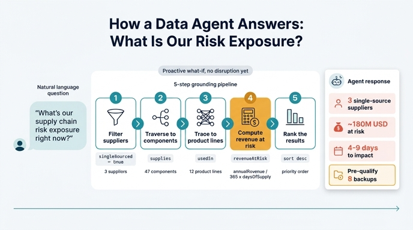

# Fabric IQ 데이터 에이전트의 5단계 리스크 노출 그라운딩

## 질문

> Fabric IQ 데이터 에이전트가 "현재 공급망 리스크 노출은?" 질문에 답하는 5단계는?

## 정답

① `singleSourced=true`인 Supplier 전부 찾기 → ② 각각이 공급하는 Component 찾기 → ③ 그 부품을 쓰는 ProductLine으로 추적 → ④ 각 라인의 `revenueAtRisk` 계산 → ⑤ `revenueAtRisk` 순으로 정렬된 목록 반환.

---

## 원문 대응

에셋 4번째 문서(Mitigation Execution & Automation)의 "Connecting to Fabric IQ" 절이 그대로 이 5단계다.

```
User: "What's our supply chain risk exposure right now?"
  ↓
Data Agent grounds query against your ontology:
  1. Find all Supplier records with singleSourced=true
  2. For each, find Components they supply
  3. Trace to ProductLines using those components
  4. Calculate revenueAtRisk for each ProductLine
  5. Return ranked list by revenueAtRisk

Agent Response:
  "You have 3 critical single-source suppliers.
   If any are disrupted, you lose ~$180M in
   4-9 days. We recommend pre-qualifying
   8 alternative suppliers (list attached)."
```

핵심은 사용자가 SQL도, 조인 경로도, 테이블 이름도 말하지 않았는데 에이전트가 **온톨로지에 정의된 속성과 관계만 밟아서** 답을 만들어냈다는 점이다. 이것이 "grounding"이다. 자연어 질문이 온톨로지의 엔티티/속성/관계라는 어휘로 번역되고, 그 어휘가 곧 실행 계획이 된다.

---

## 단계별로 무엇을 쓰는가

| 단계 | 동작 | 사용하는 온톨로지 요소 | 종류 | 중간 산출물(예시) |
|---|---|---|---|---|
| ① | 단일 소싱 공급사 전수 조회 | `Supplier.singleSourced = true` | **속성 필터** (boolean) | 3개 critical 공급사 |
| ② | 각 공급사가 공급하는 부품 전개 | `Supplier —supplies→ Component` | **관계 탐색** (1:N) | 47개 부품 |
| ③ | 부품을 쓰는 제품라인으로 추적 | `Component —usedIn→ ProductLine` | **관계 탐색** (M:N) | 12개 제품라인 |
| ④ | 라인별 위험 매출 계산 | `ProductLine.annualRevenue`, `Component.daysOfSupplyOnHand` → `RiskAssessment.revenueAtRisk` | **계산(집계)** | 합계 약 $180M, 노출 시점 4~9일 |
| ⑤ | 위험 매출 내림차순 정렬 후 반환 | `revenueAtRisk` 기준 ORDER BY | **랭킹/정렬** | 우선순위 목록 + 백업 8곳 사전 검증 권고 |

### ① boolean 필터가 시작점인 이유

`singleSourced`는 에셋의 속성 타입 표에서 유일한 `boolean` 예시로 등장하며, 용도가 명시적으로 "risk flagging"이다. 단일 소싱 공급사는 **대체 경로가 없는 지점**, 즉 리스크 증폭기(risk amplifier)다. 전체 공급사 수백 곳을 다 훑는 대신 이 플래그 하나로 "무너지면 즉시 라인이 멈추는 곳"만 즉시 좁힌다. 그래서 노출 진단의 자연스러운 진입점이 된다.

### ②③ 관계 두 번이 곧 전파 경로

`supplies`와 `usedIn`은 7개 관계 중 1번과 2번이다. 이 두 홉이 "공급사 사고 → 부품 공급 중단 → 제품라인 정지"라는 인과를 그래프 경로로 인코딩한다. 카디널리티가 각각 1:N과 M:N이므로 **부채꼴로 팬아웃**한다: 공급사 3 → 부품 47 → 라인 12(부품이 재사용되므로 다시 수렴). 관계형 스키마에서 이걸 하려면 조인 경로를 사람이 알고 있어야 하지만, 온톨로지에서는 관계 이름 자체가 경로다.

### ④ 계산은 Phase 3의 공식

에셋 Phase 3(Quantify impact)의 계산 엔진이 이 단계다.

```
For each exposed ProductLine:
  revenue_at_risk = annualRevenue / 365 * daysOfSupplyOnHand
  urgency         = 100 - (daysOfSupplyOnHand * 10)

Aggregate:
  total_revenue_at_risk = SUM(revenue_at_risk)
  critical_product_lines = WHERE urgency > 70
```

- 일 매출(`annualRevenue / 365`)에 재고로 버틸 수 있는 일수를 곱해 노출 규모를 금액으로 환산한다.
- `daysOfSupplyOnHand`가 작을수록 `urgency`가 커진다 → 재고가 얇은 라인이 먼저 터진다.
- 이 값들이 `RiskAssessment` 엔티티의 `revenueAtRisk`, `timeToImpactDays`로 물화(materialize)된다. 답변의 "4~9일"이 곧 라인별 `timeToImpactDays`의 범위다.
- 그래프 탐색(②③)과 수치 계산(④)은 성격이 다른 작업이다. 온톨로지는 탐색으로 **대상 집합**을 확정해주고, 계산 엔진은 그 집합에 **비즈니스 산식**을 적용한다.

### ⑤ 정렬이 있어야 답이 행동으로 바뀐다

"12개 라인이 노출됨"은 정보지만 "이 순서로 대응하라"는 결정이다. 리소스(예산·인력·시간)는 유한하므로 금액 기준 랭킹이 곧 우선순위다. 그래서 답변이 목록 나열로 끝나지 않고 "백업 공급사 8곳을 **사전 검증(pre-qualify)** 하라"는 권고로 이어진다.

---

## 이건 '사후 대응'이 아니라 상시 노출 진단(what-if)이다

이 5단계의 가장 중요한 성격: **DisruptionEvent가 전혀 존재하지 않아도 실행된다.**

| 구분 | 사후 대응(reactive) | 이 5단계(proactive / what-if) |
|---|---|---|
| 트리거 | 실제 교란 발생 (지진, 정전, 리콜) | 사용자의 임의 질문 — "지금 노출은?" |
| 시작 엔티티 | `DisruptionEvent` | `Supplier` (`singleSourced=true`) |
| 사용 관계 | `affects` → `supplies` → `usedIn` → `triggers` → `recommends` | `supplies` → `usedIn` |
| 조건법 | 이미 일어난 일 | "**만약** 이 중 하나라도 무너지면"(If any are disrupted) |
| 산출물 | RiskAssessment + MitigationAction 실행 | 노출 랭킹 + 사전 준비 권고 |
| 시간 축 | 사고 이후 분·시간 단위 | 사고 이전, 언제든 상시 |

- 에셋의 Phase 1~5(Detection → Trace → Quantify → Recommend → Execute)는 **실제 사고가 방아쇠**다. 반면 Fabric IQ 예시 질의는 `DisruptionEvent`를 아예 밟지 않는다. 관계 ③(`affects`)과 ④(`triggers`)가 경로에서 빠져 있다는 게 결정적 증거다.
- 답변 문장 "**If** any are disrupted, you lose ~$180M in 4-9 days"는 가정법이다. 즉 아직 아무 일도 안 일어났다.
- 그래서 권고도 사후 조치(`Activate Alternative Supplier`)가 아니라 사전 조치(`pre-qualify 8 alternative suppliers`)다. 사고가 터지기 전에 `qualificationStatus`를 `Not Qualified`/`Pending Audit`에서 `Approved`로 올려두라는 뜻이다.
- 실무적 의미: 동일한 온톨로지가 **평시의 취약점 지도**와 **전시의 대응 실행** 양쪽에 쓰인다. 같은 관계망을 어느 지점에서 진입하느냐만 다르다.

---

## 두 번째 예시 질의와의 차이

에셋에는 Fabric IQ 예시가 두 개 연달아 나온다. 헷갈리기 쉬우니 구분해두자.

**질의 A (이 카드)**: "What's our supply chain risk exposure right now?"

**질의 B**: "Which alternatives are approved for ChipX?"

```
AlternativeSupplier WHERE:
  canReplace.Supplier.name = "ChipX Corp"
  AND qualificationStatus = "Approved"
```

| 항목 | 질의 A — 노출 진단 | 질의 B — 백업 조회 |
|---|---|---|
| 질문 성격 | 열린 범위, 전사 스캔 | 특정 공급사 1곳 지정, 좁은 조회 |
| 시작 엔티티 | `Supplier` (플래그로 필터) | `AlternativeSupplier` |
| 필터 속성 | `singleSourced = true` (boolean) | `qualificationStatus = "Approved"` (enum) |
| 사용 관계 | `supplies` → `usedIn` (2홉, 하향 팬아웃) | `canReplace` (1홉, M:1 역방향 조회) |
| 계산 유무 | 있음 — `revenueAtRisk` 산출·집계 | 없음 — 저장된 속성 그대로 나열 |
| 정렬 기준 | `revenueAtRisk` 내림차순 | 없음(용량/가격 프리미엄 함께 표시) |
| 답 형태 | 금액·시간 축의 리스크 랭킹 | 후보 3곳 + `capacityAvailable`, `pricePremiumPercent` |
| 질문의 방향 | "얼마나 위험한가?" (진단) | "무엇으로 바꿀 수 있나?" (처방) |
| 홉 수 | 다중 홉 그래프 순회 | 단일 홉 속성 조회 |

핵심 차이 세 가지로 압축하면:

1. **필터 타입**: A는 `boolean` 리스크 플래그, B는 `enum` 자격 상태.
2. **탐색 깊이**: A는 2홉 하향 전파 추적, B는 1홉 역방향 조회(`canReplace`는 M:1이므로 "이 공급사를 대체할 수 있는 것들"을 역으로 모은다).
3. **계산·정렬**: A만 계산과 랭킹이 있다. B는 이미 온톨로지에 적재된 속성을 읽어 보여주면 끝난다.

이 대비가 보여주는 것: 같은 7-엔티티 온톨로지 하나가 **진단형 질의**와 **처방형 질의**를 모두 받아낸다. 자연어 질문의 종류에 따라 에이전트가 다른 진입점·다른 관계·다른 후처리를 고르는데, 그 선택지 전체가 온톨로지 정의(속성 타입 + 관계 카디널리티)에 미리 새겨져 있기 때문이다.

---

## 암기 포인트

- **필터 → 관계 → 관계 → 계산 → 정렬** 이 5박자 리듬으로 외우면 순서가 안 헷갈린다.
- 시작은 반드시 `singleSourced=true`. (`DisruptionEvent`가 아니다.)
- 관계 이름 두 개: `supplies`, `usedIn`. (`affects`, `triggers`는 이 경로에 없다.)
- 계산·정렬 기준은 같은 속성 `revenueAtRisk`. 4단계에서 만들고 5단계에서 쓴다.
- 숫자 앵커: 단일 소싱 공급사 3곳 / 약 $180M / 4~9일 / 백업 8곳 사전 검증.

## 인포그래픽


