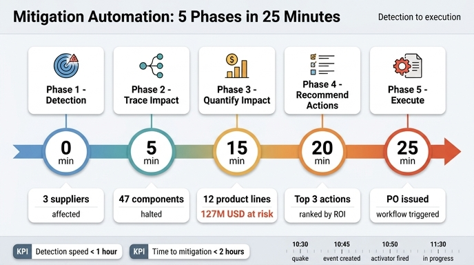

# 완화 실행 자동화의 5개 Phase와 시점(분)

## 한 줄 정답

| Phase | 이름 | 시점 |
|---|---|---|
| Phase 1 | Detection (탐지) | **0분** |
| Phase 2 | Trace impact (영향 추적) | **5분** |
| Phase 3 | Quantify impact (영향 정량화) | **15분** |
| Phase 4 | Recommend actions (조치 추천) | **20분** |
| Phase 5 | Execute (실행) | **25분** |

즉, 외부 신호가 들어온 시점(0분)부터 **25분 안에 실제 실행(PO 발행·스케줄 갱신·알림)까지 도달**하는 것이 이 모델의 목표다.

## 암기 포인트

- 간격이 균등하지 않다: **0 → 5 → 15 → 20 → 25**. 즉 `+5, +10, +5, +5`.
- 가장 긴 구간(10분)은 Phase 2 → Phase 3, 즉 **정량화(계산)** 단계다. 그래프 탐색으로 모은 대상에 대해 매출 위험액·긴급도를 실제로 계산해야 하므로 가장 오래 걸린다.
- 나머지 전이는 모두 5분. 탐지→추적, 정량화→추천, 추천→실행이 각각 5분이다.
- "5개 Phase, 25분" 이라는 숫자 쌍으로 기억하면 좋다.

## Phase별 입력 · 온톨로지 활용 · 산출

| Phase (시점) | 입력 | 온톨로지 활용 방식 | 산출 |
|---|---|---|---|
| **1. Detection** (0분) | 외부 신호 — 공급사 오프라인, 자연재해 경보, 품질 이슈 보고 | Data Agent 질의: "타이완 지진에 영향받는 공급사는?" → `Supplier.country="Taiwan"` + `DisruptionEvent.region="Taiwan"` + `DisruptionEvent.type="Natural Disaster"` 속성 매칭 | **3개 critical 공급사** 식별 |
| **2. Trace impact** (5분) | 영향받은 공급사 목록(3개) | 관계 탐색 2홉: `Supplier → supplies → Component`, 이어서 `Component → usedIn → ProductLine` | **47개 부품**, **12개 제품 라인** 노출 확인 |
| **3. Quantify impact** (15분) | 노출된 제품 라인 목록(12개) | Calculation Engine이 속성으로 계산: `revenue_at_risk = annualRevenue / 365 * daysOfSupplyOnHand`, `urgency = 100 - (daysOfSupplyOnHand * 10)`, 그리고 `urgency > 70` 필터로 critical 선별 | **$127M 위험 매출**, critical timeline **3일**, 영향 고객 **450,000명+** |
| **4. Recommend actions** (20분) | RiskAssessment 결과 | `AlternativeSupplier`에서 `qualificationStatus="Approved"` AND `capacityAvailable >= demand` AND `country NOT IN earthquake_region` 조건 필터 후 `leadTimeSavedDays` / `pricePremiumPercent` / `reliabilityScore`로 스코어링 | **ROI 순위 Top 3 조치** (A: ChipX Europe 활성화 — 2일 단축, +$2M / B: 안전재고 증량 — $500K, 2주 커버 / C: 부품 재설계 — 리드타임 미정) |
| **5. Execute** (25분) | 추천된 조치 | 규칙 트리거: `IF RiskAssessment.revenueAtRisk > $50M AND RiskAssessment.timeToImpactDays < 5` | **PurchaseOrder 생성**, ProductionSchedule 갱신, 구매·운영·재무·CEO/Board 이메일 발송, 에스컬레이션 정책이 붙은 **Activator 알림** 생성, `MitigationAction.status` 모니터링 시작 |

### 흐름의 성격 변화

- **Phase 1~2는 "그래프 탐색"** — 엔티티와 관계(`supplies`, `usedIn`)를 따라가며 *무엇이* 영향받는지 찾는다. 온톨로지의 **관계**가 일하는 구간.
- **Phase 3은 "속성 계산"** — `annualRevenue`, `daysOfSupplyOnHand` 같은 **속성**이 일하는 구간. 여기서 정성적 노출이 $127M이라는 정량적 숫자로 바뀐다.
- **Phase 4는 "제약 필터 + 스코어링"** — `AlternativeSupplier`의 enum(`qualificationStatus`)과 수치 속성이 후보를 좁히고 순위를 만든다.
- **Phase 5는 "규칙 기반 자동화"** — 임계값(`> $50M`, `< 5일`) 조건이 충족되면 사람의 승인 없이 워크플로가 발화한다. 온톨로지가 **읽기 대상에서 쓰기 주체로** 전환되는 지점.

## Day 1 실제 타임라인과 분 단위 Phase 모델의 대응

문서의 "Real-world workflow"는 벽시계(wall clock) 시각으로 서술되어 있는데, Phase 모델의 상대 시각(분)과 다음과 같이 대응된다.

| 실제 시각 | 일어난 일 | 대응 Phase | Phase 상대 시점 |
|---|---|---|---|
| **10:30 AM** | 타이완 규모 6.8 지진 발생 (물리적 사건) | — (Phase 0, 시계의 원점) | 사건 발생 |
| **10:45 AM** | 시스템이 감지 → `DisruptionEvent` 생성 (`type="Natural Disaster"`, `severity="Critical"`, `region="Taiwan"`, `estimatedDurationDays=7`) | **Phase 1 Detection** | **0분** |
| 10:46 AM | Data Agent가 영향 추적: 3 공급사 / 47 부품 / 12 제품 라인 / $127M / 3일 | **Phase 2 + Phase 3** | 5분 + 15분 |
| 10:47 AM | `RiskAssessment` 생성 — 라인별 영향 평가 + ROI 순위 조치 추천 | **Phase 4** | 20분 |
| 10:48 AM | `MitigationAction` 자동 생성 — ChipX Europe에 PO 발행, 안전재고 발주, 구매·운영·재무 알림 | **Phase 5** | 25분 |
| **10:50 AM** | `Activator` 발화 — 실시간 대시보드, 에스컬레이션으로 리더십 통보, 구매팀 확인 응답 | Phase 5의 알림/에스컬레이션 하위 단계 | 25분 이후 |
| **11:30 AM** | `MitigationAction.status = "In Progress"` — PO 진행, ChipX Europe 48시간 출하 확약, 생산 영향 7일 → 3일 축소 | Phase 5 결과 확정(모니터링 시작) | — |

### 두 시계의 차이를 이해하는 법

1. **원점이 다르다.** Phase 모델의 0분은 *지진 발생 시각(10:30)이 아니라 시스템이 신호를 인지한 시각(10:45)* 이다. 10:30~10:45의 15분은 외부 신호가 시스템에 도달하는 **감지 지연(sensing latency)** 이며 Phase 모델 밖에 있다.
2. **실제 기계 처리는 Phase 모델보다 빠르다.** 10:45~10:48, 즉 **3분** 만에 Phase 1~5가 모두 지나갔다. 문서의 0/5/15/20/25분은 "이 정도 안에는 끝나야 한다"는 **설계 예산(budget) / SLA 목표**이고, 실측치는 그 안에 넉넉히 들어온다. Phase 모델은 최악의 경우를 포함한 상한선으로 읽어야 한다.
3. **Phase 2와 Phase 3이 실제로는 한 번에 처리된다.** 10:46의 단일 Data Agent 실행이 "3 공급사 → 47 부품 → 12 라인 → $127M"까지 한 호출로 뽑아낸다. 개념상 추적과 정량화는 분리된 단계지만, 구현에서는 같은 파이프라인에 이어 붙는다.
4. **Phase 5는 점이 아니라 구간이다.** 25분(=10:48)의 PO 생성으로 끝나는 게 아니라, 10:50 Activator 발화 → 11:30 `status="In Progress"` 확정까지 이어진다. "25분 내 실행 도달"은 *실행을 개시*한 시점을 뜻하고, 조치가 *진행 상태로 확정*되는 데는 추가 시간이 든다.

## Detection speed / Time to mitigation 지표와의 관계

Continuous improvement 표의 6개 지표 중 두 개가 이 타임라인을 직접 측정한다.

| 지표 | 정의 | 목표 | Day 1 실측 | 판정 |
|---|---|---|---|---|
| **Detection speed** | 교란 발생부터 `RiskAssessment` 생성까지의 시간 | **< 1시간** | 10:30 → 10:47 = **17분** | 목표 대비 여유 있게 달성 |
| **Time to mitigation** | 평가부터 `MitigationAction` 실행까지의 시간 | **< 2시간** | 10:47 → 11:30 = **43분** | 목표 대비 여유 있게 달성 |

### 지표가 Phase를 어떻게 나누는가

- **Detection speed는 Phase 1~3을 덮는다.** 정의상 "교란 발생 → RiskAssessment"이므로, 지진 발생(10:30) + 감지 지연(15분) + Phase 1 Detection + Phase 2 Trace + Phase 3 Quantify가 이 지표의 예산 안에 들어간다. Phase 모델로 보면 **0분~15분 구간 + 그 앞의 감지 지연**이며, RiskAssessment 산출물이 나오는 순간이 지표의 끝점이다. 예산 60분 중 Phase 모델이 쓰는 몫은 15분뿐이므로, 남은 45분은 감지 지연과 데이터 신선도 문제에 배정된 여유다.
- **Time to mitigation은 Phase 4~5를 덮는다.** "평가 → MitigationAction 실행"이므로 Phase 4 Recommend(20분)와 Phase 5 Execute(25분), 그리고 실행이 실제로 `In Progress`로 확정되기까지가 대상이다. Phase 모델 상으로는 15분에서 25분까지의 **10분 구간**이지만, 승인·공급사 확약·수신 확인 같은 인간/외부 지연이 붙기 때문에 예산이 2시간으로 넉넉히 잡혀 있다.
- **두 지표를 합치면 "교란부터 실행까지 3시간 이내"** 라는 상위 목표가 된다. Phase 모델의 25분은 *자동화가 담당하는 기계 시간*이고, 지표의 시간(<1h, <2h)은 *기계 시간 + 인간·외부 시스템 지연*을 포함한 현실적 상한이다. 이 둘의 차이가 곧 온톨로지 자동화로 절약한 여유분이다.
- Summary가 말하는 **"reduce disruption impact from days to hours"** 가 정확히 이 구조다. 온톨로지 없이는 3개 공급사가 어떤 47개 부품을 통해 12개 라인에 어떻게 연결되는지 사람이 수작업으로 며칠간 추적해야 했고, 온톨로지가 있으면 그 추적이 관계 탐색 몇 홉으로 끝난다.

### 나머지 지표와의 연결

- **Trace accuracy (> 95%)** → Phase 2의 품질 지표. 47개 부품 중 실제 영향 부품을 얼마나 잡았는지.
- **Impact estimate accuracy (±10%)** → Phase 3의 품질 지표. $127M 추정이 실제와 얼마나 맞았는지.
- **Cost efficiency (±5%)** → Phase 4~5의 품질 지표. 추정 $2M 대비 실제 $2.1M이므로 오차 5%로 경계선 통과.
- **Revenue protection rate (> 80%)** → 최종 성과 지표. $127M 노출 중 ~$100M 보호 = **약 79%** 로 목표(80%)에 근소하게 미달. 즉 속도 지표는 모두 통과했지만 보호율은 개선 여지가 남아 있다는 해석이 가능하다.

정리하면, **Phase 모델(0/5/15/20/25분)은 자동화 파이프라인의 내부 예산**, **Day 1 타임라인(10:30~11:30)은 현실의 실행 기록**, **Detection speed / Time to mitigation은 그 둘을 묶어 검증하는 계약(SLA)** 이다.

## 인포그래픽

