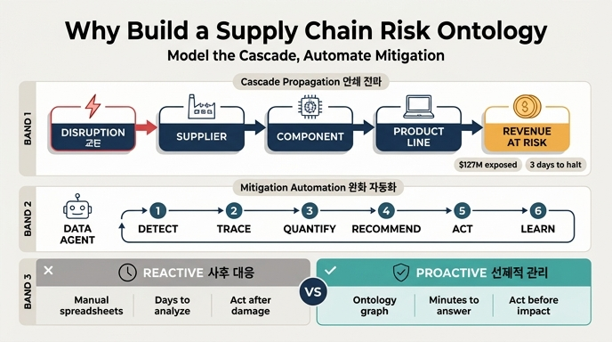

# Supply Chain Disruption & Risk Propagation 학습 경로의 온톨로지 목적

## 질문

Supply Chain Disruption & Risk Propagation 학습 경로에서 만드는 온톨로지의 목적은 무엇인가?

## 답변

공급업체 교란이 부품·제품 라인·매출로 어떻게 연쇄 전파(cascade)되는지 모델링하고, 온톨로지 기반 데이터 에이전트로 완화(mitigation) 의사결정을 자동화하는 것이다. 사후 대응이 아니라 **선제적 리스크 관리**를 목표로 한다.

---

## 왜 이 목적인가: 문제 정의

제조 운영은 복잡한 공급업체 네트워크에 의존한다. 자연재해·지정학적 사건·품질 문제·사이버 공격 같은 단 하나의 교란은 그 공급업체 하나에서 끝나지 않고 아래로 물결처럼 번진다.

| 전파 대상 | 영향 |
|---|---|
| **Components** | 해당 공급업체에 의존하는 부품 공급 중단 |
| **Product lines** | 그 부품을 쓰는 제품 라인 생산 위험 |
| **Revenue** | 출하 불가로 인한 매출 손실 |
| **Production timelines** | 주 단위로 밀리는 생산 일정 |

이 연쇄 구조에 대한 가시성이 없으면 **피해가 이미 발생한 뒤에 반응**한다. 가시성이 있으면 **고객이 영향을 받기 전에 예측하고 행동**한다. 이 대비가 학습 경로 전체의 문제의식이며, "사후 대응 → 선제적 리스크 관리(proactive risk management)" 전환이 온톨로지의 존재 이유다.

## 목적의 두 축

답변은 두 개의 축으로 나뉜다. 둘은 순서가 있는 관계다 — 먼저 **모델링**하고, 그 위에서 **자동화**한다.

### 축 1. 연쇄 전파(cascade) 모델링

교란이 어떤 경로로 무엇에 도달하는지를 그래프로 명시한다. 대표 경로는 다음과 같다.

```
Disruption → Supplier → Component → ProductLine → Revenue / Timeline
```

이 경로가 온톨로지의 **7개 관계(relationships)** 로 인코딩된다.

| 관계 | 카디널리티 | 의미 |
|---|---|---|
| Supplier **supplies** Component | 1:N | 한 공급업체가 여러 부품 공급 |
| Component **usedIn** ProductLine | M:N | 부품 재사용, 제품 간 공유 |
| DisruptionEvent **affects** Supplier | M:N | 한 재해가 여러 공급업체 타격 |
| DisruptionEvent **triggers** RiskAssessment | 1:N | 교란마다 영향 분석 생성 |
| RiskAssessment **recommends** MitigationAction | 1:N | 분석마다 우선순위 액션 목록 |
| MitigationAction **activates** AlternativeSupplier | M:N | 한 액션이 여러 백업 가동 |
| AlternativeSupplier **canReplace** Supplier | M:1 | 한 공급업체에 다수의 사전 인증 백업 |

### 축 2. 데이터 에이전트 기반 완화 의사결정 자동화

관계 그래프가 있으면 데이터 에이전트가 다음 6단계를 스스로 수행할 수 있다.

1. **Detect** — 지정 공급업체·지역 모니터링
2. **Trace** — ChipX Corp 문제 발생 시 영향받는 모든 제품 라인 자동 추적
3. **Quantify** — 위험 매출($80M)과 영향 도달 시간(3일) 계산
4. **Recommend** — 2일 단축·$2M 비용의 사전 인증 대안을 $80M 손실과 비교해 제안
5. **Act** — 구매 알림 발송, 생산 일정 갱신, 이해관계자 통보
6. **Learn** — 실제로 효과가 있었던 액션과 추정 대비 실측 영향 추적

즉 온톨로지는 "지식 표현"에서 멈추지 않고 **실행 가능한 의사결정 기반(decision automation)** 이 되는 것이 목적이다.

## 목적을 체감하는 예시: 대만 반도체 공급업체 정전 48시간

```
Disruption: Taiwan Supplier Outage
  ↓
Affects: ChipX component supply
  ↓
Impacts: 3 product lines (laptops, tablets, displays)
  ↓
Cascades: Production halts in 2 weeks (inventory runs out)
  ↓
Result: $12M revenue at risk, customer orders delayed
  ↓
Mitigation: Activate pre-qualified alternative supplier + safety stock
```

- **온톨로지가 없으면**: 이 분석에 며칠이 걸리고 수작업 스프레드시트에 의존한다.
- **온톨로지가 있으면**: AI 에이전트가 몇 분 안에 영향 부품 식별 → 제품 라인·생산 일정 추적 → 대안 공급업체와 안전재고 수량 추천 → 각 완화 액션의 비용·편익 계산 → 자동 알림 및 구매 워크플로 트리거까지 수행한다.

실제 워크플로 예시(대만 지진 시나리오)에서는 10:30 지진 발생 → 10:45 DisruptionEvent 생성 → 10:46 영향 추적(공급업체 3, 부품 47, 제품 라인 12, $127M 위험, 3일 내 생산 중단) → 10:47 RiskAssessment → 10:48 MitigationAction 자동 생성 → 10:50 Activator 경보까지 **20분** 안에 진행된다.

## 목적 달성을 위한 산출물

학습 경로는 4단계로 프로덕션 수준 온톨로지를 만든다.

| 단계 | 초점 | 결과 |
|---|---|---|
| 1 | 핵심 엔티티 (Supplier, Component, ProductLine, Disruption) | 공급망 어휘 확보 |
| 2 | 엔티티 속성과 식별자 | 리스크 계산용 풍부한 속성 |
| 3 | 관계와 cascade 모델링 | 영향 전파 그래프 |
| 4 | 리스크 평가와 완화 액션 | 의사결정 자동화 |

최종 산출물의 규모는 다음과 같다.

- **7개 엔티티 타입** — Supplier, Component, ProductLine, DisruptionEvent, RiskAssessment, MitigationAction, AlternativeSupplier (교란의 전 생애주기를 포괄)
- **40개 속성** — 신뢰도 점수, 재고 수준, 비용, 타임라인 등
- **7개 관계** — 현실적인 영향 연쇄 모델
- **Fabric IQ 호환** — 데이터 에이전트 그라운딩과 실시간 경보 지원

## 선제적(proactive)이라는 말의 구체적 의미

"선제적"은 막연한 구호가 아니라 온톨로지 구조로 뒷받침된다.

- `Supplier.singleSourced=true` — 리스크 증폭원인 단일 소스 공급업체를 교란 발생 **전에** 식별
- `Component.daysOfSupplyOnHand` — 안전재고로 며칠을 버틸 수 있는지로 여유 시간 계산
- `AlternativeSupplier.qualificationStatus="Approved"` — 사건 후 신규 심사가 아니라 **사전 인증된** 백업을 즉시 가동
- `RiskAssessment.timeToImpactDays` — 피해 발생 시점 이전의 대응 창(window)을 수치화

Fabric IQ 에이전트에 "지금 공급망 리스크 노출이 얼마인가?"라고 물으면, 교란이 아직 없는 평시에도 "단일 소스 공급업체 3곳이 있고, 한 곳이라도 교란되면 4~9일 안에 약 $180M 손실이 발생한다. 대안 공급업체 8곳의 사전 인증을 권고한다"는 답을 낸다. 이것이 사후 대응이 아닌 선제적 관리다.

## 성과 측정 지표

목적이 달성됐는지는 아래 지표로 검증한다.

| 지표 | 계산 | 목표 |
|---|---|---|
| 탐지 속도 | 교란→RiskAssessment 소요 시간 | < 1시간 |
| 추적 정확도 | 실제 영향 부품 식별 비율 | > 95% |
| 영향 추정 정확도 | 추정 대비 실제 위험 매출 | ±10% |
| 완화 소요 시간 | 평가→액션 실행 시간 | < 2시간 |
| 비용 효율 | 추정 대비 실제 액션 비용 | ±5% |
| 매출 보호율 | 액션으로 보호된 위험 매출 비율 | > 80% |

핵심 성과 문장은 **"reduce disruption impact from days to hours"** — 교란 대응을 며칠 단위에서 시간 단위로 줄이는 것이다.

## 흔한 오해

- **"단순히 공급망을 문서화하는 것"이 아니다** — 목적은 문서화가 아니라 에이전트가 따라갈 수 있는 **실행 가능한 전파 그래프**를 만드는 것이다.
- **"교란 감지"에서 끝나지 않는다** — 감지는 5단계 중 1단계일 뿐이고, 완화 액션 실행과 학습까지가 범위다.
- **"사고 후 원인 분석 도구"가 아니다** — 명시적으로 사후 대응(reactive)의 반대인 선제적(proactive) 관리를 지향한다.

## 한 줄 요약

교란 → 공급업체 → 부품 → 제품 라인 → 매출의 연쇄를 온톨로지 관계로 명시해, 데이터 에이전트가 몇 분 안에 탐지·추적·정량화·추천·실행·학습을 수행하며 피해 발생 전에 완화하도록 만드는 것.

## 인포그래픽


