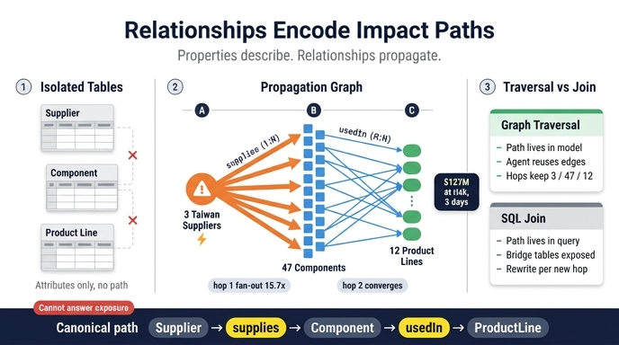

# 온톨로지에서 관계(relationship)가 갖는 핵심 힘

> **Q.** 온톨로지에서 관계(relationship)가 갖는 핵심 힘은 무엇인가?
>
> **A.** 관계가 **영향이 공급망을 타고 흐르는 경로를 인코딩**한다. 데이터 에이전트는 이 경로를 따라가 "이 공급업체 실패에 몇 개 제품 라인이 노출되나?" 같은 질문에 답한다.

---

## 1. 한 줄 요약

엔티티와 속성은 "무엇이 존재하는가"를 말해주지만, **관계는 "무엇이 무엇에 영향을 주는가"를 말해준다.**
asset의 표현을 그대로 옮기면:

> The power of your ontology lies in its relationships — they encode how impact flows through your supply chain. A data agent follows these paths to answer questions like "How many product lines are exposed to this supplier failure?"

즉 관계는 단순한 "데이터 연결선"이 아니라 **전파 경로(propagation path)** 그 자체다. 이 경로가 모델 안에 명시적으로 존재하기 때문에, 에이전트는 사람이 스프레드시트로 며칠 걸려 짜맞추던 인과 추적을 몇 분 안에 수행할 수 있다.

---

## 2. 속성만 있는 온톨로지 vs 관계가 있는 온톨로지

| | 속성만 있을 때 | 관계까지 있을 때 |
|---|---|---|
| 표현할 수 있는 것 | "ChipX Corp는 대만에 있고, 신뢰도 62, 단일 소싱이다" | "ChipX Corp가 멈추면 GPU Module이 멈추고, 그러면 Gaming Laptop 2024와 Workstation Pro가 멈춘다" |
| 답할 수 있는 질문 | 필터/집계 질문 ("대만 공급업체 목록") | 도달성/노출도 질문 ("이 공급업체 실패에 노출된 제품 라인 수") |
| 구조 | 서로 고립된 테이블들 | 하나로 연결된 전파 그래프 |
| 에이전트 동작 | 조건 매칭 | 경로 순회(traversal) + 누적 집계 |

앞선 단계(Core Entities & Properties)에서 만든 40개 속성은 **리스크 계산의 재료**다.
`daysOfSupplyOnHand`, `annualRevenue`, `reliabilityScore` 같은 값은 그 자체로는 "얼마나 위험한가"를 말해주지 못한다. **어떤 제품 라인이 어떤 부품을 통해 어떤 공급업체에 매달려 있는지**를 알아야 `revenue_at_risk` 계산이 가능해진다. 그 연결을 제공하는 게 7개의 관계다.

---

## 3. 7개 관계 = 재난 대응 파이프라인의 배선도

asset의 Risk Propagation Model이 정의하는 관계는 다음 7개이며, 이것들이 이어붙으면 **"사건 → 노출 → 정량화 → 대응"** 이라는 하나의 긴 경로가 된다.

```
DisruptionEvent ──affects──▶ Supplier ──supplies──▶ Component ──usedIn──▶ ProductLine
       │
       └──triggers──▶ RiskAssessment ──recommends──▶ MitigationAction ──activates──▶ AlternativeSupplier
                                                                                          │
                                                                          canReplace ─────┘
                                                                                          ▼
                                                                                       Supplier
```

| # | 관계 | 카디널리티 | 이 관계가 인코딩하는 "영향의 방향" |
|---|---|---|---|
| 1 | Supplier **supplies** Component | 1:N | 공급업체 하나가 멈추면 그가 대는 모든 부품이 위험 |
| 2 | Component **usedIn** ProductLine | M:N | 부품 하나가 멈추면 그것을 쓰는 여러 제품 라인이 정지 |
| 3 | DisruptionEvent **affects** Supplier | M:N | 한 재난이 여러 공급업체를 동시에 타격 |
| 4 | DisruptionEvent **triggers** RiskAssessment | 1:N | 사건마다 영향 분석이 파생 |
| 5 | RiskAssessment **recommends** MitigationAction | 1:N | 분석마다 우선순위 액션 목록 |
| 6 | MitigationAction **activates** AlternativeSupplier | M:N | 한 액션이 여러 백업을 동시 가동 |
| 7 | AlternativeSupplier **canReplace** Supplier | M:1 | 핵심 공급업체마다 복수의 승인된 백업 |

관계 1~3은 **하류로 흐르는 피해**를, 4~7은 **상류로 되돌리는 복구**를 인코딩한다. 마지막 `canReplace`가 다시 `Supplier`로 돌아오면서 그래프가 닫히고, 이 순환 덕분에 "손실 경로"와 "치유 경로"를 같은 모델 안에서 비교할 수 있다.

---

## 4. 핵심 예제: Phase 2 "Trace impact" 를 hop 단위로 뜯어보기

asset의 Mitigation Execution 편 Phase 2가 관계의 힘을 가장 압축적으로 보여준다.

```
Phase 1 (minute 0)  : Supplier.country="Taiwan" 매칭        → 3 critical suppliers
Phase 2 (minute 5)  : Supplier ──supplies──▶ Component      → 47 components
                      Component ──usedIn──▶ ProductLine     → 12 product lines exposed
Phase 3 (minute 15) : 속성으로 정량화                        → $127M at risk, 3일 내 정지
```

### hop 0 — 시드 집합 만들기 (여기까진 관계가 필요 없다)

`DisruptionEvent.region = "Taiwan"` 과 `Supplier.country = "Taiwan"` 을 맞춰서 **3개 공급업체**를 얻는다. 이건 순수 속성 필터다. 관계는 아직 등장하지 않는다.

### hop 1 — `supplies` 를 따라 팬아웃: 3 → 47

3개 공급업체 노드에서 `supplies` 엣지를 전부 펼치면 **47개 부품**이 나온다.
공급업체당 평균 약 15.7개 부품이므로 **팬아웃 배율 ≈ 15.7×**. 1:N 관계이므로 부품 집합은 중복 없이 단순히 합쳐진다(한 부품이 여러 공급업체에서 오는 멀티소싱이 있으면 합집합에서 중복이 제거되어 배율이 다소 줄어든다).

여기서 속성 하나가 결합된다: `Component.daysOfSupplyOnHand`. GPU Module이 3일치 재고라면, 이 부품은 3일 뒤 실제 정지로 전환된다. **관계는 "어디까지 번지나"를, 속성은 "언제 터지나"를 담당한다.**

### hop 2 — `usedIn` 을 따라 팬아웃하며 동시에 수렴: 47 → 12

47개 부품에서 `usedIn` 엣지를 펼치면 제품 라인이 나온다. 그런데 결과는 47보다 **작은 12개**다. 왜?

- `usedIn` 은 **M:N** 관계다. 부품 하나가 여러 제품 라인에 쓰이고(팬아웃), 제품 라인 하나가 여러 부품을 쓴다(팬인).
- 즉 hop 2는 엣지 수준에서는 팬아웃(47 × 평균 2~3 = 100+ 엣지)이지만, **도착 노드를 distinct로 모으면 12개로 수렴**한다.
- 이 수렴 자체가 중요한 리스크 신호다. 12개 제품 라인이 47개 부품을 공유한다는 건 **부품 재사용도가 높다 = 단일 부품 장애의 파급이 크다**는 뜻이다. asset이 "Components reused; products share components"라고 M:N을 정당화한 이유가 여기 있다.

### hop 3 — 속성으로 비즈니스 언어로 환산

12개 제품 라인 각각에 대해:

```
revenue_at_risk = annualRevenue / 365 * daysOfSupplyOnHand
urgency         = 100 - (daysOfSupplyOnHand * 10)
```

합산하면 `$127M at risk`, `critical timeline 3 days`, `450,000+ 고객 영향`. 그리고 Phase 5의 자동화 규칙이 발동한다:

```
IF RiskAssessment.revenueAtRisk > $50M AND RiskAssessment.timeToImpactDays < 5
THEN  PO 발행 + 생산 일정 갱신 + 이해관계자 통보 + Activator 알림
```

### 팬아웃 요약표

| hop | 따라간 관계 | 입력 | 출력 | 배율/성격 |
|---|---|---|---|---|
| 0 | (속성 필터) | Taiwan 지역 | 3 suppliers | 시드 집합 |
| 1 | `Supplier → supplies → Component` (1:N) | 3 | 47 | ≈15.7× 팬아웃 |
| 2 | `Component → usedIn → ProductLine` (M:N) | 47 | 12 | 엣지는 팬아웃, 노드는 수렴(팬인) |
| 3 | (속성 집계) | 12 | $127M / 3일 | 비즈니스 정량화 |

**포인트: 팬아웃 그 자체가 답이 아니다.** 47이라는 숫자는 "복구해야 할 작업량"이고, 12라는 숫자는 "고객에게 보이는 피해 범위"다. 관계가 없으면 이 두 숫자를 아예 계산할 수 없다.

---

## 5. 관계 순회(graph traversal) vs 조인 기반 질의

같은 데이터를 관계형 조인으로 물어볼 수도 있다. 결과는 비슷할 수 있지만 **작성 방식과 확장성이 근본적으로 다르다.**

### 조인 기반 질의

```sql
SELECT DISTINCT pl.product_line_id
FROM disruption_event de
JOIN disruption_supplier ds ON ds.event_id = de.event_id
JOIN supplier s            ON s.supplier_id = ds.supplier_id
JOIN supplier_component sc ON sc.supplier_id = s.supplier_id
JOIN component c           ON c.component_id = sc.component_id
JOIN component_product cp  ON cp.component_id = c.component_id
JOIN product_line pl       ON pl.product_line_id = cp.product_line_id
WHERE de.region = 'Taiwan';
```

- **경로가 질의문 안에 숨어 있다.** `Supplier → Component → ProductLine` 이라는 지식이 스키마가 아니라 SQL 텍스트에 들어 있다. 질의를 짜는 사람이 이미 그 경로를 알고 있어야 한다.
- **조인 테이블이 노출된다.** `supplier_component`, `component_product` 같은 M:N 브릿지 테이블은 비즈니스 개념이 아니라 구현 세부다. 에이전트가 이걸 정확히 맞춰야 한다.
- **한 홉 늘어나면 질의를 다시 쓴다.** "부품의 하위 부품(sub-assembly)까지" 같은 요구가 생기면 JOIN 절을 추가하거나 재귀 CTE로 갈아야 한다. 깊이가 가변이면 조인 개수를 미리 알 수 없다는 문제가 정면으로 드러난다.
- **결과가 평평한 행 집합이다.** 어떤 부품을 경유해 그 제품 라인에 닿았는지(경로 자체)가 유실되기 쉽다.

### 관계 순회

```
seedSuppliers   = DisruptionEvent(region="Taiwan").affects
components      = seedSuppliers.supplies                 // 3 → 47
exposedLines    = components.usedIn.distinct()            // 47 → 12
totalAtRisk     = exposedLines.sum(revenueAtRisk)
```

- **경로가 모델에 선언되어 있다.** `supplies`, `usedIn` 은 온톨로지의 1급 시민이다. 질의는 "무엇을 알고 싶은가"만 말하고, "어떻게 이어붙이는가"는 온톨로지가 이미 답해뒀다.
- **자연어 에이전트가 그라운딩할 수 있다.** Fabric IQ 데이터 에이전트가 "지금 우리 공급망 리스크 노출이 어때?"를 처리하는 방식이 정확히 이것이다 — `singleSourced=true` 공급업체를 찾고, `supplies`로 부품을 찾고, `usedIn`으로 제품 라인까지 추적하고, `revenueAtRisk`로 순위를 매긴다. 관계 이름이 곧 에이전트의 어휘다.
- **홉 추가가 선언적이다.** 새 관계 하나를 온톨로지에 추가하면 그 관계를 쓰는 모든 질문이 자동으로 확장된다. 기존 질의문을 고칠 필요가 없다.
- **hop별 중간 결과가 보존된다.** 3 / 47 / 12 라는 각 단계 숫자가 그대로 남아서 대시보드와 감사 로그에 쓰인다. 조인 결과 하나만 받으면 "47개 부품"이라는 중간 사실이 사라진다.
- **이름 있는 방향성.** `AlternativeSupplier canReplace Supplier` 처럼 관계에 의미 있는 이름과 방향이 붙어 있어 역방향 질문("이 공급업체를 대체할 수 있는 승인된 백업은?")도 같은 모델로 바로 답한다.

> 핵심 차이: 조인은 **매번 경로를 다시 조립**하고, 순회는 **한 번 선언된 경로를 재사용**한다. 그래서 관계는 재사용 가능한 자산이 되고, 조인 쿼리는 일회성 코드로 남는다.

---

## 6. 관계가 있어서 가능해진 6가지 에이전트 동작

asset의 "Why this structure enables automation"을 관계와 짝지어 보면:

| 동작 | 사용하는 관계/속성 |
|---|---|
| **Detect** — 감시 대상 지정 | `DisruptionEvent.affects Supplier` + `region`, `country` |
| **Trace** — 14개(또는 12개) 제품 라인까지 자동 추적 | `supplies`, `usedIn` |
| **Quantify** — $80M / 3일 산출 | `triggers RiskAssessment` + `annualRevenue`, `daysOfSupplyOnHand` |
| **Recommend** — 2일 절약, $2M 대안 제시 | `recommends MitigationAction`, `canReplace` |
| **Act** — PO, 일정, 알림 발송 | `activates AlternativeSupplier` |
| **Learn** — 실제 대비 추정 효과 추적 | `MitigationAction.status`, `estimatedCost` vs 실제 |

Trace 없이는 Quantify가 불가능하고, Quantify 없이는 Recommend의 ROI 비교($2M 지출 vs $80M 손실)가 불가능하다. **관계는 이 사슬의 첫 고리다.**

---

## 7. 시험에 나올 포인트

- 관계의 핵심 가치는 "데이터 정규화"나 "중복 제거"가 아니라 **영향 전파 경로의 인코딩**이다.
- Phase 2 경로를 정확히 암기: `Supplier → supplies → Component → usedIn → ProductLine`, **3 공급업체 → 47 부품 → 12 제품 라인**.
- 47 → 12로 숫자가 **줄어드는** 이유는 `usedIn` 이 M:N이라 여러 부품이 같은 제품 라인으로 수렴하기 때문이다(팬인).
- 관계 7개 중 1~3은 피해 하류 전파, 4~7은 복구 상류 경로.
- 순회 vs 조인: 경로가 **모델에 있는가(순회)** vs **질의문에 있는가(조인)**.

---

## 인포그래픽


