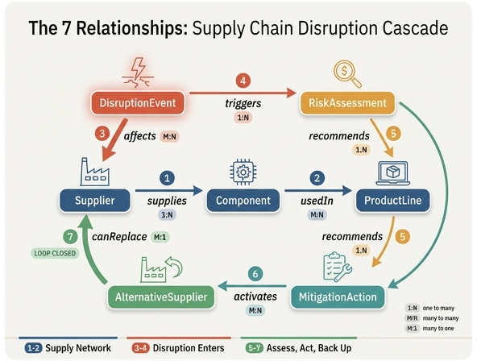

# 7개 관계를 순서대로 나열하면?

## 정답

| # | 관계 | 카디널리티 |
|---|---|---|
| ① | **Supplier** —supplies→ **Component** | 1:N |
| ② | **Component** —usedIn→ **ProductLine** | M:N |
| ③ | **DisruptionEvent** —affects→ **Supplier** | M:N |
| ④ | **DisruptionEvent** —triggers→ **RiskAssessment** | 1:N |
| ⑤ | **RiskAssessment** —recommends→ **MitigationAction** | 1:N |
| ⑥ | **MitigationAction** —activates→ **AlternativeSupplier** | M:N |
| ⑦ | **AlternativeSupplier** —canReplace→ **Supplier** | M:1 |

이 7개 관계가 곧 **공급망 교란 리스크 전파 온톨로지(Supply Chain Disruption & Risk Propagation)** 의 전부다. 7개 엔터티(Supplier, Component, ProductLine, DisruptionEvent, RiskAssessment, MitigationAction, AlternativeSupplier)를 7개 엣지가 정확히 한 바퀴 연결해, 교란 발생 → 영향 전파 → 정량 평가 → 조치 → 백업 활성화 → 원래 공급업체 대체로 이어지는 **닫힌 캐스케이드 루프**를 만든다.

---

## 관계별 상세: 관계명 · 카디널리티 · 의미 · 대표 질의

| # | 관계 | 카디널리티 | 의미 (왜 필요한가) | 대표 질의 |
|---|---|---|---|---|
| ① | `Supplier supplies Component` | **1:N** | 한 공급업체가 여러 부품을 공급한다. 공급업체 한 곳이 멈추면 그 업체에 의존하는 **모든 부품**이 동시에 영향을 받는다 — 전파의 첫 번째 증폭 지점. | "대만에 있는 공급업체들이 공급하는 부품 전체를 보여줘" |
| ② | `Component usedIn ProductLine` | **M:N** | 부품은 여러 제품라인에 재사용되고, 제품라인도 여러 부품을 공유한다. 부품 하나의 결품이 **여러 제품라인을 동시에 정지**시킬 수 있다 — 두 번째 증폭 지점이자 매출 노출로 이어지는 다리. | "이 부품에 의존하는 제품라인이 몇 개야?" |
| ③ | `DisruptionEvent affects Supplier` | **M:N** | 하나의 재해가 여러 공급업체를 동시에 타격하고, 한 공급업체도 여러 위협에 노출된다. **외부 사건이 온톨로지 안으로 들어오는 유일한 진입점**. | "홍수 지역에 있는 공급업체는 어디야?" |
| ④ | `DisruptionEvent triggers RiskAssessment` | **1:N** | 하나의 교란 사건이 영향받는 제품라인별로 여러 개의 리스크 평가를 파생시킨다. 사건을 **비즈니스 언어(금액·시간)로 번역**하는 단계. | "이 교란으로 인한 총 위험 매출은 얼마야?" |
| ⑤ | `RiskAssessment recommends MitigationAction` | **1:N** | 하나의 평가가 우선순위가 매겨진 여러 조치안을 산출한다(대체 공급업체 활성화 / 안전재고 증대 / 부품 재설계 등). **분석 → 의사결정** 전환점. | "교란 영향을 최소화하는 최선의 조치는?" |
| ⑥ | `MitigationAction activates AlternativeSupplier` | **M:N** | 하나의 조치로 여러 백업 업체를 동시에 가동할 수 있고, 한 백업 업체는 여러 상황에 투입될 수 있다. **의사결정 → 실행** 전환점. | "인수 가능한 사전 인증(pre-qualified) 공급업체는?" |
| ⑦ | `AlternativeSupplier canReplace Supplier` | **M:1** | 하나의 핵심 공급업체에 대해 승인된 백업이 **여러 개** 존재할 수 있다. 대체 관계는 미리 선언되어 있어야 하며, 이 엣지가 루프를 닫는다. | "이 공급업체에 승인된 백업이 있어?" |

> 헷갈리기 쉬운 점: ⑦은 "AlternativeSupplier가 여러 개 → Supplier 하나"이므로 **M:1** 이다. ①(Supplier 1개 → Component N개)의 1:N과 방향이 반대라는 점을 함께 기억하면 좋다.

---

## 왜 이 순서로 외우는 게 좋은가

암기 순서는 임의가 아니라 **2 + 2 + 3** 으로 쪼개지며, 각 묶음이 서로 다른 역할을 한다.

### 1단계 — 공급 네트워크 (①②): "평상시의 지도"
`Supplier → Component → ProductLine`

교란이 없어도 항상 존재하는 **정적 의존 구조**다. 이 두 관계만 있으면 이미 "부품 하나가 죽으면 어떤 제품라인이 죽는지"를 알 수 있다. 즉 **전파 경로를 미리 깔아 두는 단계**. 순서상 가장 먼저 오는 이유는, 뒤의 관계들이 모두 이 지도 위를 달리기 때문이다.

### 2단계 — 교란 유입 (③④): "사건이 들어와 숫자로 바뀐다"
`DisruptionEvent → Supplier` / `DisruptionEvent → RiskAssessment`

DisruptionEvent가 두 개의 엣지를 내보내는 **분기 허브**임을 기억하면 ③④를 한 쌍으로 묶기 쉽다.
- ③은 **어디를 때렸는가**(네트워크 지도 위의 진입점)
- ④는 **얼마나 아픈가**(revenueAtRisk, timeToImpactDays로 정량화)

③이 ①단계에서 만든 지도에 꽂히면서 전파가 시작되고, ④가 그 결과를 금액·시간으로 환산한다.

### 3단계 — 대응 (⑤⑥⑦): "평가 → 조치 → 백업 → 복귀"
`RiskAssessment → MitigationAction → AlternativeSupplier → Supplier`

정확히 3홉짜리 **일직선 실행 체인**이다. 분석 결과가 조치안이 되고, 조치가 백업을 가동하고, 백업이 원래 업체를 대체한다. 하나씩 외우기보다 "평가가 조치를 낳고, 조치가 백업을 켜고, 백업이 원본을 갈아끼운다"는 문장으로 붙여 외우는 편이 빠르다.

### 요약 기억 문장
> **공급업체가 부품을, 부품이 제품라인을 (①②) — 사건이 공급업체를 때리고 평가를 낳고 (③④) — 평가가 조치를, 조치가 백업을, 백업이 공급업체를 (⑤⑥⑦)**

카디널리티도 이 묶음 단위로 규칙성이 있다:
- 1:N은 "하나에서 여러 개로 퍼지는" 관계 → ①④⑤
- M:N은 "재사용·동시 다발" 관계 → ②③⑥
- M:1은 딱 하나, 마지막 ⑦뿐 → 예외로 기억

---

## canReplace가 루프를 닫는 의미

⑦ `AlternativeSupplier canReplace Supplier` 는 그래프를 **선형 파이프라인에서 순환 그래프로** 바꾸는 관계다. ①~⑥까지만 보면 Supplier에서 시작해 AlternativeSupplier에서 끝나는 일방향 체인이지만, ⑦이 화살표를 ①의 출발점인 Supplier로 되돌려 보낸다.

이게 실무적으로 갖는 의미는 세 가지다.

**1) 복구 경로가 원래 경로와 같은 자리에 꽂힌다.**
AlternativeSupplier가 Supplier를 대체하면, 그 자리에서 ①(supplies)과 ②(usedIn)가 **다시 성립**한다. 즉 대체 공급업체를 통해 부품 → 제품라인 공급이 재개된다. 새로운 별도 경로를 만드는 게 아니라, 끊어진 지점을 원위치에서 이어 붙이는 것이다. 루프가 닫혀 있기 때문에 "백업을 붙였을 때 매출 노출이 얼마나 줄어드는가"를 **같은 그래프 위에서 재계산**할 수 있다.

**2) 사후 대응이 아니라 사전 준비가 된다.**
canReplace는 교란이 나기 **전에** 미리 선언되어 있는 관계다(`qualificationStatus` = Pre-qualified / Approved / Pending Audit / Not Qualified). 그래서 교란 직후 에이전트가 `canReplace.Supplier.name = "ChipX Corp" AND qualificationStatus = "Approved"` 한 방으로 즉시 후보 목록을 뽑을 수 있다. 이 엣지가 없으면 대체 업체 탐색이 온톨로지 밖의 수작업(스프레드시트)으로 떨어진다.

**3) 리스크 진단을 뒤집어서도 쓸 수 있다.**
루프가 닫혀 있으면 "교란 → 영향"뿐 아니라 "이 공급업체에 백업이 있는가?"라는 **역방향 취약점 질의**가 가능해진다. `singleSourced=true` 인데 canReplace 엣지가 하나도 없는 Supplier는 곧 무방비 단일 소싱 지점이다. 문서의 사례처럼 에이전트가 "핵심 단일 소싱 공급업체 3곳이 있고, 하나라도 끊기면 4~9일 내 약 1.8억 달러 손실 — 8개 대체 업체를 미리 인증하라"고 답할 수 있는 건 이 닫힌 루프 덕분이다.

정리하면 ⑦은 단순히 일곱 번째 관계가 아니라, **"교란은 들어오고 복구는 나간다"는 사이클을 완성시키는 마감 엣지**다. 그래서 암기할 때도 마지막에 두고 "다시 Supplier로 돌아온다"로 끝내는 것이 자연스럽다.

---

## 캐스케이드 실전 예시 (7개 관계 전부 통과)

```
③ DisruptionEvent "Taiwan Power Outage" (Critical) affects
   → Supplier "ChipX Corp" (singleSourced=true)
① supplies → Component "GPU Module" (daysOfSupplyOnHand=3)
② usedIn   → ProductLine "Gaming Laptop 2024" ($50M), "Workstation Pro" ($30M)
④ triggers → RiskAssessment (revenueAtRisk=$80M, timeToImpactDays=3)
⑤ recommends → MitigationAction "Activate ChipX Europe" ($2M, 2일 단축)
⑥ activates  → AlternativeSupplier "ChipX Europe" (Approved, 50K/월, +12%)
⑦ canReplace → Supplier "ChipX Corp"   ← 루프 닫힘
```

$80M 손실 노출 대비 $2M 조치 비용이라는 판단이 가능한 것은, 7개 관계가 **끊김 없이 이어져** 사건에서 금액까지 한 경로로 추적되기 때문이다.

## 인포그래픽


