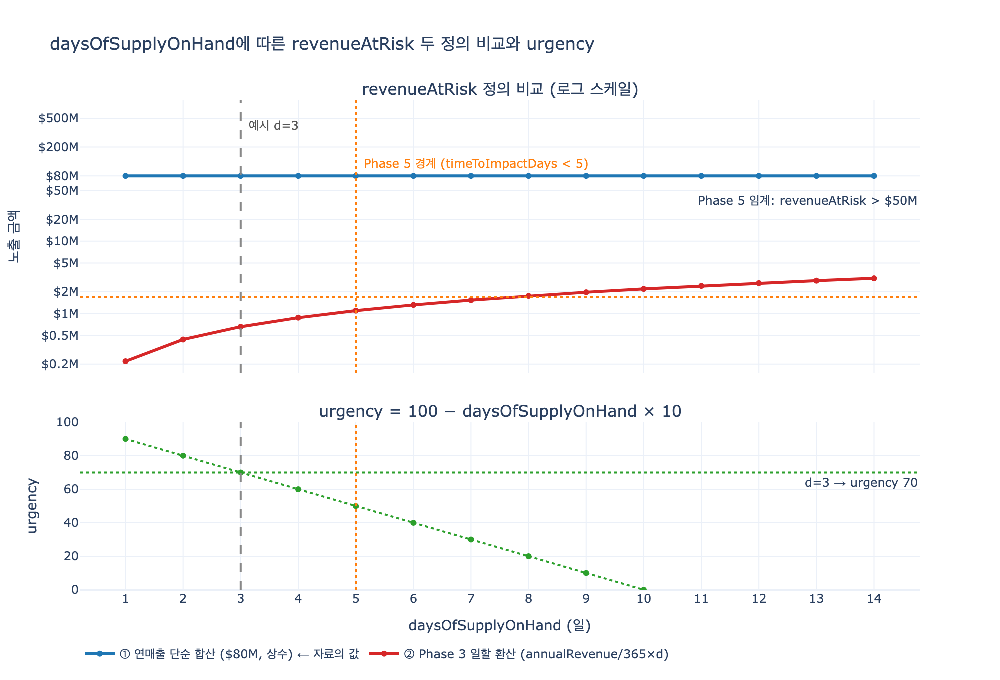

# 연쇄 예시의 RiskAssessment 결과 값

## 정답

- `revenueAtRisk` = **80M 달러**
- `timeToImpactDays` = **3**

한 줄 해석: **"3일 안에 조치하지 않으면 80M 달러 규모 매출이 위험해진다."**

## 어디서 나온 값인가

자료의 "The complete cascade example"(Risk Propagation Model 편)에 나오는 캐스케이드를 따라가면 두 숫자의 출처가 그대로 드러난다.

```
DisruptionEvent "Taiwan Power Outage" (2024-05-01, Critical severity)
│
└─ AFFECTS → Supplier "ChipX Corp" (singleSourced=true)
   │
   └─ SUPPLIES → Component "GPU Module" (daysOfSupplyOnHand=3)
      │
      ├─ USED IN → ProductLine "Gaming Laptop 2024" ($50M annual revenue)
      │          → ProductLine "Workstation Pro"    ($30M annual revenue)
      │
      └─ TRIGGERS → RiskAssessment
                    ├─ revenueAtRisk = $80M
                    └─ timeToImpactDays = 3
```

| 값 | 근거 |
|---|---|
| `revenueAtRisk` = 80M | 노출된 두 제품 라인의 `annualRevenue` 합: **50M + 30M = 80M** |
| `timeToImpactDays` = 3 | 병목 부품 GPU Module의 `daysOfSupplyOnHand`=3. 안전재고가 3일치뿐이므로 3일 뒤 생산이 멈춘다 |

자료의 "Why this structure enables automation" 3번 항목에서도 같은 값을 재확인한다.

> **Quantify** — "Calculate total revenue at risk ($80M) and time to impact (3 days)"

## 두 숫자의 의미

### `revenueAtRisk` = 80M 달러 — "얼마나 큰 돈이 걸려 있는가"

`RiskAssessment` 엔티티의 속성 정의(Core Entities & Properties 편)는 다음과 같다.

- `revenueAtRisk` (USD, decimal) — 사업 영향을 **금액**으로 환산한 값
- 용도: "Quantify impact in business terms (money and time) to prioritize response"

즉 이 숫자의 목적은 정밀한 손실 예측이 아니라 **우선순위 결정**이다. "ChipX Corp 하나가 멈추면 80M 달러 사업이 흔들린다"는 규모감이 있어야, 2M 달러짜리 대체 공급사 활성화가 합리적인 판단임을 즉시 알 수 있다.

- 완화 조치 비용: ChipX Europe 활성화 2M 달러 + 안전재고 확대 0.5M 달러 = **2.5M 달러**
- 노출 금액: **80M 달러**
- 비용은 노출액의 **약 3%** → "$2M vs. $80M loss"라는 자료의 표현이 그대로 성립

### `timeToImpactDays` = 3 — "언제까지 조치해야 하는가"

금액만으로는 행동할 수 없다. 80M 달러가 3일 뒤에 위험해지는 것과 3개월 뒤에 위험해지는 것은 완전히 다른 사안이다. `timeToImpactDays`는 **의사결정 창(window)의 길이**를 알려준다.

여기서 3일은 GPU Module의 `daysOfSupplyOnHand`=3에서 온다. 재고가 3일분 남았으니, 3일 안에 대체 물량이 도착하지 않으면 라인이 선다. 실제 워크플로에서도 이 숫자가 살아 있다.

- ChipX Europe이 48시간(2일) 배송을 확약 → `leadTimeSavedDays`=2로 3일 창 안에 들어옴
- 결과: "Production impact reduced from 7 days → 3 days", "Revenue protected: ~$100M of $127M exposure"

## 왜 3일이 임계값인가 — Phase 5 자동화 트리거

Mitigation Execution & Automation 편의 Phase 5는 두 숫자를 **그대로 조건문에 넣어** 자동 워크플로를 발동시킨다.

```
IF RiskAssessment.revenueAtRisk > $50M AND
   RiskAssessment.timeToImpactDays < 5:

   THEN:
     1. Create PurchaseOrder for recommended AlternativeSupplier
     2. Update ProductionSchedule with new timeline
     3. Send email to: Procurement / Operations / Finance / CEO·Board
     4. Create Activator alerts with escalation policy
     5. Start monitoring MitigationAction.status
```

이 예시를 대입하면:

| 조건 | 대입 | 판정 |
|---|---|---|
| `revenueAtRisk > $50M` | 80M > 50M | 참 |
| `timeToImpactDays < 5` | 3 < 5 | 참 |
| **AND 결합** | | **발동** |

두 조건이 **동시에** 참이어야 하므로, 3일이라는 값은 단순한 정보가 아니라 **자동 발주·경보·경영진 보고를 켜는 스위치**다. 이 예시에서 `daysOfSupplyOnHand`가 5일 이상이었다면 (금액이 같아도) 자동 워크플로는 발동하지 않고 통상 프로세스로 처리된다.

관련 지표로 `urgency`도 같은 일수에서 파생된다 (Phase 3).

$$\text{urgency} = 100 - \text{daysOfSupplyOnHand} \times 10 = 100 - 3 \times 10 = 70$$

> 참고: Phase 3의 판정 조건은 `critical_product_lines = WHERE urgency > 70`이므로, urgency=70은 엄격한 부등호(`>`)로는 경계에서 탈락한다. 실제 구현 시에는 `>=`인지 `>`인지 명시해야 하는 지점이다.

## 주의점: `revenueAtRisk` 정의가 자료 안에서 두 가지로 쓰인다

이 카드에서 가장 헷갈리기 쉬운 부분이다. 자료에는 `revenueAtRisk`를 계산하는 서로 다른 방식이 두 곳에 나온다.

### 정의 ① 연매출 단순 합산 (캐스케이드 예시가 쓰는 방식)

$$\text{revenueAtRisk} = \sum_{i \in \text{exposed}} \text{annualRevenue}_i = 50\text{M} + 30\text{M} = 80\text{M}$$

"노출된 제품 라인 사업의 규모 전체"를 뜻하는 **exposure(노출) 관점**이다. 캐스케이드 예시의 80M은 이쪽이다.

### 정의 ② Phase 3 일할 환산 공식

Phase 3 "Quantify impact"의 의사코드는 다르게 계산한다.

```
For each exposed ProductLine:
  revenue_at_risk = annualRevenue / 365 * daysOfSupplyOnHand
  urgency = 100 - (daysOfSupplyOnHand * 10)
```

$$\text{revenue\_at\_risk} = \frac{\text{annualRevenue}}{365} \times \text{daysOfSupplyOnHand}$$

이 공식을 같은 데이터에 적용하면:

| ProductLine | 계산 | 결과 |
|---|---|---|
| Gaming Laptop 2024 | 50M / 365 × 3 | 약 $410,959 |
| Workstation Pro | 30M / 365 × 3 | 약 $246,575 |
| **합계** | | **약 $657,534 (0.66M)** |

**80M이 아니라 0.66M**이 나온다. 두 정의는 정확히 다음 배율만큼 차이 난다.

$$\frac{\text{정의 ①}}{\text{정의 ②}} = \frac{\sum \text{annualRevenue}}{\sum \frac{\text{annualRevenue}}{365} \times d} = \frac{365}{d} = \frac{365}{3} \approx 121.7\ \text{배}$$

### 왜 신경 써야 하나

1. **시험/문제 대응**: "연쇄 예시의 RiskAssessment 결과 값"을 물으면 답은 캐스케이드 예시에 적힌 **80M**이다. Phase 3 공식을 적용해 계산하려 하면 틀린다.
2. **구현 시**: 어느 정의를 채택할지 온톨로지 문서에 못 박아야 한다. 정의가 섞이면 같은 `RiskAssessment` 레코드를 두 팀이 다르게 읽는다.
3. **임계값 연동**: Phase 5의 `> $50M` 임계는 정의 ①(연매출 합산) 스케일에 맞춰진 숫자다. 정의 ②로 계산하면 0.66M이므로 같은 사건에서 자동 워크플로가 **발동하지 않는다**. 정의를 바꾸려면 임계값도 함께 다시 잡아야 한다.
4. **Phase 3의 $127M과 예시의 $80M**: 두 숫자는 서로 다른 시나리오다. 80M은 GPU Module 하나(제품 라인 2개)의 캐스케이드이고, 127M은 공급사 3곳·부품 47개·제품 라인 12개가 얽힌 더 큰 지진 시나리오다. 부분이 전체보다 작은 것은 자연스럽다.

> 요약: 자료의 예시 값은 **연매출 합산 기준의 노출 금액**으로 읽고, Phase 3 공식은 **같은 아이디어의 보수적(기간 환산) 변형**으로 구분해 기억하면 된다.

## 함께 기억할 맥락

| 항목 | 값 | 비고 |
|---|---|---|
| `revenueAtRisk` | $80M | 50M + 30M |
| `timeToImpactDays` | 3 | GPU Module `daysOfSupplyOnHand` |
| urgency | 70 | 100 − 3×10 |
| Phase 5 트리거 | 발동 | 80M > 50M AND 3 < 5 |
| 완화 조치 A | ChipX Europe 활성화 | `estimatedCost`=$2M, `leadTimeSavedDays`=2 |
| 완화 조치 B | 안전재고 확대 | `estimatedCost`=$500K |
| 대체 공급사 | ChipX Europe | Approved, 50,000 units/month, +12% |

`RiskAssessment`의 나머지 속성(`assessmentId`, `assessedDate`, `confidenceLevel`, `recommendedAction`)도 같은 엔티티에 함께 담기며, ID 규칙은 `RA-20240501-SEM-001` 형태다.

## 시각화



위 그래프는 `daysOfSupplyOnHand`를 1~14일로 바꿔가며 두 정의를 비교한다.

- **파란 선(정의 ①)**: 연매출 합산이므로 일수와 무관한 상수 $80M. 자료의 값이 여기 놓인다.
- **빨간 선(정의 ②)**: Phase 3 일할 환산은 일수에 비례해 선형 증가하며, d=3에서 약 $0.66M에 머문다.
- **주황 점선**: Phase 5 임계 두 개 (`revenueAtRisk > $50M` 수평선, `timeToImpactDays < 5` 수직선). 파란 선은 임계를 넘지만 빨간 선은 어떤 일수에서도 못 넘는다 — 정의를 바꾸면 트리거가 죽는다는 뜻.
- **아래 패널**: urgency는 일수에 대해 선형 감소하고, d=3에서 정확히 70을 지난다.
