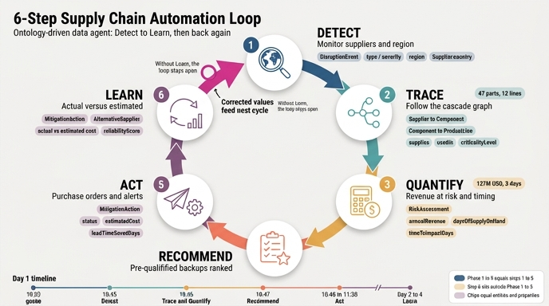

# 온톨로지 구조가 데이터 에이전트에게 가능하게 하는 6단계 자동화

## 질문

이 구조가 데이터 에이전트에게 가능하게 하는 6단계 자동화는?

## 답

① **Detect**(대상 공급업체·지역 모니터링), ② **Trace**(영향 제품 라인 자동 추적), ③ **Quantify**(위험 매출·영향 도달 시간 계산), ④ **Recommend**(사전 검증 대체 공급업체 제안), ⑤ **Act**(조달 알림·생산 일정 갱신·이해관계자 통보), ⑥ **Learn**(실제 효과 대 추정치 추적).

---

## 왜 "이 구조"가 자동화의 전제인가

여기서 "이 구조"는 7개 엔터티(Supplier, Component, ProductLine, DisruptionEvent, RiskAssessment, MitigationAction, AlternativeSupplier) + 40개 속성 + **7개 관계**로 짜인 리스크 전파 그래프다. 6단계 자동화는 새로운 알고리즘이 아니라, **에이전트가 이 그래프의 간선(edge)을 순서대로 따라 걷는 행위**에 이름을 붙인 것이다.

```
Disruption → affects → Supplier → supplies → Component → usedIn → ProductLine
     │
     └→ triggers → RiskAssessment → recommends → MitigationAction → activates → AlternativeSupplier → canReplace → Supplier
```

앞쪽 절반(affects / supplies / usedIn)이 **Detect·Trace·Quantify**를, 뒤쪽 절반(triggers / recommends / activates / canReplace)이 **Recommend·Act**를 지탱한다. 그리고 실행 후 남는 `MitigationAction`·`RiskAssessment` 레코드의 "추정치 vs 실측치" 비교가 **Learn**이다. 관계가 없으면 조인(join)을 사람이 스프레드시트로 손으로 하게 되고, 그것이 바로 "며칠 걸리는 분석"의 정체다.

---

## Phase 1~5 및 Day 1 타임라인(10:30~11:30) 매핑

| 단계 | Mitigation Execution 단계 | 상대 시각 | Day 1 타임라인 | 그 시점의 산출물 |
|---|---|---|---|---|
| ① **Detect** | Phase 1: Detection | minute 0 | **10:30** 대만 규모 6.8 지진 발생 → **10:45** `DisruptionEvent` 생성 (type=Natural Disaster, severity=Critical, region=Taiwan, estimatedDurationDays=7) | 위험 공급업체 3곳 식별 |
| ② **Trace** | Phase 2: Trace impact | minute 5 | **10:46** 데이터 에이전트가 그래프 순회 | 부품 47개 → 제품 라인 12개 노출 |
| ③ **Quantify** | Phase 3: Quantify impact | minute 15 | **10:46~10:47** 계산 엔진 → `RiskAssessment` 생성 | 위험 매출 $127M, 생산 중단까지 3일, 영향 고객 45만+ |
| ④ **Recommend** | Phase 4: Recommend actions | minute 20 | **10:47** `RiskAssessment`가 ROI 순으로 액션 랭킹 | Top 3 액션 (ChipX Europe 활성화 / 안전재고 증량 / 부품 재설계) |
| ⑤ **Act** | Phase 5: Execute | minute 25 | **10:48** `MitigationAction` 자동 생성(PO 발행, 안전재고 발주, 조달·운영·재무 알림) → **10:50** Activator 발동(대시보드·에스컬레이션·조달팀 확인) → **11:30** `MitigationAction.status = "In Progress"` | PO 진행, 48시간 선적 확약, 생산 영향 7일 → 3일 |
| ⑥ **Learn** | **Phase 1~5에 없음** — "Day 2~4 Monitoring and adjustment" + "Continuous improvement" 지표표가 담당 | 11:30 이후 ~ 사후 | 4시간마다 재계산, **Day 3** 입고 시 `status="Completed"`, 실제 비용 $2.1M(추정 $2M), 매출 방어 $127M 중 약 $100M | 6개 개선 지표(탐지 속도, 추적 정확도, 영향 추정 정확도, 대응 소요 시간, 비용 효율, 매출 방어율) 갱신 |

> **핵심 포인트**: Phase는 5개인데 자동화 단계는 6개다. Learn은 Day 1의 1시간 스프린트 **밖**에 존재하며, 실행이 끝난 뒤 실측치가 들어와야 비로소 계산된다. 시험에서 "Phase 5 = Act까지"와 "6단계 = Learn 포함"을 구분해서 기억하는 것이 중요하다.

---

## 각 단계가 의존하는 관계/속성

| 단계 | 의존 관계(relationship) | 의존 속성(property) | 이 단계가 만드는/갱신하는 엔터티 |
|---|---|---|---|
| ① Detect | `DisruptionEvent affects Supplier` (M:N) | `DisruptionEvent.type`·`severity`·`region`·`startDate`·`estimatedDurationDays`, `Supplier.country`·`tier`·`singleSourced`·`reliabilityScore` | `DisruptionEvent` 생성 |
| ② Trace | `Supplier supplies Component` (1:N) → `Component usedIn ProductLine` (M:N) | `Component.componentId`·`category`·`criticalityLevel`, `ProductLine.productLineId`·`productionStatus` | `ProductLine.productionStatus` → At Risk |
| ③ Quantify | ②의 순회 결과를 집계 + `DisruptionEvent triggers RiskAssessment` (1:N) | `ProductLine.annualRevenue`, `Component.daysOfSupplyOnHand` → `RiskAssessment.revenueAtRisk`·`timeToImpactDays`·`confidenceLevel`·`assessedDate` | `RiskAssessment` 생성 |
| ④ Recommend | `RiskAssessment recommends MitigationAction` (1:N), `AlternativeSupplier canReplace Supplier` (M:1) | `AlternativeSupplier.qualificationStatus`(=Approved)·`capacityAvailable`·`pricePremiumPercent`·`country`, `MitigationAction.type`·`estimatedCost`·`leadTimeSavedDays` | `MitigationAction` (status=Proposed) |
| ⑤ Act | `MitigationAction activates AlternativeSupplier` (M:N) | 트리거 조건 `RiskAssessment.revenueAtRisk > $50M AND timeToImpactDays < 5`, `MitigationAction.status` → Approved/In Progress | PurchaseOrder·ProductionSchedule·Activator 알림 |
| ⑥ Learn | ④·⑤가 남긴 레코드를 **되돌아 읽음** (RiskAssessment ↔ MitigationAction) | `estimatedCost` vs 실제 비용, `leadTimeSavedDays` vs 실제 절감, `revenueAtRisk` vs 실제 손실, `AlternativeSupplier.reliabilityScore` | 속성 값·검증 상태·신뢰도 보정 (다음 사이클 입력) |

### 계산식 두 개 (③ Quantify)

```
revenue_at_risk = annualRevenue / 365 * daysOfSupplyOnHand
urgency         = 100 - (daysOfSupplyOnHand * 10)
total_revenue_at_risk = SUM(revenue_at_risk)
critical_product_lines = WHERE urgency > 70
```

`annualRevenue`(ProductLine)와 `daysOfSupplyOnHand`(Component)가 **서로 다른 엔터티의 속성**임에 주목하자. ② Trace의 `usedIn` 관계가 이 둘을 같은 계산식에 올려준다 — 관계가 없으면 ③은 산술적으로 불가능하다.

### ④가 "사전 검증(pre-qualified)"인 이유

`qualificationStatus`가 Pre-qualified/Approved 상태로 **미리** 채워져 있어야 20분 안에 제안이 나온다. 재난 발생 후 감사(Pending Audit)를 시작하면 리드타임이 수 주다. 즉 ④의 속도는 평시에 축적한 데이터 품질에 종속된다. 필터 조건에 `country NOT IN earthquake_region`이 들어가는 것도 중요하다 — 대체처가 같은 재난 권역에 있으면 대체가 아니다.

---

## ⑥ Learn이 없으면 왜 다음 대응이 개선되지 않는가

Learn은 루프를 **닫는(closed loop)** 단계다. 이것이 빠지면 ①~⑤는 매번 같은 품질로 반복되는 열린 파이프라인이 되고, 다음과 같이 무너진다.

1. **추정치가 영원히 교정되지 않는다.** Day 3 실적은 실제 비용 $2.1M(추정 $2M), 방어 매출 약 $100M / 노출 $127M이다. 이 델타를 되먹이지 않으면 `estimatedCost`·`leadTimeSavedDays`는 최초에 누군가 넣은 값에 고정된다. ④의 ROI 랭킹은 그 값으로 계산되므로, **틀린 값이 다음 재난에서도 똑같이 1위 액션을 뽑는다.**
2. **"서류상 승인"과 "실제 납품"을 구분할 수 없다.** `qualificationStatus=Approved`인데 실제로는 48시간 선적을 못 지킨 대체 공급업체가 있어도, 실적이 `reliabilityScore`에 반영되지 않으면 계속 추천된다. Learn은 "어떤 대체처가 실제로 성과를 냈고, 어떤 리드타임이 실제로 지켜졌는지"를 속성 값으로 되돌려 쓰는 유일한 경로다.
3. **개선 지표를 측정할 수 없으니 목표도 없다.** 탐지 속도 <1h, 추적 정확도 >95%, 영향 추정 정확도 ±10%, 대응 소요 <2h, 비용 효율 ±5%, 매출 방어율 >80% — 이 6개 목표는 모두 "추정 대비 실측"을 전제한다. Learn이 없으면 지표가 공란이고, 공란인 지표는 개선 대상이 되지 못한다.
4. **모델의 구조적 결함이 드러나지 않는다.** 추적 정확도가 95% 미만이라는 사실은, 온톨로지에 **누락된 관계나 미등록 Tier 2/3 공급업체**가 있다는 신호다. Learn 단계가 이 신호를 잡아주지 않으면, 다음 재난에서도 같은 부품이 레이더 밖에 남는다.
5. **조직의 신뢰가 축적되지 않는다.** ⑤ Act는 사람의 승인 없이 PO를 발행하고 경영진에게 에스컬레이션한다. 이런 자동 실행 권한은 "지난번 추정이 실제와 ±10% 안에 맞았다"는 이력으로만 정당화된다. 이력이 없으면 매번 수동 검토로 회귀하고, 25분 대응은 다시 며칠짜리 회의가 된다.

한 문장으로: **①~⑤는 이번 재난을 처리하고, ⑥은 다음 재난을 더 잘 처리하게 만든다.** 그래서 6단계는 직선이 아니라 Learn → Detect로 되돌아오는 원이다. 자료의 표현대로 "각 disruption 이벤트는 학습 기회가 된다".

---

## 암기 훅

- 순서 첫 글자: **D-T-Q-R-A-L** ("Detect, Trace, Quantify, Recommend, Act, Learn")
- 성격으로 묶기: **관측(D)** → **그래프 순회(T)** → **계산(Q)** → **결정(R)** → **실행(A)** → **되먹임(L)**
- 시각으로 묶기: 10:45 D / 10:46 T·Q / 10:47 R / 10:48~11:30 A / Day 2~4 L
- 숫자 앵커: 공급업체 3 → 부품 47 → 제품 라인 12 → $127M → 3일

## 인포그래픽


