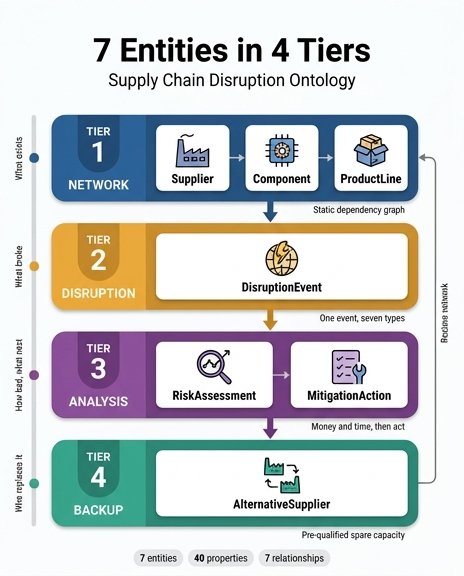

# 7개 엔터티의 4개 티어 구성

## 질문과 답

**Q.** 7개 엔터티의 4개 티어 구성은?

**A.** Tier 1 네트워크: Supplier·Component·ProductLine, Tier 2 교란: DisruptionEvent, Tier 3 분석: RiskAssessment·MitigationAction, Tier 4 백업: AlternativeSupplier.

## 한눈에 보기

```
Tier 1  네트워크    Supplier  ·  Component  ·  ProductLine        (평시 구조)
   ↓                     ↑ 무엇이 무엇에 의존하는가
Tier 2  교란        DisruptionEvent                              (사건 발생)
   ↓                     ↑ 무엇이 깨졌는가
Tier 3  분석        RiskAssessment  ·  MitigationAction          (판단과 결정)
   ↓                     ↑ 얼마나 손해인가 / 무엇을 할까
Tier 4  백업        AlternativeSupplier                          (대응 자원)
                         ↑ 누구로 대체하는가
```

핵심은 **엔터티 개수(7)가 아니라 티어의 순서**다. 이 순서는 임의의 분류가 아니라 실제 리스크 관리 사이클(정상 상태 → 사건 → 분석 → 대응)을 그대로 옮긴 것이다.

## 왜 이 순서인가

### Tier 1 — 네트워크: "평시에 이미 존재하는 것"

Supplier / Component / ProductLine은 교란이 없어도 항상 존재하는 **정적 구조(static backbone)**다. 공급업체가 부품을 공급하고(`supplies`, 1:N), 부품이 제품군에 쓰이는(`usedIn`, M:N) 의존 그래프가 여기서 만들어진다.

이 티어가 맨 앞에 오는 이유는 **의존 경로가 미리 그려져 있어야 나중에 전파를 추적할 수 있기** 때문이다. 사건이 터진 뒤에 "누가 무엇을 공급하지?"를 조사하기 시작하면 이미 늦는다. 자료의 표현대로, 온톨로지 없이는 이 분석이 며칠 걸리고 수동 스프레드시트에 의존한다.

### Tier 2 — 교란: "구조를 때리는 단일 사건"

DisruptionEvent는 네트워크에 **외부에서 들어오는 트리거**다. Tier 1 다음에 오는 것은 필연적이다. 때릴 대상(Supplier)이 정의되어 있지 않으면 `affects` 관계(M:N)를 걸 곳이 없다.

이 티어에 엔터티가 하나뿐인 것도 의미가 있다. 지진·지정학·재무 부실·물류·품질 리콜·팬데믹·사이버 공격은 성격이 전혀 다르지만, 온톨로지 관점에서는 모두 "공급을 중단시키는 사건"이라는 동일한 형태를 갖는다. 따라서 별개 엔터티로 쪼개지 않고 `type` **enum 속성 하나로 흡수**한다. `severity`와 함께 이 두 enum이 에스컬레이션 등급과 대응 시한을 결정한다.

### Tier 3 — 분석: "사건과 대응 사이의 판단 계층"

RiskAssessment와 MitigationAction이 함께 묶이는 이유는 둘이 하나의 판단 사이클을 이루기 때문이다.

- **RiskAssessment** = 진단. 사건을 **비즈니스 언어(돈과 시간)로 번역**한다. `revenueAtRisk`(USD), `timeToImpactDays` — 이 두 숫자가 있어야 우선순위를 정할 수 있다.
- **MitigationAction** = 처방. 진단 결과에서 나오는 구체적 행동이며 `estimatedCost`와 `leadTimeSavedDays`로 비용·효익을 계산할 수 있다.

관계 방향이 순서를 강제한다. `DisruptionEvent triggers RiskAssessment`(1:N) → `RiskAssessment recommends MitigationAction`(1:N). 즉 **평가 없이 행동으로 건너뛸 수 없다.** 이것이 3티어를 2티어와 4티어 사이에 끼워 넣는 이유다. 예시 시나리오에서 $80M 손실 대비 $2M 비용의 대안을 고르는 판단이 바로 이 티어에서 일어난다.

### Tier 4 — 백업: "미리 준비된 대응 자원"

AlternativeSupplier는 마지막에 온다. 왜 Tier 1의 Supplier와 합치지 않는가?

Supplier는 **현재 공급 중인 관계**를 나타내고, AlternativeSupplier는 **아직 쓰이지 않는 잠재적 대체 역량**을 나타낸다. 성격이 다르므로 속성도 다르다. AlternativeSupplier에는 `qualificationStatus`(사전 자격심사 여부), `capacityAvailable`(월 단위 수용 가능량), `pricePremiumPercent`(가격 프리미엄) 같은 **"지금 당장 전환 가능한가"를 판정하는 속성**이 들어간다. Supplier에는 `reliabilityScore`, `singleSourced` 같은 **"현재 얼마나 위험한가"를 판정하는 속성**이 들어간다.

또한 이 티어는 **사이클을 닫는다**. `AlternativeSupplier canReplace Supplier`(M:1) 관계로 Tier 4가 Tier 1로 되돌아가면서, 교란 → 분석 → 대체 → 정상 네트워크 복구의 폐루프가 완성된다.

## 티어별 엔터티와 핵심 속성

| 티어 | 엔터티 | 식별자 | 핵심 속성 | 역할 |
|---|---|---|---|---|
| **1 네트워크** | Supplier | `supplierId` | `country`, `tier`(Tier 1/2/3), `reliabilityScore`(0-100), `singleSourced`(bool) | 단일 공급처 = 리스크 증폭기 식별 |
| **1 네트워크** | Component | `componentId` | `category`, `daysOfSupplyOnHand`, `criticalityLevel` | 안전재고로 버틸 수 있는 기간 판정 |
| **1 네트워크** | ProductLine | `productLineId` | `annualRevenue`, `marketSegment`, `productionStatus` | 매출 노출액·생산 타임라인 산정 |
| **2 교란** | DisruptionEvent | `eventId` | `type`(7종 enum), `severity`, `startDate`, `estimatedDurationDays`, `region` | 분류·심각도로 에스컬레이션 결정 |
| **3 분석** | RiskAssessment | `assessmentId` | `assessedDate`, `revenueAtRisk`(USD), `timeToImpactDays`, `confidenceLevel`, `recommendedAction` | 영향을 돈·시간으로 정량화 |
| **3 분석** | MitigationAction | `actionId` | `type`(6종 enum), `status`, `estimatedCost`, `leadTimeSavedDays` | 실행 추적 및 예상 대비 실효성 검증 |
| **4 백업** | AlternativeSupplier | `altSupplierId` | `qualificationStatus`, `capacityAvailable`(units/month), `pricePremiumPercent` | 용량·비용을 알고 즉시 전환 |

## 티어가 실행 단계로 그대로 매핑된다

이 구조가 잘 설계되었다는 증거는, 4개 티어가 자동화 워크플로의 5단계와 거의 일대일로 대응한다는 점이다.

| 실행 단계 | 사용되는 티어 |
|---|---|
| Phase 1 탐지 (0분) | Tier 2 → Tier 1 (`region`·`country` 매칭) |
| Phase 2 영향 추적 (5분) | Tier 1 (`supplies` → `usedIn` 순회) |
| Phase 3 정량화 (15분) | Tier 1 → Tier 3 (`annualRevenue`, `daysOfSupplyOnHand`로 계산) |
| Phase 4 대안 추천 (20분) | Tier 3 → Tier 4 (`qualificationStatus`, `capacityAvailable` 필터) |
| Phase 5 실행 (25분) | Tier 3 (`MitigationAction.status` 모니터링) |

## 암기 포인트

- **개수 배분: 3 – 1 – 2 – 1** (합 7). 첫 티어만 3개, 나머지는 1-2개.
- **한 단어 요약**: 네트워크(무엇이 있나) → 교란(무엇이 깨졌나) → 분석(얼마고 어떻게) → 백업(누구로 대체).
- 헷갈리기 쉬운 지점: **MitigationAction은 Tier 3(분석)** 이지 Tier 4가 아니다. Tier 4는 "행동"이 아니라 그 행동이 동원하는 **자원(백업 공급업체)**만 담는다.
- 전체 통계: 7 엔터티 / 40 속성 / 7 관계, Fabric IQ 데이터 에이전트 호환.

## 인포그래픽


