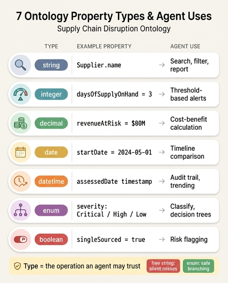

# 온톨로지 속성의 7가지 타입과 에이전트에서의 용도

## 한눈에 보기

Supply Chain Disruption & Risk Propagation 온톨로지는 7개 엔티티에 걸쳐 **40개 속성**을 담고 있고, 각 속성에는 반드시 타입이 붙는다. 타입은 단순한 "데이터 저장 형식"이 아니라 **에이전트가 그 속성으로 무엇을 할 수 있는지를 결정하는 계약**이다.

| 타입 | 이 온톨로지의 실제 예시 | 에이전트에서의 용도 |
|---|---|---|
| `string` | `Supplier.name`, `Component.name`, `DisruptionEvent.region`, `RiskAssessment.recommendedAction` | 검색 · 필터링 · 리포트 |
| `integer` | `Component.daysOfSupplyOnHand`, `AlternativeSupplier.capacityAvailable`, `DisruptionEvent.estimatedDurationDays`, `RiskAssessment.timeToImpactDays`, `MitigationAction.leadTimeSavedDays` | 임계값 기반 알림 |
| `decimal` | `Supplier.reliabilityScore`(0–100), `ProductLine.annualRevenue`, `RiskAssessment.revenueAtRisk`, `MitigationAction.estimatedCost`, `AlternativeSupplier.pricePremiumPercent` | 비용·편익 계산 |
| `date` | `DisruptionEvent.startDate` | 타임라인 비교 |
| `datetime` | `RiskAssessment.assessedDate` | 감사 추적(audit trail) · 추세 분석 |
| `enum` | `Supplier.tier`, `Component.criticalityLevel`, `DisruptionEvent.type`/`severity`, `MitigationAction.status`, `AlternativeSupplier.qualificationStatus` | 분류 · 의사결정 트리 |
| `boolean` | `Supplier.singleSourced` | 리스크 플래깅 |

---

## 타입별 상세

### 1. `string` — 검색 · 필터 · 리포트

**예시**: `Supplier.name`("ChipX Corp"), `Component.name`("GPU Module"), `DisruptionEvent.region`("Taiwan"), `RiskAssessment.recommendedAction`, 그리고 `supplierId`("SUPP-00456") 같은 식별자.

**에이전트 용도**: 자연어 질의를 데이터에 연결하는 접점이다. "Show me all components from suppliers in Taiwan"이라는 질문은 결국 `Supplier.country`와 `DisruptionEvent.region` 문자열 매칭으로 내려간다. 리포트와 알림 메일의 사람이 읽는 라벨도 대부분 string이다.

**주의**: string은 자유도가 높아서 **계산도, 정렬도, 유효성 보장도 안 된다.** 그래서 상태·분류처럼 값의 집합이 정해진 것은 절대 string으로 두면 안 된다(아래 enum 항목 참고).

### 2. `integer` — 임계값 기반 알림

**예시**: `Component.daysOfSupplyOnHand`(3일), `AlternativeSupplier.capacityAvailable`(50,000 units/month), `DisruptionEvent.estimatedDurationDays`(7), `RiskAssessment.timeToImpactDays`(3), `MitigationAction.leadTimeSavedDays`(2).

**에이전트 용도**: "**언제 터지는가**"를 판단하는 카운트다운 숫자다. 정수이기 때문에 `>`, `<`, `>=` 비교가 무조건 안전하게 성립하고, 그 위에 임계값 규칙을 그대로 얹을 수 있다.

```
IF RiskAssessment.timeToImpactDays < 5 THEN escalate
urgency = 100 - (daysOfSupplyOnHand * 10)
critical_product_lines = WHERE urgency > 70
```

추천 엔진에서도 `capacityAvailable >= demand` 필터로 "물량을 받아줄 수 있는 대체 공급사"를 곧바로 걸러낸다. 만약 이 값이 `"3 days"`, `"about a week"` 같은 문자열이었다면 이 규칙은 파싱 실패로 무너진다.

### 3. `decimal` — 비용·편익 계산

**예시**: `Supplier.reliabilityScore`(0–100), `ProductLine.annualRevenue`($50M), `RiskAssessment.revenueAtRisk`($80M), `MitigationAction.estimatedCost`($2M), `AlternativeSupplier.pricePremiumPercent`(12%).

**에이전트 용도**: 돈과 비율은 소수점이 살아 있어야 한다. 이 온톨로지의 핵심 판단은 "**$2M을 써서 $80M을 지키는 게 맞는가**"라는 ROI 비교이며, 여기에 나오는 나눗셈·집계·가중 점수는 모두 decimal 위에서 이루어진다.

```
revenue_at_risk = annualRevenue / 365 * daysOfSupplyOnHand
total_revenue_at_risk = SUM(revenue_at_risk)     → $127M
```

대체 공급사 순위화 역시 `leadTimeSavedDays`, `pricePremiumPercent`, `reliabilityScore`를 섞어 점수를 매기는 작업이다. 금액을 integer로 잘랐다면 12%의 프리미엄 계산이나 일할 계산에서 반복 오차가 누적되고, float 부동소수점을 썼다면 회계 대조에서 센트 단위 불일치가 생긴다. 통화·비율에 decimal을 쓰는 이유가 여기 있다.

### 4. `date` — 타임라인 비교

**예시**: `DisruptionEvent.startDate`(2024-05-01).

**에이전트 용도**: "이 사건이 언제 시작됐고, 지금 며칠째인가"를 계산하는 기준점이다. `startDate + estimatedDurationDays`로 예상 회복일을 뽑고, 재고 소진일(`daysOfSupplyOnHand`)과 겹쳐 보면 "생산 중단이 실제로 발생하는 날"이 나온다.

**date vs datetime**: 사건 발생일처럼 **하루 단위 해상도로 충분하고 타임존을 끌어들이면 오히려 해로운 값**은 date가 맞다. 재해 시작일에 시·분을 붙이면 지역 표준시 문제로 날짜가 하루 밀리는 사고가 생긴다.

### 5. `datetime` — 감사 추적 · 추세 분석

**예시**: `RiskAssessment.assessedDate`.

**에이전트 용도**: 같은 날 안에서도 **순서**가 중요한 값이다. Day 1 워크플로를 보면 10:45(이벤트 생성) → 10:46(영향 추적) → 10:47(RiskAssessment 생성) → 10:48(MitigationAction 자동 생성) → 10:50(Activator 발동)으로 분 단위 기록이 이어진다.

- **감사 추적**: "누가 언제 무슨 판단을 했는가"를 재구성해야 규제 대응과 사후 검토가 가능하다.
- **추세 분석**: 재고 데이터가 갱신될 때마다(예: 4시간마다) 새 RiskAssessment가 쌓이고, assessedDate 순으로 정렬하면 리스크가 커지는지 줄어드는지 곡선이 보인다. "최신 평가"를 고르는 것도 datetime 정렬이다.
- 개선 지표 중 "Detection speed = 교란 발생부터 RiskAssessment까지의 시간(< 1시간)"은 datetime 없이는 아예 측정 불가다.

### 6. `enum` — 분류 · 의사결정 트리

**예시**:
- `Supplier.tier` → Tier 1 / Tier 2 / Tier 3
- `Component.category` → Electronic / Mechanical / Chemical / Packaging / Raw Material
- `Component.criticalityLevel` → Critical / High / Medium / Low
- `ProductLine.productionStatus` → Active / At Risk / Halted / Discontinued
- `DisruptionEvent.type` → Natural Disaster / Geopolitical / Financial / Logistics / Quality Recall / Pandemic / Cyber Attack
- `DisruptionEvent.severity` → Critical / High / Medium / Low
- `RiskAssessment.confidenceLevel` → High / Medium / Low
- `MitigationAction.type` → Activate Alternative Supplier / Increase Safety Stock / Redesign Component / Reduce Production / Expedite Shipment / Customer Communication
- `MitigationAction.status` → Proposed / Approved / In Progress / Completed / Cancelled
- `AlternativeSupplier.qualificationStatus` → Pre-qualified / Approved / Pending Audit / Not Qualified

**에이전트 용도**: 분기 로직의 재료다. severity가 Critical이면 에스컬레이션 레벨과 응답 시한이 정해지고, `qualificationStatus="Approved"`인 대체 공급사만 자동 발주 대상이 되며, `MitigationAction.status`는 워크플로 상태 기계 그 자체다.

**왜 free string보다 enum이 나은가** — 이 카드에서 가장 중요한 포인트다.

1. **값 집합이 닫혀 있어 분기를 빠짐없이 쓸 수 있다.** enum이면 severity의 경우가 4개뿐임을 스키마가 보증하므로 의사결정 트리에 누락된 가지가 없다. free string이면 어떤 값이 올지 모르니 모든 규칙에 "그 외" 처리가 필요하고, 그 "그 외"로 빠진 Critical 건이 조용히 무시된다.
2. **표기 변형이 자동화를 조용히 깨뜨린다.** `"Approved"` / `"approved"` / `"APPROVED"` / `"Approved "`(뒤 공백) / `"Aproved"`(오타)는 문자열로는 전부 다른 값이다. `WHERE qualificationStatus = "Approved"` 필터가 승인된 대체 공급사를 놓치면, 재난 상황에서 **쓸 수 있는 백업이 없다고 잘못 판단**한다.
3. **집계와 추세가 성립한다.** "이번 분기 Natural Disaster 유형 몇 건"이라는 집계는 라벨이 정규화돼 있을 때만 맞는다. free string은 동의어가 흩어져 카운트가 쪼개진다.
4. **순서를 부여할 수 있다.** Critical > High > Medium > Low라는 서열을 스키마 수준에서 정의해 두면 우선순위 정렬과 임계 비교가 가능하다. 문자열 알파벳 정렬은 High < Low < Medium 같은 무의미한 순서를 낸다.
5. **LLM 에이전트의 출력이 안정된다.** 데이터 에이전트가 값을 채워 넣을 때 enum은 선택지를 제시하므로 환각된 새 카테고리("Severe", "Urgent-ish")를 만들 수 없다. 자연어 질의를 스키마에 grounding하기도 쉬워진다.
6. **UI·권한·SLA를 값에 붙일 수 있다.** enum 값마다 색상, 담당 팀, 에스컬레이션 정책을 매핑해 둘 수 있다. 무한한 문자열 공간에는 정책을 붙일 수 없다.

요약하면 enum은 **"이 필드로 자동 분기해도 안전하다"는 선언**이고, string은 "사람이 읽으라"는 선언이다. 온톨로지 요약이 "**Automation-ready with enum classifications and timestamps**"라고 못 박은 이유다.

### 7. `boolean` — 리스크 플래깅

**예시**: `Supplier.singleSourced`.

**에이전트 용도**: 단일 공급 여부는 리스크 증폭 여부를 가르는 이진 플래그다. 대체 경로가 없다는 뜻이므로, 이 하나가 true인 순간 같은 교란이 훨씬 심각한 결과를 낳는다.

```
User: "What's our supply chain risk exposure right now?"
  → Supplier WHERE singleSourced = true
  → 해당 공급사의 Component → ProductLine → revenueAtRisk 합산
  → "3개의 critical single-source 공급사, 교란 시 4~9일 내 약 $180M 손실"
```

boolean은 인덱싱과 필터가 가장 값싸서 상시 모니터링 대시보드의 진입 필터로 이상적이다. **주의**: 3-상태가 될 여지가 있는 값(예: "심사 중")은 boolean으로 두면 나중에 표현이 막힌다. 그래서 `qualificationStatus`는 boolean(승인/미승인)이 아니라 4값 enum으로 설계됐다 — Pending Audit과 Not Qualified는 의미가 다르고, 대응 액션도 다르기 때문이다.

---

## 타입 선택이 자동화 품질에 미치는 영향

| 잘못된 타입 선택 | 깨지는 자동화 |
|---|---|
| 일수를 string으로 (`"3 days"`) | `timeToImpactDays < 5` 임계값 알림이 파싱 실패 → 에스컬레이션 누락 |
| 금액을 integer/float으로 | ROI 비교와 비용 대조에 오차 누적 → "Cost efficiency ±5%" 지표 붕괴 |
| severity/status를 free string으로 | 의사결정 트리 분기 누락, 승인된 백업 미검출, 집계 카운트 분산 |
| assessedDate를 date로 | 같은 날 여러 평가의 순서 소실 → 감사 추적·추세 분석 불가 |
| startDate를 datetime으로 | 타임존 때문에 날짜가 하루 밀림 → 타임라인 비교 오류 |
| singleSourced를 string("Yes"/"Y") | 리스크 플래그 필터가 일부 레코드를 놓침 |

**핵심 원리**: 타입은 에이전트에게 주는 **연산 허가증**이다. 온톨로지의 목표가 "탐지 → 추적 → 정량화 → 추천 → 실행 → 학습" 6단계를 사람 개입 없이 도는 것이라면, 각 단계가 요구하는 연산(비교, 산술, 정렬, 분기, 필터)을 타입이 미리 보장해 줘야 한다. 타입을 느슨하게 잡는 순간 그 보장이 사라지고, 실패는 **에러가 아니라 조용한 오탐/미탐**으로 나타난다 — 재난 대응에서 가장 위험한 실패 방식이다.

## 암기 팁

**string 검색 / integer 임계 / decimal 계산 / date 날짜비교 / datetime 감사·추세 / enum 분류·분기 / boolean 플래그**

정확도 축(문자→정수→소수), 시간 축(date→datetime), 판단 축(enum→boolean) 세 묶음으로 나눠 기억하면 7개가 3덩어리로 줄어든다.

## 인포그래픽


