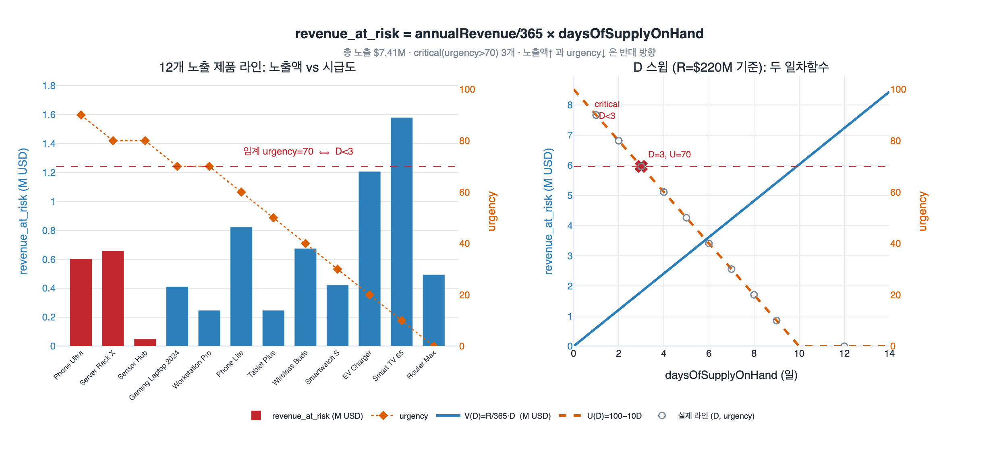

# Phase 3: 제품 라인별 위험 매출(revenue_at_risk) 계산식

## 질문과 답

**Q.** Phase 3에서 제품 라인별 위험 매출을 계산하는 식은?

**A.**

$$\text{revenue\_at\_risk} = \frac{\text{annualRevenue}}{365} \times \text{daysOfSupplyOnHand}$$

연 매출을 일 매출로 환산한 뒤 재고 소진 일수를 곱한다.

---

## 1. 이 식이 등장하는 맥락

자산 문서 `supply-chain-disruption-path.md`의 **Mitigation Execution & Automation** 장은 공급망 중단 대응을 5단계 파이프라인으로 나눈다.

| Phase | 시점 | 하는 일 | 산출물 |
|---|---|---|---|
| Phase 1 Detection | minute 0 | 외부 신호로 영향받은 `Supplier` 식별 | 3개 critical supplier |
| Phase 2 Trace impact | minute 5 | `Supplier → supplies → Component → usedIn → ProductLine` 경로 순회 | 47 components, 12 product lines |
| **Phase 3 Quantify impact** | **minute 15** | **노출된 제품 라인을 금액·시간으로 환산** | **총 $127M, 3일** |
| Phase 4 Recommend actions | minute 20 | `AlternativeSupplier` 후보 점수화 | Top 3 액션 |
| Phase 5 Execute | minute 25 | 자동 워크플로 트리거 | PO, 알림, Activator |

Phase 2까지는 **"누가 영향을 받는가"** 라는 그래프 순회 문제다. 여기까지는 온톨로지의 관계(relationship)만으로 답이 나온다. 하지만 경영진이 결정을 내리려면 "12개 제품 라인이 노출됐다"가 아니라 **"127백만 달러가 위험하고 3일 남았다"** 라는 문장이 필요하다. Phase 3이 그래프 구조를 **비즈니스 단위(돈, 시간)로 번역**하는 지점이고, 그 번역기가 바로 이 두 줄짜리 계산이다.

자산 문서의 원문(라인 373~387):

```
Calculation Engine:
  For each exposed ProductLine:
    revenue_at_risk = annualRevenue / 365 * daysOfSupplyOnHand
    urgency = 100 - (daysOfSupplyOnHand * 10)

  Aggregate:
    total_revenue_at_risk = SUM(revenue_at_risk)
    critical_product_lines = WHERE urgency > 70

  Result:
    Total at risk: $127M
    Critical timeline: 3 days
    Affected customers: 450,000+
```

---

## 2. 식의 각 항이 어디서 오는가

이 계산의 두 입력값은 **서로 다른 엔티티**에 저장되어 있다. 그래서 이 식은 관계를 타고 두 엔티티를 조인해야 성립한다.

| 항 | 소속 엔티티 | 타입 | 의미 |
|---|---|---|---|
| `annualRevenue` | **ProductLine** | decimal (USD) | 그 제품 라인의 연간 매출 |
| `daysOfSupplyOnHand` | **Component** | integer (days) | 그 부품의 현재 재고로 버틸 수 있는 일수 |
| `revenue_at_risk` | → **RiskAssessment.revenueAtRisk** | decimal (USD) | 계산 결과가 저장되는 곳 |
| `urgency` | (파생 스코어) | 0~100 | 시급도. `timeToImpactDays`와 짝을 이룸 |

즉 데이터 흐름은 이렇다.

```
Component.daysOfSupplyOnHand ──┐
                               ├─→ revenue_at_risk ─→ RiskAssessment.revenueAtRisk
ProductLine.annualRevenue ─────┘                  └─→ RiskAssessment.timeToImpactDays
```

`Component`과 `ProductLine`은 M:N 관계(`usedIn`)이므로, 한 제품 라인이 여러 부품에 의존한다면 실무에서는 보통 **가장 먼저 소진되는 부품**, 즉 $\min(\text{daysOfSupplyOnHand})$ 을 쓴다. 병목이 전체 생산 중단 시점을 결정하기 때문이다(리비히의 최소량 법칙과 같은 구조).

---

## 3. 식의 의미: 왜 나누고 왜 곱하는가

### 3-1. `annualRevenue / 365` — 단위 변환

$\text{annualRevenue}$ 는 **연 단위** 금액이다. 우리가 알고 싶은 것은 며칠 동안의 노출이므로, 먼저 **일 단위**로 환산해야 한다.

$$\text{daily\_revenue} = \frac{\text{annualRevenue}}{365} \quad [\text{USD/day}]$$

이것은 매출이 1년 동안 균등하게 발생한다는 **암묵적 가정**을 담고 있다. 계절성이 강한 제품(연말 편중 등)에서는 이 가정이 깨진다.

### 3-2. `× daysOfSupplyOnHand` — 누적 노출

일 매출에 일수를 곱하면 **그 기간 동안 쌓이는 매출 총액**이 된다.

$$\text{revenue\_at\_risk} = \underbrace{\frac{\text{annualRevenue}}{365}}_{\text{USD/day}} \times \underbrace{\text{daysOfSupplyOnHand}}_{\text{day}} \quad [\text{USD}]$$

단위가 `USD/day × day = USD`로 깔끔하게 맞는다. 단위 검산(dimensional analysis)만으로도 식의 형태를 복원할 수 있다.

기하적으로는 **"높이 = 일 매출, 너비 = 일수"인 직사각형의 면적**이다. 즉 일정한 매출률 곡선 아래의 면적, 적분의 이산 버전이다.

$$\text{revenue\_at\_risk} = \int_0^{D} r\,dt = r \cdot D \quad (r = \text{const})$$

### 3-3. `daysOfSupplyOnHand`가 왜 노출 기간인가 — 해석상의 주의점

여기서 헷갈리기 쉬운 지점이 있다. `daysOfSupplyOnHand`는 **"아직 버틸 수 있는 기간"** 인데, 왜 이것을 위험 금액에 곱하는가?

문서의 설계 의도는 이렇게 읽는 것이 자연스럽다.

- `daysOfSupplyOnHand`는 곧 **`timeToImpactDays`(생산 중단까지 남은 일수)** 와 같다. 실제로 캐스케이드 예시에서 `daysOfSupplyOnHand=3` → `timeToImpactDays=3`으로 그대로 이어진다.
- 이 **버퍼 구간이 곧 의사결정 창(decision window)** 이며, 그 창 안에서 회전하는 매출이 "이번 중단 사이클에서 직접 위태로운 금액"의 프록시(proxy)로 쓰인다.
- 다르게 보면 재고 소진 시점까지 파이프라인에 걸려 있는 **미확정 매출 규모**, 즉 "이 창을 놓치면 잃는 최소 금액"에 대한 1차 근사다.

엄밀한 재무 모델이라면 노출 기간을 `estimatedDurationDays - daysOfSupplyOnHand`(재고가 다 떨어진 뒤 실제로 생산이 멈추는 기간)로 잡는 편이 맞다. 문서의 식은 **Fabric IQ 데이터 에이전트가 15분 안에 계산해 내는 1차 트리아지(triage) 지표**이지, 회계 확정 손실액이 아니다. 문서 자체도 "Impact estimate accuracy: 추정 대비 실제 ±10%"를 지속 개선 지표로 두고 있다.

---

## 4. 짝을 이루는 식: `urgency = 100 - daysOfSupplyOnHand × 10`

$$\text{urgency} = 100 - 10 \times \text{daysOfSupplyOnHand}$$

- 기울기 $-10$ 의 **일차함수**다. 재고 여유가 하루 늘 때마다 시급도가 10점씩 떨어진다.
- $D = 0$ (재고 소진 즉시) → urgency $= 100$ (최대)
- $D = 10$ → urgency $= 0$
- $D > 10$ 이면 음수가 되므로 실무에서는 $\max(0, \cdot)$ 로 클램프한다.

**필터 조건 `urgency > 70`의 실제 뜻:**

$$100 - 10D > 70 \iff 30 > 10D \iff D < 3$$

즉 `critical_product_lines = WHERE urgency > 70`은 **"재고가 3일 미만 남은 제품 라인"** 과 정확히 같은 조건이다. 임계값 70은 자의적인 점수가 아니라 "3일"이라는 운영 기준을 0~100 스코어로 옮겨 놓은 것이다.

이 두 식은 서로 **방향이 반대**라는 점이 핵심이다.

| $D$ (일) | revenue_at_risk | urgency |
|---|---|---|
| 작다 | **작다** (노출 창이 짧음) | **크다** (시간이 없음) |
| 크다 | **크다** (노출 창이 김) | **작다** (여유 있음) |

그래서 Phase 5의 자동 트리거가 **AND 조건**을 쓴다.

```
IF RiskAssessment.revenueAtRisk > $50M AND
   RiskAssessment.timeToImpactDays < 5:
```

금액이 크기만 해도, 시간이 급하기만 해도 자동 실행하지 않는다. **"금액도 크고 시간도 없는"** 교집합만 즉시 개입 대상이다. 두 지표가 반대 방향이므로 이 교집합은 저절로 좁게 유지된다 — 알람 피로(alert fatigue)를 막는 설계다.

---

## 5. 집계와 검산

### 집계

$$\text{total\_revenue\_at\_risk} = \sum_{i=1}^{n} \frac{\text{annualRevenue}_i}{365} \times D_i$$

문서 예시는 12개 노출 제품 라인에 대해 총 $127M을 얻는다.

### 캐스케이드 예시의 $80M과는 정의가 다르다 (중요)

자산 문서의 캐스케이드 예시를 보면:

```
Component "GPU Module" (daysOfSupplyOnHand=3)
  ├─ ProductLine "Gaming Laptop 2024" ($50M annual revenue)
  ├─ ProductLine "Workstation Pro"    ($30M annual revenue)
  └─ RiskAssessment revenueAtRisk=$80M
```

$80\text{M} = 50\text{M} + 30\text{M}$ — 이것은 **연 매출의 단순 합**이다. Phase 3 공식을 적용하면 전혀 다른 값이 나온다.

$$\frac{50{,}000{,}000}{365}\times 3 + \frac{30{,}000{,}000}{365}\times 3 = \frac{80{,}000{,}000}{365}\times 3 \approx 657{,}534 \text{ USD} \approx \$0.66\text{M}$$

$80M과 $0.66M은 **약 122배** 차이 난다. 두 숫자는 서로 다른 질문에 답한다.

| 지표 | 정의 | 답하는 질문 |
|---|---|---|
| **$80M** (연 매출 합) | $\sum \text{annualRevenue}$ | "이 부품이 끊기면 **연간 매출 기준 얼마 규모의 사업**이 위태로운가?" — 노출 **규모(scale)** |
| **$0.66M** (Phase 3 식) | $\sum \frac{\text{annualRevenue}}{365} D$ | "재고 버퍼 기간 동안 **실제로 흐르는 매출**은 얼마인가?" — 노출 **유량(flow)** |

플래시카드가 묻는 것은 Phase 3의 **후자**다. 시험/실무에서 이 둘을 혼용하면 두 자릿수 배수의 오차가 생기므로, 어떤 정의를 쓰는지 항상 명시해야 한다. (문서의 $127M 역시 캐스케이드의 $80M과 같은 계열, 즉 규모 기반 수치에 가깝다. 문서 내부적으로 두 정의가 섞여 있는 셈이다.)

---

## 6. SQL / 의사코드 구현

```sql
-- 노출된 제품 라인별 위험 매출과 시급도
WITH bottleneck AS (
  -- 제품 라인별 병목 부품(가장 먼저 소진되는 것)
  SELECT
    pl.productLineId,
    pl.name,
    pl.annualRevenue,
    MIN(c.daysOfSupplyOnHand) AS days_of_supply
  FROM ProductLine pl
  JOIN usedIn u      ON u.productLineId = pl.productLineId
  JOIN Component c   ON c.componentId   = u.componentId
  JOIN supplies s    ON s.componentId   = c.componentId
  JOIN affects a     ON a.supplierId    = s.supplierId
  WHERE a.eventId = 'DISR-202405-TAIWAN-001'
  GROUP BY pl.productLineId, pl.name, pl.annualRevenue
)
SELECT
  productLineId,
  name,
  annualRevenue / 365.0 * days_of_supply       AS revenue_at_risk,
  GREATEST(0, 100 - days_of_supply * 10)       AS urgency
FROM bottleneck
ORDER BY revenue_at_risk DESC;
```

```python
DAILY = 365

def assess(product_line, days_of_supply):
    revenue_at_risk = product_line.annual_revenue / DAILY * days_of_supply
    urgency = max(0, 100 - days_of_supply * 10)
    return {
        "revenue_at_risk": revenue_at_risk,
        "urgency": urgency,
        "critical": urgency > 70,          # 즉 days_of_supply < 3
    }

total = sum(a["revenue_at_risk"] for a in assessments)
critical = [a for a in assessments if a["urgency"] > 70]
```

---

## 7. 모델의 가정과 한계

이 식은 의도적으로 단순하다. 15분 안에 답을 내야 하는 트리아지 지표이기 때문이다. 하지만 어떤 가정이 깔려 있는지는 알아야 한다.

| 가정 | 현실에서 깨지는 경우 | 보완 |
|---|---|---|
| 매출이 365일 균등 발생 | 계절성·프로모션 편중 | 월별 매출 프로파일 사용 |
| 매출 100%가 손실 | 백오더로 나중에 회수 가능 | 회수율(recovery rate) 곱하기 |
| 매출 = 손실 | 실제 손실은 **공헌이익**(매출 − 변동비) | 마진율 곱하기 |
| 부품 하나가 라인 전체를 멈춤 | 부분 생산·대체 사양 가능 | 라인별 의존도 가중치 |
| 중단 기간과 무관 | `estimatedDurationDays`가 길면 노출은 훨씬 큼 | $\max(0, \text{duration} - D)$ 기반 모델 |
| urgency가 선형 | 실무 체감은 비선형(1일 vs 2일 차이가 8일 vs 9일보다 훨씬 큼) | $100 e^{-kD}$ 등 지수 감쇠 |

---

## 8. 한 줄 요약

$\dfrac{\text{annualRevenue}}{365}$ 로 **연 → 일 단위 변환**을 하고, $\times\,\text{daysOfSupplyOnHand}$ 로 **버퍼 기간 동안의 누적 노출(직사각형 면적)** 을 얻는다. 짝을 이루는 $\text{urgency} = 100 - 10D$ 는 기울기 $-10$ 의 일차함수이며, 임계 $70$ 은 부등식 $D < 3$ 과 동치다.

## 시각화


