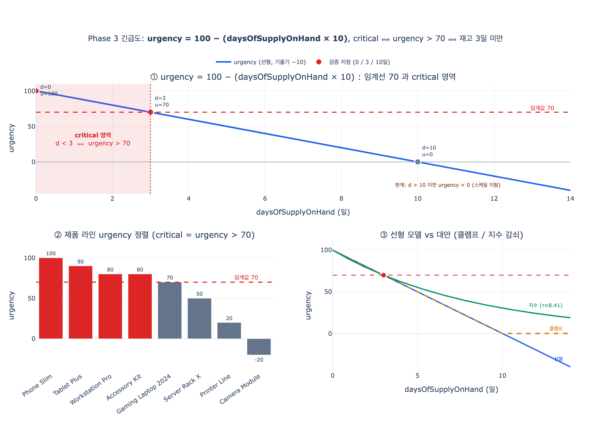

# Phase 3의 긴급도(urgency) 계산식과 임계값

## 한 줄 정답

$$\text{urgency} = 100 - (\text{daysOfSupplyOnHand} \times 10)$$

이고, $\text{urgency} > 70$ 인 제품 라인을 **critical** 로 분류한다. 즉 재고가 **3일 이하**면 긴급도가 70을 넘는다.

## Phase 3이 하는 일

공급망 붕괴 대응 시나리오는 5단계 파이프라인이다.

| Phase | 시점 | 하는 일 | 산출물 |
|---|---|---|---|
| 1 Detection | minute 0 | `Supplier.country` × `DisruptionEvent.region` 매칭 | 영향받은 공급사 3곳 |
| 2 Trace impact | minute 5 | `Supplier → supplies → Component → usedIn → ProductLine` | 부품 47개, 제품 라인 12개 |
| **3 Quantify impact** | **minute 15** | **금액·시간으로 환산** | **$127M at risk, critical timeline 3 days** |
| 4 Recommend actions | minute 20 | `AlternativeSupplier` 스코어링 | Top 3 액션 + ROI |
| 5 Execute | minute 25 | 임계 조건 충족 시 워크플로 자동 실행 | PO / 스케줄 / 알림 |

Phase 2까지는 그래프 탐색(“누가 노출되었나”)이고, Phase 3은 그 노출을 **비교 가능한 스칼라**로 바꾸는 단계다. 원문 계산 엔진은 노출된 제품 라인마다 두 값을 계산한다.

```
Calculation Engine:
  For each exposed ProductLine:
    revenue_at_risk = annualRevenue / 365 * daysOfSupplyOnHand
    urgency         = 100 - (daysOfSupplyOnHand * 10)

  Aggregate:
    total_revenue_at_risk = SUM(revenue_at_risk)
    critical_product_lines = WHERE urgency > 70
```

즉 Phase 3은 **돈(`revenueAtRisk`)** 과 **시간(`urgency`)** 두 축을 만든다. 돈은 “얼마나 큰 문제인가”, 긴급도는 “얼마나 급한 문제인가”를 답한다. 두 값 모두 `daysOfSupplyOnHand`(안전 재고 일수)를 입력으로 쓰지만 방향이 반대다.

- `revenue_at_risk`는 재고가 많을수록 **커진다** (재고 기간 동안의 매출을 위험 노출로 보는 정의)
- `urgency`는 재고가 많을수록 **작아진다**

## 계산식 해부: 기울기 −10의 선형식

식을 표준 일차함수 형태로 쓰면 이렇다.

$$u(d) = -10\,d + 100 \quad\text{where } d = \text{daysOfSupplyOnHand}$$

- **절편 100**: $d = 0$, 즉 재고가 이미 소진된 상태가 만점 긴급도 100.
- **기울기 −10**: $\dfrac{du}{dd} = -10$. **재고 1일이 긴급도 10점에 정확히 대응한다.** 재고를 하루 더 확보하면 긴급도가 정확히 10점 내려가고, 하루 더 잃으면 10점 올라간다.

이 “1일 = 10점” 대응 관계가 이 식의 설계 의도 전부다. 0~100 스케일을 10일 구간에 균등하게 펼친 것이므로, 사실 이 식은 **재고 일수를 0~100 게이지로 리스케일한 것**에 불과하다. 정보량이 늘어나지 않는다.

$$u(d) = 100\left(1 - \frac{d}{10}\right)$$

로 쓰면 “10일을 만점 재고로 보고 그 소진율(%)을 긴급도로 삼는다”는 해석이 더 분명해진다.

주요 지점 값:

| `daysOfSupplyOnHand` | urgency | critical? (`>70`) |
|---|---|---|
| 0 | 100 | ✅ |
| 1 | 90 | ✅ |
| 2 | 80 | ✅ |
| 3 | 70 | ❌ (경계, 초과 아님) |
| 4 | 60 | ❌ |
| 5 | 50 | ❌ |
| 10 | 0 | ❌ |
| 15 | −50 | ❌ |

## 임계값 부등식 풀이: `urgency > 70 ⟺ d < 3`

임계값 70을 재고 일수 조건으로 되돌려 보면 왜 “3일”이 나오는지 보인다.

$$
\begin{aligned}
100 - 10d &> 70 \\
-10d &> -30 \\
10d &< 30 \quad (\text{음수로 나누므로 부등호 반전}) \\
d &< 3
\end{aligned}
$$

$$\boxed{\;\text{urgency} > 70 \iff \text{daysOfSupplyOnHand} < 3\;}$$

즉 임계값 70은 **“재고 3일 미만”의 다른 표기법**이다. 원문에서 Taiwan Power Outage 시나리오의 `Component "GPU Module"`이 `daysOfSupplyOnHand = 3`이고, Phase 3 결과가 `Critical timeline: 3 days`, RiskAssessment의 `timeToImpactDays = 3`으로 일관되게 나오는 것도 이 3일 경계에서 유래한다.

### 경계 처리 주의: `>` 는 닫힌 구간이 아니다

`d = 3`이면 urgency가 정확히 70이고, 조건은 `urgency > 70`이므로 **critical에 포함되지 않는다.**
`daysOfSupplyOnHand`가 정수형(`integer`) 속성이므로 실질적 critical 집합은

$$d \in \{0, 1, 2\}$$

이다. 답안의 “재고가 3일 이하면 긴급도가 70을 넘는다”는 서술은 “3일 수준의 임박한 재고”를 가리키는 느슨한 표현으로 읽어야 하고, 코드로 옮길 때는 `d <= 2`(또는 `d < 3`)가 정확하다. `daysOfSupplyOnHand`가 소수(예: 2.9일)로 들어오는 파이프라인이면 `d < 3`이 안전한 구현이다. 이 한 칸 차이가 실제 시나리오 부품(GPU Module, `d=3`)의 분류를 뒤집기 때문에 결코 무해한 off-by-one이 아니다 — 요구사항 확정 시 “3일을 포함하는가”를 반드시 못 박아야 한다.

## 이 선형 모델의 한계

이 식은 데모 파이프라인용 **1차 근사**다. 실무 도입 시 드러나는 결함이 최소 네 가지 있다.

### 1. 10일 이상이면 값이 0 이하로 발산한다

$d > 10$ 이면 $u(d) < 0$ 이다. $d = 30$ (한 달 재고)이면 urgency $= -200$. 스코어 스케일이 0~100이라는 암묵적 계약이 깨지고, “−200이 −50보다 얼마나 덜 급한가”라는 질문에는 의미가 없다. 재고 10일과 100일은 실무상 둘 다 “지금 급하지 않음”으로 동일하게 취급되어야 하는데, 이 식은 −0과 −900이라는 무의미하게 벌어진 값을 준다. 대시보드 정렬·평균·가중합에 그대로 들어가면 왜곡이 커진다.

### 2. 상한 100을 넘을 수 없다 — 이미 결품인 상태를 구분 못 한다

$d \ge 0$ 이므로 최대값은 $d = 0$ 일 때의 100이다. 그런데 “오늘 재고가 0”과 “이미 3일 전에 결품이 나서 생산이 멈췄고 백로그가 쌓이는 중”은 긴급도가 전혀 다르다. `daysOfSupplyOnHand`를 음수로 허용하지 않는 한 이 식은 두 상황을 모두 100으로 뭉갠다. 즉 **포화(saturation)** 가 상단에서 발생해 최악 케이스들 사이의 우선순위를 정하지 못한다.

### 3. 부품 `criticalityLevel`을 반영하지 않는다

`Component`는 `criticalityLevel` (Critical/High/Medium/Low) 속성을 갖고 있는데 urgency 식은 이를 전혀 쓰지 않는다. 그 결과 **재고 2일인 포장재(Packaging, Low)** 가 **재고 4일인 GPU 모듈(Electronic, Critical)** 보다 급한 것으로 계산된다(80 vs 60). 포장재는 로컬 대체 조달이 하루면 되고 GPU 모듈은 대체 공급사 인증에 수 주가 걸리는데, 모델은 이 비대칭을 보지 못한다.

### 4. 리드타임을 반영하지 않는다 — 긴급도의 본질을 놓친다

가장 근본적인 문제다. 진짜 긴급도는 “재고가 얼마나 남았나”가 아니라 **“재고가 바닥나기 전에 대체 조달을 끝낼 수 있나”** 다. 즉 여유 시간(slack)이

$$\text{slack} = \text{daysOfSupplyOnHand} - \text{replenishmentLeadTimeDays}$$

인데 식에는 리드타임 항이 없다. 재고 8일 + 리드타임 21일(urgency 20, "안전")이 재고 2일 + 리드타임 1일(urgency 80, "critical")보다 실제로는 훨씬 위험하다. 선형 식은 이 순위를 정확히 거꾸로 매긴다.

부수적으로 `DisruptionEvent.estimatedDurationDays`(붕괴가 며칠 지속되는가), 단일 소싱 여부(`Supplier.singleSourced`), 부품이 걸린 제품 라인 수(cascade fan-out)도 모두 무시된다.

## 실무 보정 방향

### (a) 클램프 — 최소한의 방어

$$u(d) = \mathrm{clamp}\big(100 - 10d,\; 0,\; 100\big) = \min\big(100,\ \max(0,\ 100 - 10d)\big)$$

한계 1을 없애는 한 줄 수정. 재고 10일 이상은 모두 0으로 포화된다. 스코어 계약(0~100)을 지키는 최소 조치이므로 프로덕션에서는 사실상 필수다.

### (b) slack 기반 — 리드타임 반영

임계값을 재고가 아니라 여유 시간에 걸어, 대체 조달 가능성을 직접 모델링한다.

$$u = \mathrm{clamp}\left(100 \times \left(1 - \frac{d - L}{H}\right),\ 0,\ 100\right)$$

여기서 $L$ = 대체 조달 리드타임, $H$ = 관심 지평(예: 10일). $d \le L$ (재고가 리드타임보다 짧음)이면 즉시 100에 가까워진다.

### (c) 지수 감쇠 — 임박 구간 민감도 확보

$$u(d) = 100 \, e^{-d/\tau}$$

- 항상 $(0, 100]$ 구간에 머무르므로 발산·음수가 원천적으로 없다 (한계 1 해소)
- 재고가 적을 때 기울기가 급하고 많아지면 완만해진다 → “0일 vs 1일”의 차이를 “8일 vs 9일”보다 크게 벌려, 실제 의사결정 민감도와 일치
- $\tau$ 로 감쇠 속도를 조절. 선형 식과 임계값 70을 정렬하려면 $u(3) = 70$ 에서

$$\tau = \frac{-3}{\ln 0.7} \approx 8.41$$

로 잡으면 3일 지점이 그대로 경계가 된다.

### (d) criticality 가중

$$u = \mathrm{clamp}\big(100 - 10d,\ 0,\ 100\big) \times w(\text{criticalityLevel})$$

예: Critical 1.0 / High 0.85 / Medium 0.6 / Low 0.4. 곱셈 가중이면 “재고 2일 Low 포장재” 80 × 0.4 = 32 로 내려가 “재고 4일 Critical GPU” 60 × 1.0 = 60 아래로 정렬된다. 한계 3 해소.

실무에서는 (a)를 기본으로 깔고 (b)·(d)를 조합한 뒤, 과거 사건 라벨(실제로 생산이 멈췄는가)로 임계값 70과 가중치를 캘리브레이션하는 방식이 일반적이다.

## Phase 5 트리거(`timeToImpactDays < 5`)와의 차이

두 임계값은 자주 혼동되지만 **계층·목적·주체가 다르다.**

| | Phase 3 `urgency > 70` | Phase 5 `revenueAtRisk > $50M AND timeToImpactDays < 5` |
|---|---|---|
| 시점 | minute 15 | minute 25 |
| 대상 엔티티 | **ProductLine** (부품 재고에서 파생) | **RiskAssessment** |
| 입력 속성 | `daysOfSupplyOnHand` | `revenueAtRisk`, `timeToImpactDays` |
| 조건 개수 | 단일 조건 | **AND 결합 2조건** (금액 + 시간) |
| 목적 | **분류 / 우선순위** — 어디를 먼저 볼지 | **자동화 게이트** — 사람 승인 없이 실행할지 |
| 결과 | critical 라벨, 리포트 정렬 | PO 발행, 스케줄 변경, CEO/이사회 통보 |
| 되돌리기 비용 | 없음 (라벨) | 높음 (실제 구매·통보 발생) |

핵심 차이 세 가지.

1. **파생값 vs 저장값.** urgency는 Phase 3이 즉석에서 계산하는 파생 지표이고, `timeToImpactDays`는 `RiskAssessment` 엔티티에 **저장된 속성**이다. 후자는 감사(audit) 대상이 되는 기록이다.

2. **시간 단독 vs 금액 AND 시간.** urgency는 시간축만 본다. 그래서 재고 1일인 $2M 니치 제품도 urgency 90으로 critical이 된다 — 분류 단계에서는 이게 옳다(놓치지 않아야 하므로 재현율 우선). 반면 Phase 5는 `revenueAtRisk > $50M`을 AND로 묶어 **금액 게이트**를 추가한다. 자동 PO 발행처럼 되돌리기 비용이 큰 행동은 정밀도 우선이어야 하므로, 급하지만 작은 건은 자동화 대상에서 뺀다.

3. **경계 숫자 3 vs 5.** urgency 임계값 70은 재고 3일 미만을 뜻하는데(위 부등식), Phase 5는 5일 미만에서 발동한다. 순서가 뒤집힌 게 아니라 **자동화가 더 이른 시점에 열려야** 하기 때문이다. 대체 공급사 PO는 리드타임이 있으므로 재고가 3일로 줄기를 기다리면 늦는다. 5일 창은 그 실행 리드타임을 흡수하는 버퍼다. 원문 Taiwan 시나리오의 `timeToImpactDays = 3`은 두 조건을 모두 통과하므로($3 < 5$, $\$80\text{M} > \$50\text{M}$) 워크플로가 자동 실행된다.

요약하면 **urgency는 “주의를 어디에 둘지”를 정하는 랭킹 함수, Phase 5 트리거는 “사람 손을 뗄지”를 정하는 안전 게이트**다. 전자는 느슨해도 되고 후자는 보수적이어야 한다.

## 시각화


