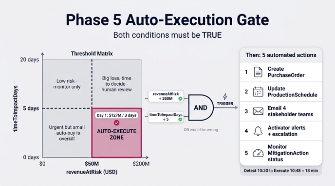

# Phase 5의 자동 실행 트리거 조건

## 정답 요약

```
IF RiskAssessment.revenueAtRisk > $50M
   AND
   RiskAssessment.timeToImpactDays < 5
THEN → 자동 워크플로 발동
```

`revenueAtRisk`(위험 금액)와 `timeToImpactDays`(영향까지 남은 일수) **두 조건을 모두** 만족해야
사람의 승인 없이 워크플로가 자동 실행된다. 즉 **금액(크기)** 과 **시급성(속도)** 의 AND 게이트다.

---

## 1. 이 조건이 어디에 있는 단계인가

Mitigation Execution 흐름은 5개 Phase로 구성된다.

| Phase | 시점 | 하는 일 | 산출물 |
|---|---|---|---|
| 1. Detection | 0분 | 외부 신호로 영향받는 공급업체 식별 | Supplier 3곳 |
| 2. Trace impact | 5분 | Supplier → Component → ProductLine 추적 | 부품 47개, 제품라인 12개 |
| 3. Quantify | 15분 | 금액·시간으로 환산 | **$127M / 3일** |
| 4. Recommend | 20분 | 대안 공급업체 스코어링, Top 3 액션 | Action A/B/C |
| 5. **Execute** | 25분 | **게이트 판정 후 자동 실행** | PO, 일정, 알림, Activator |

Phase 3에서 만들어진 `RiskAssessment`의 두 속성이 Phase 5의 입력이 된다. 즉 게이트는
"계산은 끝났고, 이제 사람이 결재할 것인가 / 기계가 바로 집행할 것인가"를 가르는 지점이다.

관련 속성 정의 (RiskAssessment 엔티티):

- `revenueAtRisk` (USD) — 노출된 제품라인들의 매출 위험 합계
  (`annualRevenue / 365 * daysOfSupplyOnHand`의 SUM)
- `timeToImpactDays` — 생산 중단까지 남은 일수
- 그 외: `assessmentId`, `assessedDate`, `confidenceLevel`, `recommendedAction`

---

## 2. 왜 OR가 아니라 AND인가

자동 실행은 "사람 승인 없이 돈을 쓰는" 행위다. 그래서 게이트는 **자동화가 확실히 이득인 구간**만
통과시켜야 한다. 두 조건 중 하나만 만족하는 경우를 보면 AND의 이유가 드러난다.

### 케이스 A: 금액은 크지만 시간 여유가 있다 (`$200M`, `20일`)
- 20일이면 여러 대안을 비교하고, 가격을 협상하고, 재설계까지 검토할 시간이 있다.
- 자동으로 프리미엄 가격(`pricePremiumPercent` +12~18%)의 대안 공급업체에 PO를 던져버리면
  **협상으로 아낄 수 있었던 비용을 날린다.**
- → **사람의 판단이 더 좋은 답을 낸다.** 자동 실행할 이유가 없다.

### 케이스 B: 급하지만 금액이 작다 (`$3M`, `2일`)
- 2일 뒤 중단되더라도 손실이 작다. 그런데 자동 실행은 PO 발행 + 생산일정 변경 +
  **CEO/이사회 알림** + Activator 에스컬레이션까지 한꺼번에 일으킨다.
- 소액 사건마다 경영진이 호출되면 알림 피로(alert fatigue)가 쌓여 정작 중요한 알림이 묻힌다.
- 또한 긴급 조달 자체가 프리미엄 비용이라 **대응 비용이 손실보다 커질 수 있다**(과잉 대응).
- → **자동 구매가 과잉이다.** 일반 조달 프로세스로 충분하다.

### 케이스 C: 둘 다 만족 (`$127M`, `3일`)
- 손실이 압도적으로 크고(자동화 비용 $2M ≪ 손실 $127M), 사람이 회의를 잡아 결재할 시간조차 없다.
- 이때만 "잘못 눌러도 손해보다 이득이 크다"가 성립 → 자동 실행.

**정리**: 큰 금액은 *조치할 가치*를, 짧은 시간은 *사람을 기다릴 수 없음*을 증명한다.
두 조건은 서로를 대체하지 못하므로 곱셈(AND)이어야 한다. OR로 바꾸면
"여유 있는 대형 건에 성급한 지출" + "소액 건에 경영진 소환"이라는 두 실패를 동시에 얻는다.

---

## 3. 두 임계값(50M / 5일)의 의미

| 임계값 | 무엇을 재는가 | 왜 이 선인가 |
|---|---|---|
| `revenueAtRisk > $50M` | **물질성(materiality)** — 조치 비용을 정당화할 만큼 손실이 큰가 | 자동 대응 비용(예: +$2M 프리미엄 + 안전재고 $500K)이 손실에 비해 무시할 수준이어야 한다. 자료의 Gaming Laptop 2024 제품라인 연매출이 $50M 규모 — 즉 "제품라인 하나가 통째로 날아가는 수준" 이상을 뜻하는 기준선이다. |
| `timeToImpactDays < 5` | **시급성(urgency)** — 사람 승인 루프가 물리적으로 가능한가 | 대안 공급업체 리드타임(48시간 배송) + 승인·발주 시간을 감안하면 5일 미만은 사실상 "지금 안 누르면 늦는다"에 해당. Phase 3의 `urgency = 100 - daysOfSupplyOnHand * 10` 및 `urgency > 70`(≈ 재고 3일 미만) 기준과 같은 감각이다. |

### 임계값 조정의 트레이드오프 (오탐 vs 미탐)

| 조정 | 결과 | 위험 |
|---|---|---|
| 금액 기준을 **낮춤** ($50M → $10M) 또는 일수 기준을 **늘림** (5일 → 15일) | 게이트가 넓어짐 → 자동 실행 빈번 | **오탐(false positive)**: 불필요한 긴급 조달로 프리미엄 비용 낭비, 재고 과잉, 경영진 알림 피로, "자동화가 시끄럽다"는 신뢰 하락 |
| 금액 기준을 **높임** ($50M → $200M) 또는 일수 기준을 **줄임** (5일 → 2일) | 게이트가 좁아짐 → 사람 승인 경로로 회귀 | **미탐(false negative)**: 대응해야 할 사건을 자동화가 놓침. 승인 회의를 기다리는 사이 리드타임을 놓쳐 3일 지연이 7일 지연이 된다(= 보호했을 $100M을 못 지킴) |

즉 게이트 튜닝은 **낭비 비용(오탐)** 과 **놓친 매출(미탐)** 의 균형 문제다. 어느 쪽으로 옮길지는
`confidenceLevel`(High/Medium/Low)과 사후 지표로 판단한다. 자료의 개선 지표 중
`Revenue protection rate > 80%`(미탐 감시), `Cost efficiency ±5%`,
`Impact estimate accuracy ±10%`(추정치가 부정확하면 임계값 비교 자체가 흔들림),
`Time to mitigation < 2시간`이 이 튜닝의 피드백 신호다.

참고로 임계값 비교가 가능한 이유는 온톨로지가 `revenueAtRisk`를 `decimal`,
`timeToImpactDays`를 `integer`로 **타입 있는 속성**으로 정의했기 때문이다.
문자열 메모가 아니라 숫자 속성이어야 "threshold-based alerts"가 성립한다.

---

## 4. 게이트를 통과하면 실행되는 5개 동작

```
THEN:
  1. Create PurchaseOrder for recommended AlternativeSupplier
  2. Update ProductionSchedule with new timeline
  3. Send email to: Procurement / Operations / Finance / CEO·Board
  4. Create Activator alerts with escalation policy
  5. Start monitoring MitigationAction.status
```

| # | 동작 | 의미 |
|---|---|---|
| 1 | **PurchaseOrder 생성** | Phase 4에서 추천된 `AlternativeSupplier`(예: ChipX Europe, `qualificationStatus="Approved"`)에 발주. 사전 승인된 대안만 대상이므로 자동 발주가 안전하다 |
| 2 | **ProductionSchedule 갱신** | 새 리드타임을 반영해 생산 일정 재조정 (7일 중단 → 3일 지연) |
| 3 | **관계자 이메일 발송** | 조달(집행) / 운영(일정) / 재무(추가비용 $2M 예측) / CEO·이사회(노출 보고) — 역할별 4개 수신자 |
| 4 | **Activator 알림 + 에스컬레이션 정책** | 실시간 대시보드와 미확인 시 상향 통보. 자동 실행이 "조용히 일어나지 않도록" 보장하는 안전장치 |
| 5 | **MitigationAction.status 모니터링 시작** | Proposed → Approved → In Progress → Completed 추적. 대안 공급업체가 지연되면 `leadTimeSavedDays` 슬립을 감지해 추가 대응 |

핵심: 자동 실행은 **"발주하고 끝"이 아니라 통보와 추적을 포함한다.** 3·4·5번이 있기 때문에
사람이 사후에 개입·중단할 수 있고, 그래서 자동 실행을 허용할 수 있다.

---

## 5. Day 1 실측치는 조건을 어떻게 만족하는가

Taiwan 지진 시나리오의 실제 수치:

```
10:30 AM  Taiwan earthquake M6.8
10:45 AM  DisruptionEvent 생성 (Natural Disaster / Critical / Taiwan / 7일)
10:46 AM  Data Agent 추적 → 공급업체 3, 부품 47, 제품라인 12
          ├─ revenueAtRisk    = $127M
          └─ timeToImpactDays = 3
10:47 AM  RiskAssessment 생성
10:48 AM  MitigationActions 자동 생성  ← 게이트 통과
```

조건 대입:

| 조건 | 임계값 | 실측 | 판정 |
|---|---|---|---|
| `revenueAtRisk > $50M` | 50 | **127** | ✅ 통과 (2.5배 초과) |
| `timeToImpactDays < 5` | 5 | **3** | ✅ 통과 (2일 여유 부족) |
| AND | — | — | ✅ **자동 실행** |

두 조건이 모두 참이라 10:48에 사람 승인 없이 MitigationAction이 생성됐고,
10:50에 Activator가 발동했다. 감지(10:30)에서 집행(10:48)까지 **18분**.

결과: 생산 중단이 7일 → 3일로 축소, 실제 비용 $2.1M(추정 $2M),
노출 $127M 중 **약 $100M 매출 보호(≈79%)**. 사람 결재 루프를 기다렸다면
3일 안에 ChipX Europe의 48시간 배송 슬롯을 잡지 못했을 것이다.

---

## 6. 암기 포인트

- 조건은 **2개, 모두 AND** — 하나만 외우면 틀린다.
- 숫자 방향을 혼동하지 말 것: 금액은 **초과(`>` 50M)**, 시간은 **미만(`<` 5일)**.
  "돈은 클수록, 시간은 짧을수록 자동"이라고 기억한다.
- 게이트 통과 후 동작은 **5개**: 발주 → 일정 → 이메일 → Activator → 상태 모니터링.
- Day 1 실측 **$127M / 3일** — 둘 다 만족. (자료에 등장하는 다른 숫자 $80M/3일도
  마찬가지로 통과하며, 제품라인 단위 값이다.)

## 인포그래픽


</content>
