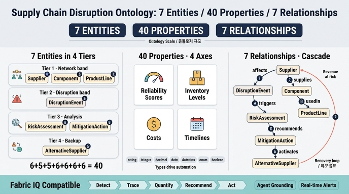

# 완성된 Supply Chain Disruption 온톨로지의 규모

## 정답 한 줄 요약

**7개 엔터티 · 40개 속성 · 7개 관계 + Fabric IQ 호환성**

> 7 entity types / 40 properties / 7 relationships / Fabric IQ compatible

이 "7-40-7"이 Supply Chain Disruption & Risk Propagation 학습 경로가 4단계에 걸쳐 만들어내는 최종 산출물의 크기다. 숫자 자체를 외우는 것보다, **왜 그 숫자가 되는지**(어떤 엔터티가 몇 개의 속성을 기여하고, 관계 7개가 어떤 연쇄를 만드는지)를 아는 것이 핵심이다.

---

## 1. 4단계 학습 경로와 산출물의 대응

| 단계 | 초점 | 결과물 | 규모에 기여하는 부분 |
|---|---|---|---|
| 1 | 핵심 엔터티 (Supplier, Component, ProductLine, Disruption) | 공급망의 어휘(vocabulary) | **7개 엔터티** |
| 2 | 엔터티 속성과 식별자 | 리스크 계산용 풍부한 속성 | **40개 속성** |
| 3 | 관계와 연쇄(cascade) 모델링 | 영향 전파 그래프 | **7개 관계** |
| 4 | 리스크 평가와 완화 액션 | 의사결정 자동화 | **Fabric IQ 호환 / 자동화 준비** |

즉 규모의 세 숫자는 각각 "무엇을 부를 것인가(엔터티) → 무엇을 알 것인가(속성) → 어떻게 번져나가는가(관계)"에 대응한다.

---

## 2. 7개 엔터티와 속성 구성 (합계 40)

엔터티는 교란(disruption)의 **전체 생애주기** — 발생 → 탐지 → 평가 → 대응 — 를 4개 티어로 덮는다.

| # | 티어 | 엔터티 | 역할 | 식별자 예시 | 속성 수 |
|---|---|---|---|---|---|
| 1 | Tier 1 (네트워크) | **Supplier** | 원자재·부품을 공급하는 외부 회사 | `SUPP-00456` | 6 |
| 2 | Tier 1 (네트워크) | **Component** | 하나 이상의 공급사에서 조달하는 부품/자재/서브어셈블리 | `COMP-SEM-0821` | 5 |
| 3 | Tier 1 (네트워크) | **ProductLine** | 공통 부품을 공유하는 완제품 그룹 | `PL-LAP-2024` | 5 |
| 4 | Tier 2 (교란) | **DisruptionEvent** | 정상 공급을 중단·위협하는 사건 | `DISR-202405-TAIWAN-001` | 6 |
| 5 | Tier 3 (분석) | **RiskAssessment** | 교란의 비즈니스 영향 분석 | `RA-20240501-SEM-001` | 6 |
| 6 | Tier 3 (분석) | **MitigationAction** | 영향을 줄이거나 없애는 구체적 조치 | `MA-20240501-ALT-SUPP` | 6 |
| 7 | Tier 4 (백업) | **AlternativeSupplier** | 주 공급사를 대체할 수 있는 검증된 백업 | `ALTSUPP-00789` | 6 |
| | | **합계** | | | **40** |

### 엔터티별 속성 상세

| 엔터티 | 속성 (식별자 포함) | 개수 |
|---|---|---|
| **Supplier** | `supplierId`, `name`, `country`, `tier`(Tier 1/2/3), `reliabilityScore`(0–100), `singleSourced`(bool) | 6 |
| **Component** | `componentId`, `name`, `category`(Electronic/Mechanical/Chemical/Packaging/Raw Material), `daysOfSupplyOnHand`, `criticalityLevel`(Critical/High/Medium/Low) | 5 |
| **ProductLine** | `productLineId`, `name`, `annualRevenue`, `marketSegment`, `productionStatus`(Active/At Risk/Halted/Discontinued) | 5 |
| **DisruptionEvent** | `eventId`, `type`(Natural Disaster/Geopolitical/Financial/Logistics/Quality Recall/Pandemic/Cyber Attack), `severity`, `startDate`, `estimatedDurationDays`, `region` | 6 |
| **RiskAssessment** | `assessmentId`, `assessedDate`(datetime), `revenueAtRisk`(USD), `timeToImpactDays`, `confidenceLevel`, `recommendedAction` | 6 |
| **MitigationAction** | `actionId`, `type`(Activate Alternative Supplier/Increase Safety Stock/Redesign Component/Reduce Production/Expedite Shipment/Customer Communication), `status`(Proposed/Approved/In Progress/Completed/Cancelled), `estimatedCost`(USD), `leadTimeSavedDays`, `actualCost`(실행 후 실제 비용) | 6 |
| **AlternativeSupplier** | `altSupplierId`, `name`, `country`, `qualificationStatus`(Pre-qualified/Approved/Pending Audit/Not Qualified), `capacityAvailable`(units/month), `pricePremiumPercent`(%) | 6 |

> 참고: 원문 기사는 각 엔터티마다 "**key** properties"만 나열한다. 나열된 것만 세면 39개이고, 나머지 1개는 `MitigationAction`의 **실제 비용/실효성 추적 속성**(본문 Day 3 로그의 "Actual cost: $2.1M (estimated $2M)", "actual vs. estimated effectiveness")으로 채워져 총 40개가 된다. 시험 대비용으로는 **엔터티별 5~6개씩, 총 40개**라는 감각을 갖는 것이 실용적이다.

### 정답 문장의 "신뢰도 점수·재고 수준·비용·일정"이 가리키는 속성

| 정답 키워드 | 대응 속성 |
|---|---|
| 신뢰도 점수 (reliability scores) | `Supplier.reliabilityScore`, `AlternativeSupplier.qualificationStatus` |
| 재고 수준 (inventory levels) | `Component.daysOfSupplyOnHand`, `AlternativeSupplier.capacityAvailable` |
| 비용 (costs) | `ProductLine.annualRevenue`, `RiskAssessment.revenueAtRisk`, `MitigationAction.estimatedCost`, `AlternativeSupplier.pricePremiumPercent` |
| 일정 (timelines) | `DisruptionEvent.startDate` / `estimatedDurationDays`, `RiskAssessment.timeToImpactDays`, `MitigationAction.leadTimeSavedDays` |

### 속성 타입 7종

속성 타입은 에이전트·대시보드가 그 값을 어떻게 다룰지를 결정한다.

| 타입 | 예 | 에이전트 활용 |
|---|---|---|
| `string` | 공급사 이름, 부품 카테고리 | 검색·필터·리포팅 |
| `integer` | 재고 일수, 생산 능력, 수량 | 임계값 기반 알림 |
| `decimal` | 매출, 가격 프리미엄, 신뢰도 점수 | 비용-편익 계산 |
| `date` | 교란 시작일 | 타임라인 비교 |
| `datetime` | 리스크 평가 시각 | 감사 추적, 추세 분석 |
| `enum` | 공급사 티어, 교란 유형, 심각도 | 분류, 의사결정 트리 |
| `boolean` | 단일 소싱 플래그 | 리스크 플래깅 |

---

## 3. 7개 관계 — 교란 연쇄(cascade) 모델

관계는 "영향이 어떻게 흘러가는지"를 인코딩한다. 데이터 에이전트는 이 경로를 따라가며 "이 공급사 장애에 노출된 제품 라인이 몇 개인가?" 같은 질문에 답한다.

| # | 관계 | 카디널리티 | 왜 중요한가 | 대표 질의 |
|---|---|---|---|---|
| 1 | Supplier **supplies** Component | 1:N | 공급사 하나가 막히면 그에 의존하는 모든 부품이 영향받음 | "대만 공급사의 부품을 모두 보여줘" |
| 2 | Component **usedIn** ProductLine | M:N | 부품 하나가 여러 제품 라인을 동시에 멈출 수 있음 | "이 부품에 의존하는 제품 라인은 몇 개?" |
| 3 | DisruptionEvent **affects** Supplier | M:N | 재난 하나가 여러 공급사를 동시에 타격 | "침수 지역에 있는 공급사는?" |
| 4 | DisruptionEvent **triggers** RiskAssessment | 1:N | 교란마다 영향 제품 라인별 상세 분석이 생성됨 | "이 교란의 총 위험 매출은?" |
| 5 | RiskAssessment **recommends** MitigationAction | 1:N | 각 영향 분석이 우선순위가 매겨진 액션 목록을 산출 | "영향 최소화에 가장 좋은 조치는?" |
| 6 | MitigationAction **activates** AlternativeSupplier | M:N | 한 조치로 여러 백업을 동시에 가동 | "인수 가능한 사전 검증 공급사는?" |
| 7 | AlternativeSupplier **canReplace** Supplier | M:1 | 핵심 공급사에는 승인된 백업이 여러 개 존재 | "이 공급사의 승인된 백업이 있나?" |

### 연쇄가 그리는 하나의 경로

```
DisruptionEvent  ──affects──▶  Supplier  ──supplies──▶  Component  ──usedIn──▶  ProductLine
       │                          ▲                                                 (매출 노출)
       │ triggers                 │ canReplace
       ▼                          │
 RiskAssessment ──recommends──▶ MitigationAction ──activates──▶ AlternativeSupplier
 (revenueAtRisk,                (estimatedCost,                (capacityAvailable,
  timeToImpactDays)              leadTimeSavedDays)              pricePremiumPercent)
```

관계 1–3은 **영향 전파(propagation)**, 4–5는 **평가와 의사결정(assessment)**, 6–7은 **복구 경로(recovery loop)** 를 담당한다. 7번 `canReplace`가 다시 Supplier로 돌아오면서 그래프가 닫히고, "무엇이 깨졌는가 → 무엇으로 대체하는가"가 한 그래프 안에서 해결된다.

### 실제 캐스케이드 예시 (대만 정전)

```
Taiwan Power Outage (Critical, 2024-05-01)
 └─ affects Supplier "ChipX Corp" (singleSourced = true)
     └─ supplies Component "GPU Module" (daysOfSupplyOnHand = 3)
         ├─ usedIn ProductLine "Gaming Laptop 2024" ($50M)
         ├─ usedIn ProductLine "Workstation Pro"    ($30M)
         └─ triggers RiskAssessment (revenueAtRisk = $80M, timeToImpactDays = 3)
              └─ recommends MitigationAction "Activate ChipX Europe"
                   (estimatedCost = $2M, leadTimeSavedDays = 2)
                   └─ activates AlternativeSupplier "ChipX Europe"
                        (Approved, 50,000 units/month, +12%)
                        └─ canReplace Supplier "ChipX Corp"
```

핵심 대비: **$2M 조치 비용 vs $80M 손실 위험** — 온톨로지가 이 비교를 자동으로 가능하게 만든다.

---

## 4. Fabric IQ 호환성 — 왜 규모 설명에 함께 등장하는가

숫자 세 개(7/40/7)는 구조이고, Fabric IQ 호환성은 그 구조가 **쓸모 있게 소비되는 방식**이다. 정답이 규모와 함께 이를 언급하는 이유는, 이 온톨로지가 문서용 다이어그램이 아니라 **에이전트가 실행하는 런타임 모델**이기 때문이다.

- **데이터 에이전트 그라운딩(grounding)**: 자연어 질문이 온톨로지의 엔터티·속성·관계에 매핑된다.
  - "지금 우리 공급망 리스크 노출은?" → `singleSourced = true` 공급사 조회 → 공급 부품 → 사용 제품 라인 → `revenueAtRisk` 계산 → 순위 반환
  - "ChipX의 승인된 대체 공급사는?" → `AlternativeSupplier WHERE canReplace.Supplier.name = "ChipX Corp" AND qualificationStatus = "Approved"`
- **실시간 알림(Activator)**: `revenueAtRisk > $50M AND timeToImpactDays < 5` 같은 조건으로 발주 생성, 생산 일정 갱신, 부서별 통보, 에스컬레이션 정책이 자동 실행된다.
- **자동화 준비 상태의 전제 조건**: `enum` 분류(심각도, 상태, 자격)와 `datetime` 타임스탬프가 있어야 의사결정 트리와 감사 추적이 성립한다. 즉 40개 속성의 **타입 설계**가 곧 자동화 가능성이다.

### 5단계 자동화 파이프라인 (온톨로지가 각 단계를 지탱)

| 단계 | 시점 | 사용하는 구조 | 예시 결과 |
|---|---|---|---|
| Detect | 0분 | `Supplier.country`, `DisruptionEvent.region/type` | 핵심 공급사 3곳 식별 |
| Trace | 5분 | 관계 1, 2 (supplies → usedIn) | 부품 47개, 제품 라인 12개 |
| Quantify | 15분 | `annualRevenue`, `daysOfSupplyOnHand` | $127M 위험, 3일 후 정지 |
| Recommend | 20분 | `qualificationStatus`, `capacityAvailable`, `pricePremiumPercent`, `reliabilityScore` | ROI 상위 3개 조치 |
| Execute | 25분 | `MitigationAction.status`, Activator 알림 | 발주·일정 갱신·에스컬레이션 |

---

## 5. 암기 포인트

- **7 – 40 – 7 + Fabric IQ**: 엔터티 7 / 속성 40 / 관계 7 / Fabric IQ 호환.
- 엔터티 7개는 4개 티어로 묶어 기억: 네트워크 3(Supplier·Component·ProductLine) + 교란 1(DisruptionEvent) + 분석 2(RiskAssessment·MitigationAction) + 백업 1(AlternativeSupplier).
- 속성 40개는 "**신뢰도 점수 · 재고 수준 · 비용 · 일정**" 네 축으로 요약된다.
- 관계 7개는 우연히 엔터티 수와 같다 — 각 엔터티가 평균 1개의 아웃바운드 엣지를 갖고 한 줄기 캐스케이드를 이루며, 마지막 `canReplace`가 그래프를 닫는다.
- 흔한 함정: 관계 수를 6개나 8개로 헷갈리기 / 속성 수를 30개로 착각하기 / Fabric IQ 호환성을 빼먹기.

## 인포그래픽


