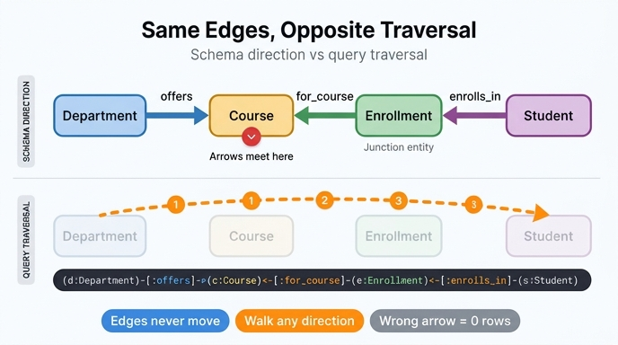

# 화살표 방향이 뒤섞인 이유

## 질문

```gql
MATCH (d:Department)-[:offers]->(c:Course)<-[:for_course]-(e:Enrollment)<-[:enrolls_in]-(s:Student)
WHERE e.grade IN ['C', 'D', 'F']
RETURN d.name, c.title, COUNT(e) AS struggling_count
ORDER BY struggling_count DESC
```

한 줄짜리 경로 안에 `->`가 한 번, `<-`가 두 번 나온다. 왜 방향이 일관되지 않을까?

## 한 문장 답

`offers`는 Department에서 Course로 **나가는** 관계지만, `for_course`는 Enrollment에서 Course로, `enrolls_in`은 Student에서 Enrollment로 향하는 관계다. 즉 **간선의 방향은 스키마가 이미 정해 놓았고**, 질의는 그 정의를 바꾸지 않은 채 경로를 이어야 하므로 필요한 구간에서 `<-`로 역방향 순회한다.

## 1. 두 개의 서로 다른 "방향"

이 카드의 핵심은 다음 두 개념이 **완전히 독립적**이라는 사실이다.

| 구분 | 정의된 방향 (스키마) | 순회 방향 (질의) |
|---|---|---|
| 누가 정하나 | 온톨로지 설계자 (엔티티 간 관계 정의) | 질의 작성자 |
| 언제 정해지나 | 모델링 시점, 데이터에 고정 저장 | 질의 실행 시점, 매번 다를 수 있음 |
| 바꿀 수 있나 | 스키마를 고쳐야 함 (데이터 마이그레이션) | 그냥 `<-`/`->`만 바꾸면 됨 |
| 표기 | `Student → Enrollment` | 패턴을 왼쪽→오른쪽으로 읽는 순서 |

그래프 DB의 간선은 **방향이 있는(directed)** 상태로 저장된다. 하지만 인접 리스트는 양방향 인덱스로 관리되므로 **어느 쪽 끝에서 출발해도 같은 비용으로 탐색**할 수 있다. 따라서 "역방향 순회"는 성능 페널티가 아니라 단순한 표기 문제다.

이 질의는 Department에서 출발해 Student로 내려가고 싶지만, 그 경로에 놓인 세 간선 중 두 개는 반대쪽을 가리키고 있다. 그래서 `<-`가 등장한다.

## 2. 이 온톨로지의 관계 정의

University 온톨로지의 6개 관계 중 이 질의가 쓰는 3개:

| 관계 | 정의된 방향 | 카디널리티 |
|---|---|---|
| `offers` | `Department` → `Course` | one-to-many |
| `for_course` | `Enrollment` → `Course` | many-to-one |
| `enrolls_in` | `Student` → `Enrollment` | one-to-many |

이걸 그대로 그리면:

```
Department ──offers──▶ Course ◀──for_course── Enrollment ◀──enrolls_in── Student
```

질의의 패턴 문자열과 화살표 모양이 **정확히 일치**한다. 즉 GQL/Cypher 패턴은 "그림을 ASCII로 옮긴 것"에 가깝다. 화살표가 섞인 건 실수가 아니라 그림을 충실히 옮긴 결과다.

## 3. 왜 Course와 Enrollment가 sink(화살표가 모이는 곳)인가

방향이 섞이는 근본 원인은 **junction entity 패턴**이다.

Student와 Course는 many-to-many다(한 학생이 여러 과목, 한 과목에 여러 학생). 게다가 그 연결 자체에 `grade`, `semester`, `status`, `enrollDate` 같은 속성이 붙는다. 이런 속성은 Student의 것도 Course의 것도 아니다. 그래서 연결 자체를 1급 엔티티로 승격시킨 것이 **Enrollment**다.

junction entity를 만들 때의 관례는 **junction이 양쪽 끝을 가리키게** 하는 것이다. Enrollment는 "이 학생이 이 과목을 듣는다"는 하나의 사실 레코드이므로, 그 레코드가 참조 대상(Student, Course)을 향해 화살표를 내보내는 것이 자연스럽다. 관계형 DB의 조인 테이블이 양쪽에 외래 키(FK)를 갖는 것과 정확히 같은 구조다.

```
Student ◀── (FK) ── Enrollment ── (FK) ──▶ Course
```

그런데 이 온톨로지는 `enrolls_in`을 `Student → Enrollment`(one-to-many)로 정의했다. "학생이 여러 enrollment를 소유한다"는 소유 관점을 택한 것이다. 결과적으로:

- `Course`: `offers`(Department에서)와 `for_course`(Enrollment에서) 두 화살표가 **모여드는 sink**
- `Enrollment`: `enrolls_in`(Student에서) 화살표가 들어오고, `for_course` 화살표를 내보내는 중간 노드

질의는 Department → Student 순으로 읽고 싶은데, 도중에 Course라는 sink를 지나야 한다. sink에 들어갔다가 나오려면 반드시 한 번은 화살표를 거슬러야 한다. 이게 `<-[:for_course]-`다. 그 다음 Enrollment에서 Student로 가려면 `enrolls_in`도 거슬러야 한다. 이게 `<-[:enrolls_in]-`다.

> 참고: 학습 경로 첫 장에서 이 질문을 `Department → Professor → Course → Enrollment (grade < C) ← Student`로 표현한 것도, 완성 모델 표에서 `Department → Course ← Enrollment ← Student`로 적은 것도 같은 이유다. sink를 통과하는 경로는 필연적으로 화살표가 섞인다.

## 4. 같은 결과를 내는 다른 표기

패턴은 왼쪽에서 오른쪽으로 읽어야 할 의무가 없다. 아래 세 질의는 **논리적으로 동일한 결과**를 낸다.

**(a) 원본 — Department에서 시작**
```gql
MATCH (d:Department)-[:offers]->(c:Course)<-[:for_course]-(e:Enrollment)<-[:enrolls_in]-(s:Student)
```

**(b) Student에서 시작 — 통째로 뒤집기**
```gql
MATCH (s:Student)-[:enrolls_in]->(e:Enrollment)-[:for_course]->(c:Course)<-[:offers]-(d:Department)
```
화살표를 전부 반대로 쓰면서 순서만 뒤집었다. 이번엔 `->`가 두 번, `<-`가 한 번이다. 여전히 섞여 있다 — Course가 sink인 한 어느 방향에서 읽어도 반전은 한 번 생긴다.

**(c) 여러 줄로 쪼개기 — 가독성 우선**
```gql
MATCH (d:Department)-[:offers]->(c:Course)
MATCH (e:Enrollment)-[:for_course]->(c)
MATCH (s:Student)-[:enrolls_in]->(e)
```
각 관계를 정의된 방향 그대로만 쓰고, 이미 바인딩된 변수(`c`, `e`)로 조각을 이어 붙였다. `<-`가 하나도 없다. 방향 혼란이 싫으면 이 스타일이 가장 안전하다.

## 5. 방향을 생략하면(`--`) 어떻게 되나

```gql
MATCH (d:Department)-[:offers]-(c:Course)-[:for_course]-(e:Enrollment)-[:enrolls_in]-(s:Student)
```

`--`(또는 `-[:rel]-`)는 **방향 무관(undirected) 매칭**이다. 엔진은 각 간선을 양방향 모두 시도한다.

- **동작은 하고 결과도 대체로 같다.** 이 온톨로지는 `offers`가 Department와 Course 사이에만, `for_course`가 Enrollment와 Course 사이에만 존재하므로, 라벨 제약(`:Department`, `:Course`, …) 덕분에 반대 방향 조합이 애초에 존재하지 않는다.
- **하지만 비용이 든다.** 엔진이 방향 필터로 후보를 미리 잘라내지 못하므로 양쪽 인덱스를 모두 탐색한다. 대규모 그래프에서는 실행 계획이 눈에 띄게 나빠질 수 있다.
- **자기 참조·양방향 관계에서는 결과가 틀어진다.** 예컨대 Professor 간 `mentors`처럼 같은 라벨끼리 연결되는 관계가 있으면, `--`는 A→B와 B→A를 구별하지 못해 의도하지 않은 행이 딸려 온다. Department의 `headOfDept` 같은 자기 참조 패턴을 관계로 모델링했다면 특히 위험하다.
- **의도가 사라진다.** "부서가 과목을 개설한다"는 방향성 있는 사실인데 `--`는 그 의미를 지운다. 리뷰어가 스키마를 열어보지 않으면 방향을 알 수 없다.

결론: 방향을 정말 모르거나 정말 상관없는 탐색적 질의에서만 쓰고, 프로덕션 질의에서는 명시하는 편이 낫다.

## 6. 방향을 잘못 쓰면 어떻게 되나

```gql
MATCH (d:Department)-[:offers]->(c:Course)-[:for_course]->(e:Enrollment)-[:enrolls_in]->(s:Student)
```
`for_course`와 `enrolls_in`을 정방향으로 잘못 썼다.

- **에러가 나지 않는다.** 문법적으로 완벽히 유효한 질의다.
- **결과가 0행이다.** Course에서 나가는 `for_course` 간선은 존재하지 않으므로 어떤 조합도 매칭되지 않는다.

이것이 방향 실수가 위험한 이유다. 타입 에러나 문법 에러처럼 시끄럽게 실패하지 않고 **조용히 빈 결과**를 낸다. 집계 질의라면 `COUNT(e)`가 0으로 나올 뿐이라, "이 학기엔 성적 부진 학생이 없구나"로 오독하기 딱 좋다.

부분적으로만 틀린 경우는 더 나쁘다. 스키마에 우연히 반대 방향 간선도 존재한다면 **틀린 데이터가 그럴듯하게 나온다.**

### 디버깅 습관

1. 결과가 0행이면 방향부터 의심한다.
2. 패턴을 한 홉씩 잘라 실행해 어디서 끊기는지 찾는다.
   ```gql
   MATCH (d:Department)-[:offers]->(c:Course) RETURN COUNT(*)   -- 여기까진 나오나?
   ```
3. 방향을 잠시 `--`로 바꿔 결과가 나오면, 방향 실수가 확정된다.
4. 스키마 문서(관계 정의 표)로 돌아가 정방향을 확인한다.

## 7. 정리

- **패턴의 화살표는 순회 방향이 아니라 스키마에 정의된 간선 방향을 가리킨다.** 질의는 어느 쪽에서 걸어 들어가든 자유롭다.
- **junction entity(Enrollment)와 hub의 sink(Course) 때문에 화살표가 한 지점에서 마주 본다.** 그 지점을 통과하는 경로는 반드시 `<-`를 포함한다.
- **`<-`는 성능 페널티가 아니다.** 그래프 엔진은 양방향 인접 인덱스를 갖는다.
- **`--`는 방향을 지우는 대가로 편의를 준다.** 탐색용으로만.
- **방향 실수는 조용히 0행을 낸다.** 0행이 나오면 방향을 가장 먼저 의심할 것.

## 인포그래픽


