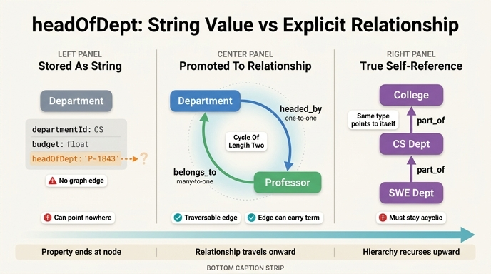

# Department의 `headOfDept`가 보여주는 패턴

## 질문

Department의 `headOfDept` 속성이 보여주는 패턴은?

## 답

**학과장을 맡은 교수를 참조하는 self-referential(자기 참조) 패턴**이다. 조직 계층 모델링에서 흔히 등장하는 형태다.

---

## 1. 원문에서의 위치

University System 온톨로지의 3단계(Department 추가)에서 Department 엔티티는 다음 속성을 갖는다.

| Property | Type | Identifier? |
|---|---|---|
| `departmentId` | string | ✓ |
| `name` | string | |
| `building` | string | |
| `budget` | float | |
| `headOfDept` | string | |

원문 설명:

> The `budget` float enables resource allocation queries. The `headOfDept` property references a professor who leads the department — **a self-referential pattern common in organizational hierarchies.**

즉 `headOfDept`는 "학과 안에 속한 구성원(Professor) 중 한 명을 다시 학과가 가리키는" 구조다. 조직이 자기 구성원을 되가리키기 때문에 그래프 상에 **되돌아오는 화살표(back-reference)** 가 생긴다.

### 용어 주의: 여기서 말하는 "self-referential"

엄밀한 정의의 self-reference는 `Department.parentDepartment → Department`처럼 **같은 타입이 자기 타입을 참조**하는 경우다. `headOfDept`는 Department → Professor라 타입이 다르므로 순수한 자기 참조는 아니다.

원문이 이를 self-referential이라 부른 것은 **"조직 구조 내부를 되가리키는 참조"** 라는 넓은 의미다.

- Professor는 `belongs_to`로 Department에 속한다.
- 그런데 Department는 그 안에 속한 Professor 중 하나를 `headOfDept`로 다시 가리킨다.
- 결과적으로 **조직 경계 안에서 닫히는 순환(cycle)** 이 만들어진다.

이 "닫힌 순환"이 조직 계층 모델링의 전형이며, 상위 부서 참조(`parentDepartment`) 같은 진짜 self-reference와 같은 계열의 문제(순환, 무한 재귀, 정합성)를 공유한다. 그래서 같은 이름으로 묶어 부른 것이다.

---

## 2. `headOfDept`가 string일 때 vs 명시적 관계로 승격할 때

이 카드의 핵심 학습 포인트다. 원문에서 `headOfDept`는 **타입이 `string`인 평범한 속성**이다. 하지만 개념적으로는 Professor를 가리키는 **관계**다. 이 둘의 차이가 온톨로지 설계의 갈림길이다.

### (A) string 속성으로 저장하는 방식

```
Department {
  departmentId: "CS"
  name: "Computer Science"
  headOfDept: "P-1043"     ← 그냥 문자열. 혹은 "Dr. Smith"
}
```

특징:

| 항목 | 내용 |
|---|---|
| 저장 형태 | 노드의 속성값(literal). 그래프의 엣지가 아니다 |
| 참조 무결성 | **없음.** `"P-9999"`처럼 존재하지 않는 교수 ID를 넣어도 막히지 않는다 |
| 표기 불일치 | `"P-1043"`, `"Dr. Smith"`, `"Smith, John"`이 뒤섞일 수 있다 |
| 조회 방식 | 조인/문자열 매칭. `MATCH (d:Department), (p:Professor) WHERE d.headOfDept = p.professorId` |
| 그래프 순회 | 불가능. 엣지가 없으므로 traversal 대상이 아니다 |
| 삭제 시 동작 | 교수를 지워도 `headOfDept` 문자열은 그대로 남아 **dangling reference**가 된다 |
| 장점 | 단순하다. 원천 시스템(HR CSV, SIS export)에서 온 값을 그대로 적재하기 쉽다 |

### (B) 명시적 관계 `headed_by`로 승격하는 방식

```
(d:Department {departmentId: "CS"})-[:headed_by]->(p:Professor {professorId: "P-1043"})
```

특징:

| 항목 | 내용 |
|---|---|
| 저장 형태 | 1급 엣지(first-class relationship) |
| 참조 무결성 | 엣지는 실제 노드를 향하므로 **존재하지 않는 대상을 가리킬 수 없다** |
| 카디널리티 표현 | Department당 학과장 1명 등 제약을 스키마 수준에서 선언 가능 |
| 조회 방식 | 순회. `MATCH (d:Department)-[:headed_by]->(p:Professor)` |
| 그래프 순회 | 가능. 다른 관계와 자유롭게 이어붙일 수 있다 |
| 삭제 시 동작 | 노드 삭제 시 엣지도 함께 정리(또는 삭제 차단)된다 |
| 엣지 속성 | `since`, `appointedBy`, `term` 같은 **임기 정보를 엣지에 붙일 수 있다** |
| 비용 | 데이터 적재 시 매칭·해석(resolution) 단계가 필요하다 |

### 승격했을 때만 가능해지는 질의

string 속성으로는 표현하기 매우 번거롭거나 불가능한 질의들이다.

```gql
-- 학과장이 가르치는 과목의 평균 성적
MATCH (d:Department)-[:headed_by]->(p:Professor)-[:teaches]->(c:Course)
      <-[:for_course]-(e:Enrollment)
RETURN d.name, p.name, AVG(e.gradePoint)

-- 자기 학과 소속이 아닌 사람이 학과장인 경우 찾기 (정합성 검증)
MATCH (d:Department)-[:headed_by]->(p:Professor)
WHERE NOT (p)-[:belongs_to]->(d)
RETURN d.name, p.name

-- 학과장이면서 종신교수가 아닌 사람
MATCH (d:Department)-[:headed_by]->(p:Professor)
WHERE p.tenured = false
RETURN d.name, p.name
```

특히 두 번째 질의가 중요하다. **`headOfDept`가 string이면 이 검증 자체를 그래프 패턴으로 쓸 수 없다.**

### 언제 string으로 두어도 되는가

- 그 값을 **표시(display)에만** 쓰고 순회하지 않을 때
- 원천 데이터의 품질이 낮아 아직 엔티티 해석(entity resolution)이 안 될 때 — 이 경우 string을 **staging 값**으로 두고 파이프라인에서 `headed_by` 엣지로 승격하는 2단계 설계가 실무적이다
- 이력 스냅샷처럼 "그 시점의 이름 문자열"을 보존해야 할 때

> **원칙:** 그 값을 타고 **다른 데이터로 이동할 일이 생기면** 관계로 승격하라. 속성은 노드에서 끝나고, 관계는 노드 너머로 이어진다.

---

## 3. `belongs_to`와 함께 생기는 순환 참조

`headed_by`로 승격하면 그래프에 **양방향 사이클**이 생긴다.

```
        belongs_to (many-to-one)
Professor ─────────────────────▶ Department
    ▲                                │
    └────────────────────────────────┘
             headed_by (one-to-one)
```

`(p)-[:belongs_to]->(d)-[:headed_by]->(p)` — 길이 2의 순환이다.

### 이 순환은 문제인가?

**그 자체로는 정상적이고 의미 있는 모델링이다.** 두 엣지의 의미가 다르기 때문이다.

| 관계 | 방향 | 카디널리티 | 의미 |
|---|---|---|---|
| `belongs_to` | Professor → Department | many-to-one | 소속 (모든 교수가 가짐) |
| `headed_by` | Department → Professor | one-to-one | 역할 임명 (학과당 1명) |

`belongs_to`는 "누구나 어딘가에 속한다"는 **멤버십**이고, `headed_by`는 "그중 한 명이 대표한다"는 **역할(role)** 이다. 서로 역관계(inverse)가 아니다. `headed_by`의 역관계는 `belongs_to`가 아니라 `heads`다.

### 다만 순환이 만드는 실무적 유의점

1. **정합성 제약이 필요하다.** 보통 학과장은 그 학과 소속이어야 한다. 이는 `belongs_to`와 `headed_by`가 **닫힌 삼각형(이 경우 2-사이클)을 이뤄야 한다**는 제약이며, 자동으로 보장되지 않는다. 위의 `WHERE NOT (p)-[:belongs_to]->(d)` 질의가 이 제약의 검증 쿼리다.

2. **순회 시 무한 루프.** 방향 무시(undirected) 순회나 가변 길이 패턴(`-[*]-`)을 쓰면 Professor ↔ Department를 왕복하며 경로가 폭증한다. 관계 타입을 명시하고 깊이 상한을 두어야 한다.
   ```gql
   -- 위험: 사이클 왕복
   MATCH path = (d:Department)-[*1..6]-(x)
   -- 안전: 타입·방향·깊이 제한
   MATCH path = (d:Department)-[:offers|belongs_to*1..3]->(x)
   ```

3. **삭제 순서 문제.** 학과장 교수를 삭제하면 `headed_by`가 끊기고 학과는 "장 없음" 상태가 된다. 학과를 삭제하면 소속 교수들의 `belongs_to`가 끊긴다. 순환 구조에서는 **어느 쪽을 먼저 지워야 하는지**가 자명하지 않으므로 삭제 정책(cascade / restrict / set-null)을 명시해야 한다.

4. **집계 시 중복 계산.** "학과 인원 수"를 셀 때 학과장이 `belongs_to`로 한 번, `headed_by`로 또 한 번 잡히지 않도록 `DISTINCT`를 쓰거나 관계 타입을 좁혀야 한다.

5. **직렬화·캐시 무한 재귀.** JSON/객체 그래프로 내보낼 때 Department → Professor → Department → … 로 무한 확장되지 않도록 깊이 제한이나 ID 참조 방식이 필요하다.

---

## 4. 진짜 self-referential 계층: 상위 부서 참조

조직 모델링에서 더 전형적인 자기 참조는 **같은 엔티티 타입 안에서의 계층**이다.

```
Department {
  departmentId: string
  name: string
  parentDepartment: string   ← 자기 자신(Department)을 가리킴
}
```

관계로 승격하면:

```
(child:Department)-[:part_of]->(parent:Department)
```

예: `Software Engineering → Computer Science → College of Engineering → University`

### `headed_by`와 `part_of`의 대응 관계

| 구분 | `headed_by` | `part_of` (상위 부서) |
|---|---|---|
| 참조 대상 | 다른 타입 (Professor) | **같은 타입 (Department)** |
| 순환의 형태 | `belongs_to`와 함께 만드는 2-사이클 | 이론상 자기 자신·조상으로의 사이클 (금지해야 함) |
| 정상 구조 | 사이클이 있는 것이 정상 | **사이클이 없어야 정상 (트리/DAG)** |
| 필요한 제약 | "학과장은 그 학과 소속" | "조상을 부모로 삼을 수 없음" |
| 대표 질의 | 1-hop 조회 | **가변 길이 재귀 순회** |

`part_of`에서만 필요한 재귀 질의:

```gql
-- 어떤 학과의 모든 상위 조직 (조상 체인)
MATCH (d:Department {name: 'Software Engineering'})-[:part_of*1..10]->(anc:Department)
RETURN anc.name

-- 어떤 단과대 아래 모든 하위 학과 (자손 전체)
MATCH (college:Department {name: 'College of Engineering'})<-[:part_of*1..10]-(sub:Department)
RETURN sub.name
```

여기서 `*1..10` 같은 **깊이 상한이 사실상 필수**다. 데이터에 실수로 사이클이 들어가면 재귀가 끝나지 않기 때문이다.

### 두 패턴을 함께 쓰면

실제 대학 조직도는 두 가지가 겹친다.

```
(SWE:Department)-[:part_of]->(CS:Department)-[:part_of]->(Engineering:Department)
     │                              │
     │ headed_by                    │ headed_by
     ▼                              ▼
(p1:Professor)                (p2:Professor)
     │ belongs_to                   │ belongs_to
     ▼                              ▼
  (SWE)                           (CS)
```

이 조합이면 "공대 산하 모든 학과의 학과장 명단" 같은 질의가 한 패턴으로 나온다.

```gql
MATCH (e:Department {name: 'College of Engineering'})<-[:part_of*0..5]-(d:Department)
      -[:headed_by]->(p:Professor)
RETURN d.name, p.name
```

`headOfDept`를 string으로 남겨두면 이 질의는 성립하지 않는다. **관계로 승격해야 계층 순회와 역할 참조가 하나의 그래프 패턴으로 연결된다.**

---

## 5. 정리

1. `headOfDept`는 "조직이 자기 구성원 중 하나를 되가리키는" 참조로, 조직 계층 모델링의 전형적 패턴이다.
2. 원문에서는 타입이 `string`이지만, 개념상 이것은 관계다. 순회·검증·임기 정보가 필요해지는 순간 `headed_by` 엣지로 승격해야 한다.
3. 승격하면 `belongs_to`와 함께 Professor ↔ Department 2-사이클이 생긴다. 두 관계의 의미가 다르므로 정상이지만, "학과장은 그 학과 소속" 제약과 순회 깊이 제한이 필요하다.
4. 같은 타입 간 자기 참조(`parentDepartment` / `part_of`)는 여기서 한 걸음 더 나간 형태로, 사이클이 **있으면 안 되는** 트리/DAG이며 재귀 질의와 깊이 상한이 핵심이다.

## 관련 카드로 이어지는 개념

- **Junction entity** (Enrollment): 관계 자체에 속성이 필요할 때 엔티티로 승격 — `headOfDept`를 `headed_by` 엣지로 승격하고 `since`를 붙이는 것과 같은 사고의 연장선
- **Hub entity** (Department): Professor와 Course 양쪽으로 연결되는 허브. `headed_by`는 이 허브를 다시 아래쪽 노드로 되돌리는 엣지다
- **Transitive query**: 사이클과 계층이 섞이면 순회 경로 설계가 곧 질의 성능이 된다

## 인포그래픽


