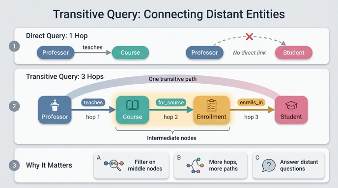
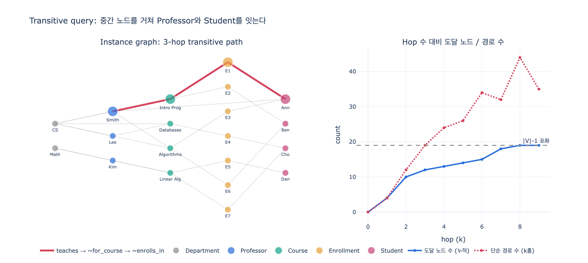

# Transitive Query (전이 질의)

> **Q.** transitive query(전이 질의)란 무엇인가?
>
> **A.** 직접 관계가 없는 엔티티들을 중간 노드를 거쳐 여러 관계를 연달아 타고 연결하는 질의다. 그래프 기반 온톨로지의 가장 큰 강점 중 하나다.

---

## 1. 한 줄 정의

**전이 질의**는 시작 엔티티에서 출발해 **간선(관계)을 두 번 이상 연달아 타고** 목적지 엔티티에 도달하는 질의다.

$$p = v_0 \xrightarrow{r_1} v_1 \xrightarrow{r_2} \cdots \xrightarrow{r_k} v_k, \qquad k \ge 2$$

- $v_0, v_k$ : 시작·목적 엔티티 — **둘 사이에 직접 간선이 없다**
- $v_1 \dots v_{k-1}$ : **중간 노드(intermediate node)**
- $r_i$ : 타고 넘어가는 관계 라벨
- $k$ : **홉(hop) 수**

$k = 1$ 이면 그냥 인접 노드 조회(1홉 질의)다. $k \ge 2$ 부터가 전이 질의다.

"전이(transitive)"라는 이름은 수학의 추이 관계에서 왔다. $a \to b$ 이고 $b \to c$ 이면 $a \rightsquigarrow c$ 를 유도할 수 있다는 성질을, 그래프 탐색으로 구현한 것이 전이 질의다.

---

## 2. University 온톨로지에서의 실제 예

이 학습 경로에서 만든 온톨로지는 **5 엔티티 / 6 관계**다.

| 관계 | 방향 | 카디널리티 |
|---|---|---|
| `enrolls_in` | Student → Enrollment | 1:N |
| `for_course` | Enrollment → Course | N:1 |
| `teaches` | Professor → Course | 1:N |
| `advises` | Professor → Student | 1:N |
| `belongs_to` | Professor → Department | N:1 |
| `offers` | Department → Course | 1:N |

여기서 **"Smith 교수의 수업을 듣는 학생은 누구인가?"** 를 묻는다고 하자.

`teaches`/`enrolls_in` 계열에는 Professor와 Student를 잇는 **직접 간선이 없다**. 하지만 다음 3홉 경로로 이을 수 있다.

```
Professor --teaches--> Course <--for_course-- Enrollment <--enrolls_in-- Student
```

이것이 바로 전이 질의다. 학습 자료의 표현을 그대로 옮기면:

> With `Professor → Course ← Enrollment ← Student`, you can now ask questions that cross the teaching relationship: *"Which students are taking courses from tenured professors?"*

### 주의: `advises` 는 별개다

Professor → Student 사이에는 `advises`라는 직접 관계가 따로 있다. 하지만 이건 **지도교수** 관계이지 **수업 수강** 관계가 아니다. "내 수업을 듣는 학생"은 `advises` 로는 절대 답할 수 없고, 반드시 Course·Enrollment를 경유해야 한다. 전이 질의는 이렇게 **의미가 다른 연결을 새로 만들어내는** 도구다.

---

## 3. 왜 이것이 그래프 온톨로지의 강점인가

### (1) 스키마를 바꾸지 않고 새 질문에 답한다

관계형 DB에서 "교수별 수강생"을 자주 조회하려면 보통 뷰나 비정규화 테이블을 새로 만든다. 그래프 온톨로지에서는 **이미 있는 간선을 더 타기만 하면** 된다. 새 관계를 정의할 필요가 없다.

### (2) 중간 노드의 속성을 조건에 쓸 수 있다

전이 질의의 진짜 힘은 여기에 있다. 경로 위 **모든 노드**의 속성을 필터로 걸 수 있다.

```gql
MATCH (d:Department)-[:offers]->(c:Course)<-[:for_course]-(e:Enrollment)<-[:enrolls_in]-(s:Student)
WHERE e.grade IN ['C', 'D', 'F']
RETURN d.name, c.title, COUNT(e) AS struggling_count
ORDER BY struggling_count DESC
```

이 한 패턴 안에서
- 출발점 `Department`
- 중간 노드 `Course`, `Enrollment` (그중 `Enrollment.grade` 로 필터)
- 도착점 `Student`

가 모두 다뤄진다. `Professor.tenured = true` 같은 조건을 앞단에 더 붙이면 *"종신교수 수업에서 C 이하를 받은 학생"* 이 된다.

### (3) 학습 경로의 원래 시나리오가 전부 전이 질의다

| 질문 | 그래프 경로 | 홉 수 |
|---|---|---|
| 어느 학과의 평균 학점이 가장 높은가? | Department → Course ← Enrollment ← Student | 3 |
| 학과별 수강률은? | Department → Course ← Enrollment | 2 |
| 자기 학과 밖 과목을 가르치는 교수는? | Professor → Department vs Professor → Course ← Department | 2 |
| 50% 이상이 C 미만인 수업을 가진 학과는? | Department → Professor → Course → Enrollment ← Student | 4 |

---

## 4. 방향과 역방향 traversal

전이 질의를 구현할 때 가장 흔히 놓치는 지점이다. 스키마의 간선에는 방향이 있지만, **질의는 간선을 역방향으로도 탄다**.

```
Professor --teaches-->   Course       (정방향)
Course    <--for_course-- Enrollment  (역방향!)
Enrollment <--enrolls_in-- Student    (역방향!)
```

GQL/Cypher 문법의 `<-[:for_course]-` 가 정확히 이 역방향 traversal이다. 구현 관점에서는 인접 리스트를 **양방향**으로 만들어 두어야 한다 (`expy.py`에서는 역방향 라벨에 `~` 접두사를 붙였다).

그래서 Course처럼 나가는 간선이 하나도 없는 엔티티도 허브 역할을 할 수 있다.

---

## 5. 전이 질의의 비용 — 홉이 늘면 무슨 일이 생기나

두 가지 지표가 다르게 움직인다.

- **도달 가능 노드 수** $R_k = |\{v : dist(v_0, v) \le k\}|$ — 결국 $|V|$ 로 **포화**한다.
- **탐색해야 할 경로 수** $P_k$ — 분기(branching factor)가 곱해지며 훨씬 크게 불어난다. 대략 $P_k \sim b^k$.

`expy.py` 실측(20노드/26간선, Smith 교수 출발):

| hop | 1 | 2 | 3 | 4 | 5 | 6 | 7 | 8 | 9 |
|---|---|---|---|---|---|---|---|---|---|
| 도달 노드(누적) | 4 | 10 | 12 | 13 | 14 | 15 | 18 | 19 | 19 |
| 단순 경로 수 | 4 | 12 | 19 | 24 | 26 | 34 | 32 | 44 | 35 |

교훈:

1. **홉 수 상한을 반드시 건다.** 무제한 전이 탐색은 실무 그래프에서 즉시 폭발한다.
2. **결과는 노드 집합으로 dedup 한다.** Smith → Student 3홉 경로가 4개 나와도 실제 학생은 Ann, Ben 둘뿐이다 (Ann은 두 과목을 듣는다).
3. **단순 경로(simple path) 제약**(노드 재방문 금지)이 없으면 사이클에서 무한 루프에 빠진다.
4. 필터는 **가능한 한 앞쪽 홉에서** 걸어 프론티어를 줄인다 (`Professor.tenured = true` 를 먼저 적용).

---

## 6. Junction 엔티티와의 관계

전이 질의는 **junction 엔티티 패턴과 짝을 이룬다.**

Student–Course는 M:N이고 학점·학기·상태 같은 속성이 관계 자체에 붙는다. 그래서 `Enrollment`라는 junction 엔티티를 중간에 세웠다. 그 결과 Student와 Course 사이의 거리가 1홉에서 2홉으로 늘어났다 — **junction 엔티티를 도입하는 순간, 그 관계를 쓰는 모든 질의는 전이 질의가 된다.**

즉 두 개념은 트레이드오프다.

- junction 엔티티 → 관계에 속성을 붙일 수 있다 (grade, semester, status)
- 대가로 → 경로가 한 홉 길어지고, 질의는 전이 질의가 된다
- 전이 질의를 잘 다룰 수 있으니 → 이 대가는 충분히 감당할 만하다

---

## 7. 자주 하는 오해

| 오해 | 사실 |
|---|---|
| 전이 질의 = 단일 엔티티 속성 조회 | 아니다. 그건 0홉(속성 lookup)이다 |
| 전이 질의 = ID로 노드 찾기 | 아니다. 그건 인덱스 조회다 |
| 전이 질의는 관계를 새로 저장해야 한다 | 아니다. 기존 간선을 **탐색 시점에** 이어붙일 뿐이다 |
| 홉이 길수록 좋다 | 아니다. 의미 없는 긴 경로는 노이즈이고 비용만 든다 |
| SQL로는 불가능하다 | 가능하지만 홉마다 JOIN이 늘고, 홉 수가 가변이면 재귀 CTE가 필요해 표현이 급격히 어려워진다 |

---

## 8. 핵심 요약

1. 전이 질의 = **중간 노드를 경유해 관계를 연달아 타는 다홉 질의** ($k \ge 2$).
2. University 온톨로지의 대표 사례는 `Professor → Course → Enrollment → Student`.
3. **직접 간선이 없는 엔티티**를 연결하고, **중간 노드의 속성**까지 조건으로 쓸 수 있다는 것이 강점.
4. 간선은 정방향·역방향 모두 탄다 (`<-[:for_course]-`).
5. 홉이 늘면 도달 노드는 포화하지만 경로 수는 폭발 → **깊이 제한 + dedup + 조기 필터**가 필수.
6. junction 엔티티(Enrollment)를 쓰는 순간 전이 질의는 선택이 아니라 기본이 된다.

---

## 인포그래픽



## 시각화


