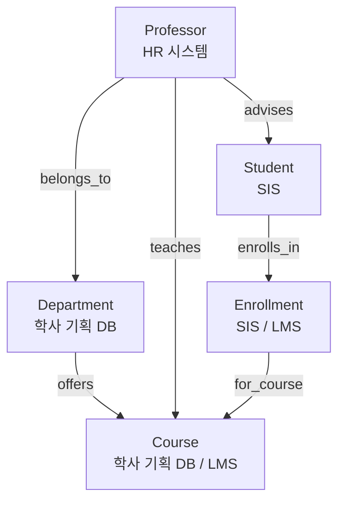

# 대학 데이터는 원래 어떤 시스템들에 흩어져 있는가?

## 정답

**학생정보시스템(SIS), 학습관리시스템(LMS), 인사(HR) 시스템, 학사 기획 데이터베이스**에 분산되어 있다.
온톨로지는 이 사일로들을 하나의 그래프로 연결한다.

> 원문: *"Data lives across student information systems (SIS), learning management systems (LMS), human resources, and academic planning databases."*

---

## 왜 이 질문이 중요한가

대학 온톨로지를 배울 때 첫 번째로 잡아야 할 감각은 "이 모델이 **왜** 필요한가"이다.
학생, 과목, 수강, 교수, 학과라는 5개 엔티티는 이미 대학 어딘가에 데이터로 존재한다.
문제는 그 데이터가 **한 곳에 있지 않다**는 점이다. 각 시스템은 서로 다른 부서가,
서로 다른 시기에, 서로 다른 목적으로 도입했기 때문에 스키마도 식별자도 제각각이다.

온톨로지는 새 데이터를 만드는 것이 아니라, **이미 흩어져 있는 데이터에
공통의 의미 계층(semantic layer)을 씌워 하나의 그래프로 잇는 것**이다.

---

## 4개 시스템, 각각 무엇을 들고 있나

| 시스템 | 원어 | 담당 부서(전형적) | 여기에 사는 데이터 | 대응하는 온톨로지 엔티티 |
|---|---|---|---|---|
| 학생정보시스템 | Student Information System (SIS) | 교무처 / 학적과 | 학번, 이름, 학년, 전공, 학적 상태, GPA, 수강신청·성적 원장 | `Student`, `Enrollment` |
| 학습관리시스템 | Learning Management System (LMS) | 교수학습지원센터 | 강의실(코스) 개설, 과제·퀴즈 제출, 출석, 학습 활동 로그 | `Course`, `Enrollment`(활동 측면) |
| 인사 시스템 | Human Resources (HR) | 인사처 | 교원 정보, 직급(rank), 정년보장(tenure) 여부, 소속 학과, 급여 | `Professor`, `Department`(소속 관계) |
| 학사 기획 DB | Academic Planning Database | 기획처 / 학사지원팀 | 교육과정, 학점 구조, 선수과목, 정원(maxEnrollment), 학과 예산·건물 | `Course`(교과 정의), `Department` |

### 각 시스템을 조금 더 풀어보면

**SIS (Student Information System)**
학적의 "공식 기록"을 담당한다. 학번이 발급되고, 수강신청이 확정되고,
최종 성적이 확정 저장되는 곳. 온톨로지의 `Student.studentId`,
`Student.gpa`, `Enrollment.grade` 같은 값의 원천(system of record)이다.
예: Banner, PeopleSoft Campus Solutions, 국내 대학의 종합정보시스템.

**LMS (Learning Management System)**
"수업이 실제로 굴러가는" 곳. 강의자료 배포, 과제 제출, 토론, 퀴즈, 출석이 여기 쌓인다.
같은 "과목"이라도 SIS의 과목 코드와 LMS의 코스 ID가 다른 경우가 흔하다.
예: Moodle, Canvas, Blackboard.

**HR 시스템**
교수는 "학생을 가르치는 사람"이기 전에 "고용된 직원"이다.
그래서 `Professor.rank`(Assistant/Associate/Full), `Professor.tenured`(boolean),
소속 학과 같은 속성은 교무 시스템이 아니라 인사 시스템에 산다.

**학사 기획 데이터베이스**
교육과정 설계와 자원 배분을 담당한다. 어떤 과목을 몇 학점으로 개설할지,
정원은 몇 명인지, 학과 예산(`Department.budget`)과 건물(`Department.building`)이
어떻게 배정되는지가 여기 있다.

---

## 사일로가 만드는 문제

학습 경로에서 제시한 대표 질문은 이것이다.

> **"전체 수강생의 50% 이상이 C 미만을 받은 과목을 가르치는 교수가 속한 학과는 어디인가?"**
> *(Which departments have professors teaching courses where over 50% of enrolled students scored below a C?)*

이 질문 하나에 필요한 데이터를 추적해 보면:

- **학과 기록** → 학사 기획 DB
- **교수 배정 / 소속** → HR 시스템
- **개설 과목** → 학사 기획 DB + LMS
- **학생 성적** → SIS

즉 **네 시스템을 모두 건드려야** 한 문장짜리 질문에 답할 수 있다.
전통적인 방식이라면 각 부서에 데이터 추출을 요청하고, 엑셀에서 학번·과목코드·사번을
수작업으로 맞춰 붙이고, 며칠에 걸쳐 리포트를 만든다. 그리고 다음 달에 같은 질문이
조금 다른 형태로 오면 그 작업을 처음부터 다시 한다.

---

## 온톨로지가 하는 일: 사일로 → 하나의 그래프

온톨로지는 각 시스템의 레코드를 **엔티티**로 승격시키고, 시스템 경계를 가로지르는
**관계**를 1급 시민으로 선언한다. 그러면 위의 질문은 이렇게 단순한 경로 탐색이 된다.

```
Department → Professor → Course → Enrollment (grade < C) ← Student
```

완성된 University 온톨로지는 **5개 엔티티, 6개 관계**로 구성된다.



| 관계 | 방향 | 카디널리티 | 잇는 사일로 |
|---|---|---|---|
| `enrolls_in` | Student → Enrollment | 1:N | SIS 내부 |
| `for_course` | Enrollment → Course | N:1 | SIS ↔ LMS/기획DB |
| `teaches` | Professor → Course | 1:N | **HR ↔ LMS/기획DB** |
| `advises` | Professor → Student | 1:N | **HR ↔ SIS** |
| `belongs_to` | Professor → Department | N:1 | **HR ↔ 기획DB** |
| `offers` | Department → Course | 1:N | 기획DB 내부 |

굵게 표시한 세 관계가 바로 **사일로를 가로지르는 연결**이다.
이 링크들이 없으면 "정년보장 교수의 수업을 듣는 학생" 같은 질문에 답할 수 없다.

---

## 실제 GQL로 보면

학습 경로에 나오는 질의 예시 — "학생들이 고전하고 있는 학과 찾기":

```gql
MATCH (d:Department)-[:offers]->(c:Course)<-[:for_course]-(e:Enrollment)<-[:enrolls_in]-(s:Student)
WHERE e.grade IN ['C', 'D', 'F']
RETURN d.name, c.title, COUNT(e) AS struggling_count
ORDER BY struggling_count DESC
```

한 줄의 `MATCH` 패턴이 기획DB(Department, Course) → SIS(Enrollment, Student)를
가로지른다. 사일로가 통합되지 않았다면 이건 조인 SQL 수십 줄 + 부서 간 협조 요청이 된다.

---

## 통합 시 실무에서 걸리는 지점

온톨로지가 "연결한다"고 할 때, 실제로 해결해야 하는 것들:

1. **식별자 정합(entity resolution)**
   SIS의 학번, LMS의 계정 ID, 이메일 주소가 같은 학생을 가리키는지 매핑해야 한다.
   온톨로지에서 `studentId`, `courseId`, `professorId`를 **identifier**로 지정하는 이유가 이것이다.
2. **어휘 정렬**
   SIS는 "과목", LMS는 "코스", 기획DB는 "교과목"이라 부른다. 온톨로지가 `Course`라는
   단일 개념으로 통일한다.
3. **권한 경계**
   HR의 급여 데이터, SIS의 성적은 민감 정보다. 그래프로 연결하되 속성 단위 접근 제어가 필요하다.
4. **갱신 주기 차이**
   LMS 활동 로그는 실시간, SIS 성적은 학기말 확정, HR은 인사발령 시점에 갱신된다.

---

## 암기 포인트

- **4개 사일로**: SIS(학생) · LMS(학습) · HR(교원) · 학사 기획 DB(교육과정·예산)
- 각각 → `Student/Enrollment` · `Course/Enrollment` · `Professor` · `Course/Department`
- 온톨로지의 역할 = 새 데이터 생성이 아니라 **기존 사일로를 하나의 그래프로 연결**
- 통합의 가치가 드러나는 순간 = **여러 시스템을 가로지르는 질문**을 한 번의 경로 탐색으로 답할 때

### 기억을 돕는 문장

> **"학생은 SIS, 수업은 LMS, 교수는 HR, 교육과정과 예산은 기획DB."**

---

## 함께 보면 좋은 개념

- **정션 엔티티(junction entity)**: `Enrollment`가 Student–Course의 다대다 관계를
  속성(grade, semester, status)과 함께 해소한다. 이 엔티티 자체가 SIS와 LMS 양쪽에
  걸쳐 있다는 점이 사일로 통합의 대표 사례다.
- **허브 엔티티(hub entity)**: `Department`는 Professor(HR)와 Course(기획DB) 양쪽으로
  연결되어 조직 계층의 최상단이자 집계 질의의 기준점이 된다.
- **전이적 질의(transitive query)**: `Professor → Course → Enrollment → Student`처럼
  직접 관계가 없는 엔티티를 중간 노드를 거쳐 잇는 것. 사일로 통합의 실질적 산출물이다.
