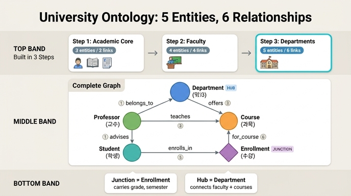

# 완성된 University 온톨로지의 최종 규모

## 정답 요약

**5개 엔티티 + 6개 관계**

- 엔티티(5): `Student`, `Course`, `Enrollment`, `Professor`, `Department`
- 관계(6): `enrolls_in`, `for_course`, `teaches`, `advises`, `belongs_to`, `offers`

이 규모로 학사 행정(academic administration) 모델 전체 — 학생·교과·수강·교원·조직 — 를 포괄한다.

---

## 3단계 누적 구조

학습 경로는 한 번에 5개를 던지지 않고, 세 단계에 걸쳐 엔티티를 **누적**하며 쌓아 올린다.

| 단계 | 추가 엔티티 | 누적 엔티티 | 추가 관계 | 누적 관계 | 핵심 개념 |
|---|---|---|---|---|---|
| 1. Academic Core | Student, Course, Enrollment | 3 | enrolls_in, for_course | 2 | 정션 엔티티, 다대다 해소 |
| 2. Faculty | Professor | 4 | teaches, advises | 4 | 전이적 질의, boolean 속성 |
| 3. Complete Model | Department | 5 | belongs_to, offers | 6 | 조직 계층, 허브 엔티티 |

포인트: **매 단계마다 엔티티 1~3개, 관계 2개씩** 늘어난다. 마지막 단계에서 5/6에 도달한다.

---

## 엔티티 5개 상세

### 1) Student — 누가 배우는가

| 속성 | 타입 | 식별자 |
|---|---|---|
| `studentId` | string | ✓ |
| `name` | string | |
| `gpa` | float | |
| `enrollmentYear` | integer | |
| `major` | string | |

`gpa`가 float인 이유: 0.0~4.0 범위의 집계 지표라서 학사경고·우등생 명단 같은 임계값 질의가 가능해진다.

### 2) Course — 무엇을 가르치는가

| 속성 | 타입 | 식별자 |
|---|---|---|
| `courseId` | string | ✓ |
| `title` | string | |
| `credits` | integer | |
| `level` | string | |
| `maxEnrollment` | integer | |

`level`(100/200/300/400)은 난이도와 선수과목을, `maxEnrollment`는 정원 계획을 담당한다.

### 3) Enrollment — 정션 엔티티 (이 모델의 심장)

| 속성 | 타입 | 식별자 |
|---|---|---|
| `enrollmentId` | string | ✓ |
| `semester` | string | |
| `grade` | string | |
| `enrollDate` | date | |
| `status` | string | |

Student와 Course는 다대다다. 그런데 그 **연결 자체가 속성(성적, 학기, 상태)을 갖는다.** 직접 관계로는 성적을 어디에도 붙일 수 없으므로, 관계를 일급 엔티티로 승격시킨 것이 Enrollment다.

### 4) Professor — 교원

| 속성 | 타입 | 식별자 |
|---|---|---|
| `professorId` | string | ✓ |
| `name` | string | |
| `rank` | string | |
| `tenured` | boolean | |
| `officeHours` | string | |

`rank`는 Assistant → Associate → Full 계층, `tenured`는 boolean으로 범주 필터링을 가능하게 한다.

### 5) Department — 허브 엔티티

| 속성 | 타입 | 식별자 |
|---|---|---|
| `departmentId` | string | ✓ |
| `name` | string | |
| `building` | string | |
| `budget` | float | |
| `headOfDept` | string | |

`budget`(float)은 자원 배분 질의를, `headOfDept`는 학과장 교수를 참조하는 자기참조적 조직 패턴을 표현한다.

---

## 관계 6개 상세

| # | 관계 | 방향 | 카디널리티 | 의미 |
|---|---|---|---|---|
| 1 | `enrolls_in` | Student → Enrollment | 1:N | 학생은 학기마다 여러 수강 기록을 갖는다 |
| 2 | `for_course` | Enrollment → Course | N:1 | 각 수강 기록은 하나의 과목에 대한 것 |
| 3 | `teaches` | Professor → Course | 1:N | 교수는 학기당 하나 이상의 과목을 가르친다 |
| 4 | `advises` | Professor → Student | 1:N | 교수는 지도학생을 둔다 |
| 5 | `belongs_to` | Professor → Department | N:1 | 교수는 특정 학과 소속 |
| 6 | `offers` | Department → Course | 1:N | 학과는 교과과정으로 과목을 개설한다 |

### 관계 그래프 형태

```
              Department
              /        \
      belongs_to      offers
            /            \
      Professor --teaches--> Course
         |                     ^
      advises              for_course
         |                     |
      Student --enrolls_in--> Enrollment
```

Department는 아래로 Professor(교원)와 Course(교과) **양쪽**에 연결되어 조직 계층의 꼭대기에 앉는다. 이 이중 연결이 Department를 "허브 엔티티"로 만들고, 학과 단위 집계 질의를 자연스럽게 한다.

---

## 왜 5/6이면 "전체를 포괄"한다고 하는가

학사 행정 도메인의 네 축이 모두 커버되기 때문이다.

| 축 | 담당 엔티티 |
|---|---|
| 학습자 | Student |
| 교과 | Course |
| 학사 기록/성적 | Enrollment |
| 교원 | Professor |
| 조직/예산 | Department |

그리고 6개 관계가 이 축들을 끊김 없이 이어 주기 때문에 **전이적 질의(transitive query)** 가 가능하다. 원래 데이터는 SIS(학생정보), LMS(학습관리), HR(인사), 학사기획 DB에 흩어져 있지만, 온톨로지 위에서는 하나의 경로가 된다.

대표 질문: *"등록 학생의 50% 이상이 C 미만을 받은 과목을 가르치는 교수가 있는 학과는?"*

```
Department → Professor → Course → Enrollment(grade < C) ← Student
```

### 완성 모델이 답할 수 있는 질의

| 질문 | 그래프 경로 |
|---|---|
| 평균 GPA가 가장 높은 학과는? | Department → Course ← Enrollment ← Student |
| 소속 학과 밖 과목을 가르치는 교수는? | Professor → Department vs Professor → Course → Department |
| 학과별 수강률은? | Department → Course ← Enrollment (count) / Course.maxEnrollment |
| 정년보장 교원이 가장 많은 학과는? | Department ← Professor (tenured=true, count) |

### GQL 예시 (성적 부진 학과 찾기)

```gql
MATCH (d:Department)-[:offers]->(c:Course)<-[:for_course]-(e:Enrollment)<-[:enrolls_in]-(s:Student)
WHERE e.grade IN ['C', 'D', 'F']
RETURN d.name, c.title, COUNT(e) AS struggling_count
ORDER BY struggling_count DESC
```

이 쿼리 하나에 `offers`, `for_course`, `enrolls_in` 3개 관계와 Department·Course·Enrollment·Student 4개 엔티티가 동시에 동원된다. 규모가 작아도 조합으로 표현력이 나온다는 것이 핵심이다.

---

## 암기 포인트

- **숫자**: 엔티티 5, 관계 6. (관계가 엔티티보다 **1개 많다**는 점으로 기억)
- **단계별 누적**: 3 → 4 → 5 (엔티티), 2 → 4 → 6 (관계). 관계는 단계마다 정확히 2개씩.
- **엔티티 순서**: Student, Course, Enrollment(코어 3) → Professor(교원) → Department(조직)
- **관계 짝**: (enrolls_in, for_course) / (teaches, advises) / (belongs_to, offers)
- **역할 요약**: Enrollment = 정션, Department = 허브

## 흔한 함정

- "6개 엔티티"로 착각 — 엔티티는 5개, 6은 **관계** 수다.
- Enrollment를 관계로 세는 실수 — Enrollment는 속성을 가진 **엔티티**이며, 그것을 잇는 `enrolls_in`/`for_course`가 관계다.
- `advises`를 빠뜨리는 실수 — Professor는 Course뿐 아니라 Student와도 직접 연결된다(지도 관계). 이걸 빼면 관계가 5개가 된다.

## 인포그래픽


