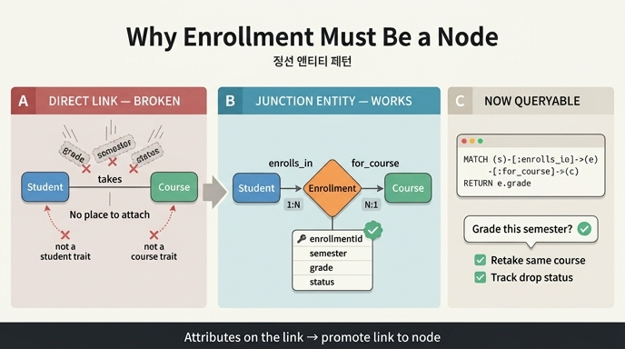

# Enrollment을 Student–Course 직접 관계로 대체할 수 없는 이유

## 질문과 답

**Q.** Enrollment를 Student–Course 직접 관계로 대체할 수 없는 이유는?

**A.** 직접 관계로는 성적·학기·상태 정보를 실을 수 없기 때문이다. "이 학생이 이번 학기 이 강좌에서 받은 성적은?" 같은 질의는 연결 자체에 속성이 있어야 답할 수 있다.

---

## 1. 핵심 한 줄

**속성이 붙어야 하는 대상이 "학생"도 "강좌"도 아닌 "그 둘의 연결"이기 때문**이다.
성적(grade), 학기(semester), 상태(status)는 학생 개인의 속성도 아니고 강좌의 속성도 아니다. "김학생이 2024년 봄학기에 CS101에서 받은 A"라는 사실은 **(학생, 강좌, 학기)라는 조합**에만 존재한다. 그래서 그 조합을 담을 1급 객체(first-class entity)가 필요하다 — 그것이 **Enrollment(정션 엔티티)** 다.

---

## 2. 직접 관계로 시도했을 때 무엇이 깨지는가

가정: `Student -[takes]-> Course` 라는 단순 다대다 관계만 둔다.

| 담고 싶은 정보 | 어디에 넣을까? | 결과 |
|---|---|---|
| `grade` = "A" | Student에? | 학생은 강좌를 여러 개 듣는다 → 어떤 강좌의 A인지 알 수 없음 |
| | Course에? | 강좌에는 학생이 여러 명이다 → 누구의 A인지 알 수 없음 |
| `semester` = "2024 Spring" | Student에? | 재수강·복수 학기 이력이 뭉개짐 |
| `status` = "enrolled/dropped" | Course에? | 강좌 전체가 드롭된 것처럼 해석됨 |
| 같은 강좌 재수강 | takes 관계 2개? | 두 관계를 구분할 식별자·속성이 없어 구분 불가 |

즉 직접 관계에서는 **속성을 놓을 자리 자체가 없다.** 억지로 끝점(endpoint)에 밀어 넣으면 정보가 소실되거나 잘못된 대상에 귀속된다.

---

## 3. 정션 엔티티(Junction Entity) 패턴

> **패턴 정의:** 두 엔티티가 **다대다(many-to-many)** 관계이면서 **그 관계 자체에 속성이 있을 때**, 관계를 엔티티로 승격시킨다.

학습 자료의 모델:

```
Student  --enrolls_in-->  Enrollment  --for_course-->  Course
        (one-to-many)                  (many-to-one)
```

- 한 학생은 여러 학기에 걸쳐 여러 Enrollment를 가진다 (1:N)
- 각 Enrollment는 정확히 하나의 Course를 가리킨다 (N:1)
- 결과적으로 Student ↔ Course는 다대다이지만, **중간 노드가 그 연결의 맥락을 보관**한다

### Enrollment의 속성

| Property | Type | Identifier? |
|---|---|---|
| `enrollmentId` | string | ✓ |
| `semester` | string | |
| `grade` | string | |
| `enrollDate` | date | |
| `status` | string | |

`enrollmentId`라는 **자체 식별자**가 있다는 점이 중요하다. 이것이 "관계가 1급 객체가 되었다"는 증거다. 관계를 개별적으로 지목하고, 조회하고, 갱신하고, 이력을 남길 수 있다.

---

## 4. 질의로 확인하기

직접 관계로는 표현조차 불가능한 질의:

```gql
MATCH (s:Student)-[:enrolls_in]->(e:Enrollment)-[:for_course]->(c:Course)
WHERE s.studentId = 'S001'
  AND c.courseId  = 'CS101'
  AND e.semester  = '2024-Spring'
RETURN e.grade
```

`e.grade`를 쓰려면 `e`가 **바인딩 가능한 노드**여야 한다. 직접 관계 `(s)-[:takes]->(c)`에서는 붙잡을 대상이 없다.

학습 자료의 실제 예시 — "평균 성적이 B 미만인, 학생들이 고전하는 학과 찾기":

```gql
MATCH (d:Department)-[:offers]->(c:Course)<-[:for_course]-(e:Enrollment)<-[:enrolls_in]-(s:Student)
WHERE e.grade IN ['C', 'D', 'F']
RETURN d.name, c.title, COUNT(e) AS struggling_count
ORDER BY struggling_count DESC
```

`WHERE e.grade IN [...]` 필터는 Enrollment가 노드이기 때문에 성립한다. 시나리오 개요의 대표 질문 **"등록 학생의 50% 이상이 C 미만을 받은 강좌를 가르치는 교수가 있는 학과는?"** 역시 `Department → Professor → Course → Enrollment(grade < C) ← Student` 경로를 필요로 한다.

---

## 5. 부수 효과: 얻게 되는 것들

정션 엔티티로 승격하면 단순히 "속성을 담는다"를 넘어 다음이 따라온다.

1. **시간축(temporal) 표현** — 같은 (학생, 강좌) 쌍이 학기별로 여러 번 존재 가능 (재수강, 청강 후 정식 수강)
2. **상태 전이(lifecycle)** — `status`가 enrolled → dropped → completed 로 변하는 과정을 한 객체에서 추적
3. **집계 단위** — `COUNT(e)`, 학과별 평균 성적, 강좌 등록률(`COUNT(e) / Course.maxEnrollment`) 계산의 기준점
4. **확장 지점** — 나중에 `attendanceRate`, `withdrawalDate`, `waitlistPosition` 같은 속성을 추가할 때 Student/Course를 건드리지 않아도 됨
5. **다중 홉 경로의 경유지** — Professor → Course → Enrollment → Student 같은 전이적(transitive) 질의의 연결 고리

---

## 6. 언제 직접 관계로 충분한가 (반대 사례)

모든 관계를 엔티티로 만들 필요는 없다. 학습 자료의 다른 관계들은 직접 관계로 남아 있다.

| 관계 | 형태 | 왜 직접 관계로 충분한가 |
|---|---|---|
| `teaches` (Professor → Course) | 1:N | 연결 자체에 실을 속성이 없음 |
| `belongs_to` (Professor → Department) | N:1 | 소속 사실만 필요 |
| `offers` (Department → Course) | 1:N | 제공 사실만 필요 |

**판단 기준:**
- 관계에 속성이 있는가? → 있으면 엔티티로 승격
- 같은 두 노드 사이에 연결이 **여러 번** 생길 수 있는가? → 있으면 승격
- 그 연결을 개별적으로 식별·조회해야 하는가? → 필요하면 승격

세 질문 모두 "아니오"면 직접 관계가 더 단순하고 낫다.

---

## 7. 오답 정리

학습 자료 퀴즈에 나온 오답들과 그 이유:

- ❌ "그래프에 노드를 더 많이 만들려고" — 노드 수는 목적이 아니다. 오히려 불필요한 정션 엔티티는 모델을 무겁게 한다.
- ❌ "온톨로지는 최소 3개 엔티티가 필요해서" — 그런 규칙은 없다.
- ❌ "엔티티 간 직접 관계는 허용되지 않아서" — 직접 관계는 얼마든지 허용된다 (`teaches`, `offers` 등).
- ✅ "Enrollment가 Student에도 Course에도 속하지 않는 자체 속성(grade, semester, status)을 가지기 때문"

---

## 8. 한 문장 요약

> 성적·학기·상태는 **연결의 속성**이므로, 연결을 엔티티(Enrollment)로 승격해야만 저장하고 질의할 수 있다.

---

## 인포그래픽


