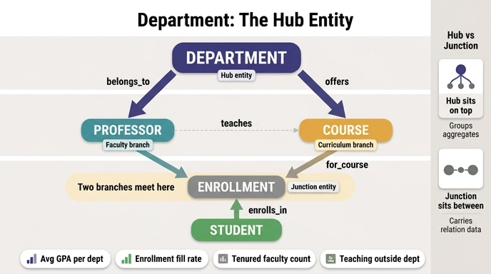

# Department가 hub entity(허브 엔티티)로 불리는 이유

## 핵심 한 줄

Department는 **`belongs_to`로 Professor(교수진)와, `offers`로 Course(커리큘럼)와 동시에 아래 방향으로 연결**된다.
한 엔티티가 서로 다른 두 갈래를 동시에 거느리므로, 학과 수준에서 교수 데이터와 강의 데이터를 합치는 **집계 질의의 중심점**이 된다.

---

## 1. Department 엔티티

| Property | Type | Identifier? |
|---|---|---|
| `departmentId` | string | ✓ |
| `name` | string | |
| `building` | string | |
| `budget` | float | |
| `headOfDept` | string | |

- `budget`(float) → 예산 배분·비용 대비 성과 같은 자원 할당 질의를 가능하게 한다.
- `headOfDept` → 학과를 이끄는 교수를 가리키는 값으로, 조직 계층에서 흔한 **자기 참조(self-referential) 패턴**이다.

## 2. Department에 붙는 두 관계

- **`belongs_to`** — `Professor` → `Department` (many-to-one)
  교수는 하나의 학과에 소속된다. 화살표는 Professor에서 출발하지만, 계층 그림에서 보면 Department 아래에 교수진이 매달린다.
- **`offers`** — `Department` → `Course` (one-to-many)
  학과는 자신의 교육 과정으로 강의를 개설한다.

즉 Department 하나에서 **"사람(faculty)"** 갈래와 **"교육과정(curriculum)"** 갈래가 동시에 뻗어 나간다.
이 두 갈래는 아래쪽에서 다시 `Course ← Enrollment ← Student`로 합류한다.

```
                 Department
        belongs_to /      \ offers
                  /        \
           Professor        Course
                  \          |
             teaches\        | for_course
                     \       |
                      \   Enrollment
                       \    |
                        \   | enrolls_in
                         Student
```

> 완성된 University 온톨로지는 **5 엔티티 / 6 관계**다: `enrolls_in`, `for_course`, `teaches`, `advises`, `belongs_to`, `offers`.

---

## 3. hub entity vs junction entity — 헷갈리기 쉬운 구분

이 학습 경로에는 "여러 엔티티를 이어 주는 엔티티"가 두 종류 나온다. 역할이 완전히 다르다.

| | **Junction entity** (Enrollment) | **Hub entity** (Department) |
|---|---|---|
| 왜 존재하나 | Student–Course의 **many-to-many를 해소**하려고 존재. 관계 자체를 1급 엔티티로 승격 | **조직/도메인상 실재하는 대상**. 관계 해소와 무관하게 원래 존재하는 개념 |
| 없으면 | Student–Course를 직접 연결할 수는 있지만 `grade`, `semester`, `status`를 어디에도 둘 수 없다 | 그래프는 여전히 성립한다. 다만 "학과 단위"라는 그룹핑 축이 사라진다 |
| 속성의 성격 | **관계의 속성** (grade, semester, enrollDate, status) | **주체 자신의 속성** (name, building, budget, headOfDept) |
| 그래프 위치 | 두 엔티티 **사이(between)** 에 끼어든 중간 노드 | 계층의 **위(top)** 에서 여러 갈래를 거느리는 상위 노드 |
| 카디널리티 모양 | 양쪽에서 모이는 N:1 + 1:N (Student → Enrollment → Course) | 자신에게서 갈라지는 여러 1:N / 자신으로 모이는 여러 N:1 |
| 질의에서의 역할 | **경로를 이어 주는 통로**. "이 학생이 이 과목에서 받은 학점은?" | **집계의 GROUP BY 키**. "학과별 평균 GPA는?" |
| 대표 질문 형태 | 개별 사실 조회 | 묶어서 세기/평균 내기 |

**한 문장 정리**
- Junction = *두 엔티티를 잇기 위해 만들어진* 엔티티 (관계가 몸통).
- Hub = *여러 갈래가 매달리는 중심이 된* 엔티티 (주체가 몸통).

⚠️ 시험에서 틀리는 포인트: "Department가 hub인 이유는 속성이 가장 많아서" / "마지막에 추가돼서" / "budget 속성이 있어서"가 **아니다**. 오직 **Professor와 Course 두 갈래에 동시에 연결되어 조직 계층의 최상단에 있기 때문**이다.

---

## 4. 학과 수준 집계 질의 4종

Department가 hub이기 때문에 가능해지는 대표 질의들이다. 두 갈래(faculty / curriculum) 중 어느 쪽을 타는지에 주목하자.

| # | 질문 | 그래프 경로 | 사용하는 갈래 |
|---|---|---|---|
| 1 | 학생 평균 GPA가 가장 높은 학과는? | `Department → Course ← Enrollment ← Student` (avg GPA) | offers(커리큘럼) |
| 2 | 자기 학과 강의 밖에서 가르치는 교수는? | `Professor → Department` vs `Professor → Course → Department` | 두 갈래 **교차 검증** |
| 3 | 학과별 수강률(등록률)은? | `Department → Course ← Enrollment` (count) / `Course.maxEnrollment` | offers(커리큘럼) |
| 4 | 정년보장(tenured) 교수가 가장 많은 학과는? | `Department ← Professor` (tenured=true, count) | belongs_to(교수진) |

2번이 hub의 성격을 가장 잘 보여 준다. **같은 Department에 도달하는 서로 다른 두 경로**(교수 소속 경로 vs 강의 개설 경로)를 비교하는 질의는, Department가 양쪽 갈래에 모두 연결돼 있어야만 성립한다.

### GQL 예시

**(0) 원문 예제 — 학생들이 고전하는 학과 찾기 (평균 학점 B 미만)**

```gql
MATCH (d:Department)-[:offers]->(c:Course)<-[:for_course]-(e:Enrollment)<-[:enrolls_in]-(s:Student)
WHERE e.grade IN ['C', 'D', 'F']
RETURN d.name, c.title, COUNT(e) AS struggling_count
ORDER BY struggling_count DESC
```

**(1) 학과별 학생 평균 GPA**

```gql
MATCH (d:Department)-[:offers]->(:Course)<-[:for_course]-(:Enrollment)<-[:enrolls_in]-(s:Student)
RETURN d.name, AVG(s.gpa) AS avg_gpa
ORDER BY avg_gpa DESC
```

**(2) 소속 학과 밖 강의를 가르치는 교수**

```gql
MATCH (p:Professor)-[:belongs_to]->(home:Department)
MATCH (p)-[:teaches]->(c:Course)<-[:offers]-(owner:Department)
WHERE owner.departmentId <> home.departmentId
RETURN p.name, home.name AS home_dept, owner.name AS teaching_dept, c.title
```

**(3) 학과별 수강률(정원 대비 등록 비율)**

```gql
MATCH (d:Department)-[:offers]->(c:Course)<-[:for_course]-(e:Enrollment)
RETURN d.name,
       COUNT(e) AS enrolled,
       SUM(c.maxEnrollment) AS capacity,
       COUNT(e) * 1.0 / SUM(c.maxEnrollment) AS fill_rate
ORDER BY fill_rate DESC
```

**(4) 정년보장 교수가 가장 많은 학과**

```gql
MATCH (d:Department)<-[:belongs_to]-(p:Professor)
WHERE p.tenured = true
RETURN d.name, COUNT(p) AS tenured_count
ORDER BY tenured_count DESC
```

**(보너스) 두 갈래를 한 번에 묶는 학과 스코어카드** — hub 엔티티의 진가

```gql
MATCH (d:Department)
OPTIONAL MATCH (d)<-[:belongs_to]-(p:Professor)
OPTIONAL MATCH (d)-[:offers]->(c:Course)
RETURN d.name, d.budget,
       COUNT(DISTINCT p) AS faculty_count,
       COUNT(DISTINCT c) AS course_count,
       d.budget / COUNT(DISTINCT c) AS budget_per_course
```

---

## 5. 왜 hub 위치가 중요한가

1. **집계의 자연스러운 축** — 대학의 의사결정(예산, 채용, 개설 과목 수)은 대부분 학과 단위로 이뤄진다. hub 엔티티는 그 의사결정 단위와 그래프의 그룹핑 키를 일치시킨다.
2. **서로 다른 데이터 소스를 봉합** — Professor는 HR 시스템에서, Course는 학사/교육과정 DB에서 온다. Department가 두 소스를 같은 노드 아래로 모아 준다.
3. **다중 홉 질의의 출발점** — 시나리오의 대표 질문 "재학생 절반 이상이 C 미만을 받은 강의를 가르치는 교수가 있는 학과는?"은 `Department → Professor → Course → Enrollment ← Student` 경로다. 시작점이 곧 Department다.
4. **확장 지점** — 이후 College, Program, Degree 같은 상위/하위 조직을 붙일 때도 Department가 연결 지점이 된다.

## 6. 암기 카드

- Enrollment = **junction** → *두 엔티티 사이(between)*, 관계에 속성을 달기 위한 존재, 개별 사실 조회의 통로.
- Department = **hub** → *여러 갈래의 위(top)*, `belongs_to`(Professor) + `offers`(Course) 이중 연결, 집계 질의의 GROUP BY 키.
- 학습 경로 3단계의 핵심어: 1단계 junction entity, 2단계 transitive query, **3단계 organizational hierarchy & hub entity**.

## 인포그래픽


