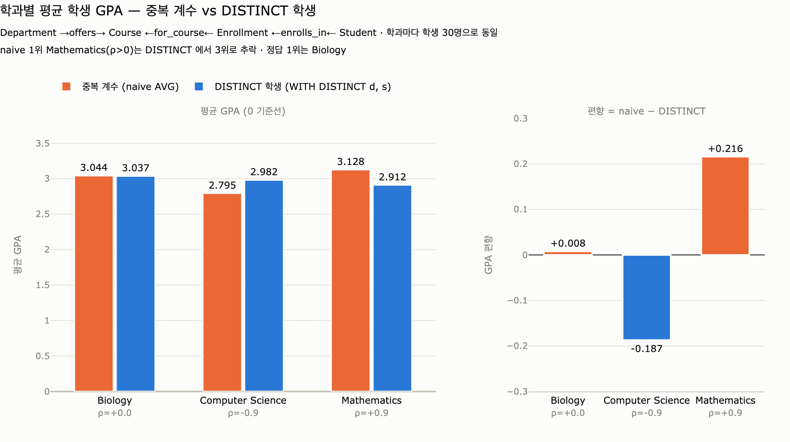

# 학과별 평균 학생 GPA 경로: `Department → Course ← Enrollment ← Student`

## 질문과 답

- **Q.** "학과별 평균 학생 GPA가 가장 높은 곳은?"의 그래프 경로는?
- **A.** `Department → Course ← Enrollment ← Student` 경로를 타고 GPA를 평균낸다. 학과에서 시작해 강좌·수강기록을 거쳐 학생에 도달한다.

University 온톨로지(5 엔티티 / 6 관계)에서 **Department와 Student 사이에는 직접 관계가 없다.** 학과는 강좌를 개설하고(offers), 강좌에는 수강기록이 달리고(for_course), 수강기록은 학생에게 연결된다(enrolls_in). 따라서 학과 단위 학생 통계는 반드시 **3홉 전이 질의(transitive query)** 로 풀어야 한다.

---

## 1. 각 홉의 관계 이름과 방향

경로를 화살표까지 정확히 읽는 것이 핵심이다. 화살표는 **온톨로지에 선언된 관계의 방향**을 가리키며, 질의에서 그 방향을 거슬러 순회(traverse)하는 것은 얼마든지 가능하다.

| 홉 | 표기 | 관계 이름 | 선언 방향 | 카디널리티 | 순회 방향 |
|---|---|---|---|---|---|
| 1 | `Department → Course` | **offers** | Department → Course | 1:N | 선언 방향과 **같음** (정방향) |
| 2 | `Course ← Enrollment` | **for_course** | Enrollment → Course | N:1 | 선언 방향과 **반대** (역방향) |
| 3 | `Enrollment ← Student` | **enrolls_in** | Student → Enrollment | 1:N | 선언 방향과 **반대** (역방향) |

즉 화살표가 가운데(`Course`)를 향해 모였다가 다시 왼쪽을 향하는 것이 아니라,

```
Department --offers--> Course <--for_course-- Enrollment <--enrolls_in-- Student
```

`Course`가 **수렴점(convergence point)** 이다. 학과 쪽에서 내려온 화살표와 학생 쪽에서 내려온 화살표가 `Course`에서 만난다. 답의 "학과에서 시작해 강좌·수강기록을 거쳐 학생에 도달한다"는 문장이 이 구조를 말한다.

### 왜 이 방향인가

- `offers`가 Department → Course인 이유: 학과가 커리큘럼의 **소유자**다. 강좌 하나는 한 학과에 속하고(N:1의 반대편), 학과는 여러 강좌를 연다.
- `for_course`가 Enrollment → Course인 이유: Enrollment는 **정션 엔티티(junction entity)** 로서 자신이 어느 강좌에 대한 기록인지 가리킨다. 한 수강기록은 정확히 하나의 강좌를 향한다(N:1).
- `enrolls_in`이 Student → Enrollment인 이유: 학생이 학기마다 수강기록을 쌓아 올린다(1:N).

### 대안 경로와의 비교

같은 "학과별 학생" 질문을 `Department ← Professor → Course ← Enrollment ← Student`로 풀 수도 있다(`belongs_to`, `teaches` 사용). 하지만 이 경로는 **교수의 소속 학과**를 기준으로 삼기 때문에, 타 학과 강좌를 가르치는 교수가 있으면 결과가 달라진다(자료의 "Which professors teach outside their department's courses?" 질문이 정확히 그 불일치를 노린다). 커리큘럼 기준 집계는 `offers`를 쓰는 것이 정답이다.

---

## 2. 핵심 함정: 중복 계수(double counting)

이 경로에는 **1:N 확장이 두 번** 들어 있다.

$$
\underbrace{\text{Department} \xrightarrow{\;1:N\;} \text{Course}}_{\text{확장 1}}
\;\xleftarrow{\;N:1\;}\;
\underbrace{\text{Enrollment} \xleftarrow{\;1:N\;} \text{Student}}_{\text{확장 2}}
$$

경로를 그대로 펼치면 결과 행(row)의 단위는 **학생**이 아니라 **수강기록(Enrollment)** 이다. 한 학생이 같은 학과의 강좌를 $k$개 들으면, 그 학생의 `gpa` 값이 결과 집합에 $k$번 등장한다.

### 수식으로 보기

학과 $d$에 대해, 순진하게 평균을 내면:

$$
\overline{\text{GPA}}^{\text{naive}}_{d}
= \frac{\sum_{s \in S_d} k_{s,d}\cdot \text{gpa}(s)}{\sum_{s \in S_d} k_{s,d}}
$$

여기서 $S_d$는 학과 $d$의 강좌를 하나라도 들은 학생 집합, $k_{s,d}$는 학생 $s$가 학과 $d$에서 들은 강좌 수다. 이는 사실상 **수강 횟수를 가중치로 쓴 가중평균**이다.

우리가 원하는 것은 학생 1인 1표인 **비가중 평균**:

$$
\overline{\text{GPA}}^{\text{distinct}}_{d}
= \frac{1}{|S_d|}\sum_{s \in S_d} \text{gpa}(s)
$$

두 값은 $k_{s,d}$가 모든 학생에 대해 동일할 때만 일치한다. 현실에서는 절대 그렇지 않다.

### 왜 위험한가

`gpa`는 **Student에 붙은 집계 속성(aggregate property)** 이다. Enrollment 단위 속성(`grade`)이 아니다. 자료에서 "Float properties (GPA) enable aggregate calculations"라고 말한 그 속성을, 다른 입도(granularity)의 행에 실어 나르면서 값이 복제된다. 이런 상황을 데이터 모델링에서 **팬 트랩(fan trap)** 또는 **팬아웃(fan-out) 집계 오류**라 부른다.

편향의 방향도 예측 가능하다: **수강 과목이 많은 학생 쪽으로 평균이 끌려간다.** 열심히 많이 듣는 고학점 학생이 몇 명 있는 학과는 실제보다 좋아 보이고, 반대로 최소 학점만 듣는 고학점 학생이 많은 학과는 손해를 본다. 그 결과 **학과 순위가 실제로 뒤바뀔 수 있다.**

반면 `COUNT(e)` 같은 **Enrollment 단위 지표**(자료의 struggling_count, enrollment rate)는 중복 계수가 오히려 정답이다. 문제가 되는 것은 **"경로 끝 노드의 속성"을 집계할 때**뿐이라는 점을 구분해야 한다.

---

## 3. GQL로 쓰기

### (a) 잘못된 버전 — 중복 계수 발생

```gql
MATCH (d:Department)-[:offers]->(c:Course)
      <-[:for_course]-(e:Enrollment)
      <-[:enrolls_in]-(s:Student)
RETURN d.name AS department,
       AVG(s.gpa) AS avg_gpa          -- 학생이 수강 횟수만큼 중복 집계됨
ORDER BY avg_gpa DESC
```

`AVG(s.gpa)`가 Enrollment 행 위에서 계산되므로, 학생 3과목 수강 = GPA 3회 반영.

### (b) 올바른 버전 1 — `DISTINCT` 집계 인자

```gql
MATCH (d:Department)-[:offers]->(c:Course)
      <-[:for_course]-(e:Enrollment)
      <-[:enrolls_in]-(s:Student)
RETURN d.name AS department,
       AVG(DISTINCT s.gpa)   AS avg_gpa,
       COUNT(DISTINCT s)     AS student_count
ORDER BY avg_gpa DESC
```

주의: `AVG(DISTINCT s.gpa)`는 **GPA 값 자체를 중복 제거**한다. 서로 다른 두 학생이 우연히 같은 GPA(예: 3.50)를 가지면 **한 명으로 취급되어 또 다른 편향**이 생긴다. GPA는 소수 2자리라 충돌이 흔하다. 그래서 이 형태는 권장하지 않는다.

### (c) 올바른 버전 2 — 학생 단위로 먼저 중복 제거 (권장)

```gql
MATCH (d:Department)-[:offers]->(c:Course)
      <-[:for_course]-(e:Enrollment)
      <-[:enrolls_in]-(s:Student)
WITH DISTINCT d, s                     -- (학과, 학생) 쌍 단위로 접기
RETURN d.name       AS department,
       AVG(s.gpa)   AS avg_gpa,
       COUNT(s)     AS student_count
ORDER BY avg_gpa DESC
LIMIT 1
```

`WITH DISTINCT d, s`가 핵심이다. 집계 **이전에** 행의 입도를 Enrollment에서 `(Department, Student)` 쌍으로 낮춘다. 노드 아이덴티티로 중복을 제거하므로 GPA 값 충돌 문제가 없다. **이것이 표준 해법이다.**

### (d) 동치 형태 — 컬렉션으로 모았다가 펼치기

```gql
MATCH (d:Department)-[:offers]->(c:Course)
      <-[:for_course]-(e:Enrollment)
      <-[:enrolls_in]-(s:Student)
WITH d, COLLECT(DISTINCT s) AS students
RETURN d.name AS department,
       REDUCE(t = 0.0, x IN students | t + x.gpa) / SIZE(students) AS avg_gpa,
       SIZE(students) AS student_count
ORDER BY avg_gpa DESC
```

`COLLECT(DISTINCT s)`로 학생 집합을 만든 뒤 평균을 직접 계산한다. 학생 수를 함께 노출하기 좋아 소표본 학과를 걸러내기 쉽다.

### (e) 서브쿼리 패턴 — 확장에 유리

```gql
MATCH (d:Department)
CALL {
  WITH d
  MATCH (d)-[:offers]->(:Course)<-[:for_course]-(:Enrollment)<-[:enrolls_in]-(s:Student)
  RETURN DISTINCT s
}
WITH d, COLLECT(s) AS students
WHERE SIZE(students) >= 5              -- 소표본 학과 제외
RETURN d.name, AVG(...) ...
```

---

## 4. 실전 체크리스트

1. **집계 대상의 입도를 먼저 정한다.** "학생 GPA 평균"이면 행 단위는 학생, "수강기록 수"면 행 단위는 Enrollment.
2. **경로에 1:N 확장이 몇 번 있는지 센다.** 두 번 이상이면 중복 계수를 반드시 의심한다.
3. **집계 전에 `WITH DISTINCT`로 입도를 맞춘다.** `AVG(DISTINCT prop)`가 아니라 `DISTINCT node`.
4. **분모를 항상 함께 출력한다.** `COUNT(DISTINCT s)`를 같이 보면 이상값을 즉시 발견할 수 있다.
5. **한 학생이 여러 학과 강좌를 들으면 여러 학과에 중복 소속된다.** 이는 버그가 아니라 정의의 문제다. "전공 기준"(`s.major`)으로 쓸지 "수강 기준"(경로)으로 쓸지 질문 정의 단계에서 못 박아야 한다.
6. **`Student.major` 필드가 있다는 사실을 잊지 말 것.** 만약 질문이 "전공 학과별 평균 GPA"라면 3홉 경로 없이 `Student.major`로 그룹핑하면 끝난다. 경로 질의는 "그 학과 강좌를 수강한 학생" 기준일 때 필요하다. 두 정의는 다른 답을 낸다.

---

## 5. 한 줄 요약

`Department -offers-> Course <-for_course- Enrollment <-enrolls_in- Student`, 그리고 **집계 직전에 `WITH DISTINCT d, s`**. 이 두 가지가 답의 전부다.

## 시각화



`expy.py`가 생성한 결과다. 학과 3개 · 강좌 12개 · 학생 45명 · 수강기록 224건이고, **세 학과 모두 학생 수가 정확히 30명으로 동일**하다. 그런데도 결과가 갈린다.

| 학과 | ρ (GPA↔수강수 상관) | naive AVG | DISTINCT AVG | 편향 | 순위 변화 |
|---|---|---|---|---|---|
| Mathematics | +0.9 | **3.128** | 2.912 | **+0.216** | 1위 → **3위** |
| Biology | 0.0 | 3.044 | **3.037** | +0.008 | 2위 → **1위** |
| Computer Science | −0.9 | 2.795 | 2.982 | −0.187 | 3위 → 2위 |

naive 방식의 1위(Mathematics)가 올바른 집계에서는 **꼴찌**가 된다. 편향의 부호는 데이터에 심어 둔 상관 ρ의 부호와 정확히 일치한다 — 고학점 학생이 과목을 많이 들으면(ρ>0) 학과가 과대평가되고, 적게 들으면(ρ<0) 과소평가된다. 표본 크기 문제가 아니라 **구조적 편향**이다.
