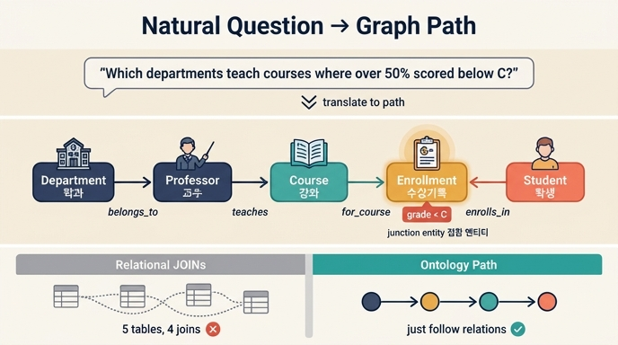

# 학과 → 교수 → 강좌 → 수강기록 ← 학생: 그래프 경로로 읽는 질문

## 질문 다시 보기

원문 질문은 이것이다.

> **"등록 학생의 50% 이상이 C 미만을 받은 강좌를 가르치는 교수가 속한 학과는?"**
> (Which departments have professors teaching courses where over 50% of enrolled students scored below a C?)

정답 경로는 이렇다.

```
Department → Professor → Course → Enrollment (grade < C) ← Student
```

## 왜 이 경로인가 — 문장을 뒤에서부터 자르기

자연어 질문은 한 문장이지만, 그 안에는 서로 다른 시스템에 흩어져 있는 네 종류의 사실이 겹쳐 있다. 문장을 명사 단위로 잘라 보면 경로가 그대로 드러난다.

| 질문 조각 | 대응하는 온톨로지 요소 | 원래 데이터가 사는 곳 |
|---|---|---|
| "학과는?" | `Department` (최종 반환 대상) | 학사기획 DB |
| "교수가 속한" | `Professor` --belongs_to--> `Department` | HR 시스템 |
| "강좌를 가르치는" | `Professor` --teaches--> `Course` | 교무 / 강의 배정 |
| "C 미만을 받은" | `Enrollment.grade` 속성 필터 | SIS / LMS |
| "등록 학생의" | `Student` --enrolls_in--> `Enrollment` | 학생정보시스템(SIS) |

즉 **질문의 명사 = 노드, 질문의 조사·동사 = 엣지, 질문의 형용구 = 속성 필터**로 거의 1:1 대응된다. 온톨로지가 잘 설계되면 자연어 질문이 그래프 경로로 "번역"되는 수준이 아니라 거의 그대로 "받아쓰기"된다는 점이 이 예시의 핵심이다.

## 경로를 이루는 관계들

University 온톨로지는 5개 엔티티 · 6개 관계로 구성된다. 이 질문이 사용하는 것은 그중 4개다.

| 관계 | 방향 | 카디널리티 |
|---|---|---|
| `belongs_to` | `Professor` → `Department` | many-to-one |
| `teaches` | `Professor` → `Course` | one-to-many |
| `for_course` | `Enrollment` → `Course` | many-to-one |
| `enrolls_in` | `Student` → `Enrollment` | one-to-many |

(나머지 두 개는 `advises` — `Professor` → `Student`, `offers` — `Department` → `Course`.)

## 화살표 방향을 오해하지 말 것

정답의 표기 `Department → Professor → Course → Enrollment ← Student`에서 화살표는 **관계의 선언 방향이 아니라 "질문을 풀며 그래프를 걸어가는 방향(탐색 순서)"** 이다. 실제 관계 정의와 비교하면 이렇다.

| 경로 구간 | 표기 | 실제 관계 선언 | 탐색 성격 |
|---|---|---|---|
| Department → Professor | 앞으로 | `Professor --belongs_to--> Department` | **역방향** 탐색 |
| Professor → Course | 앞으로 | `Professor --teaches--> Course` | 정방향 |
| Course → Enrollment | 앞으로 | `Enrollment --for_course--> Course` | **역방향** 탐색 |
| Enrollment ← Student | 뒤에서 들어옴 | `Student --enrolls_in--> Enrollment` | 정방향 |

정답 표기에서 마지막만 `← Student`로 화살표가 반대인 이유가 여기 있다. `Enrollment`는 **Student와 Course 양쪽에서 화살표를 받는 지점이 아니라, 양쪽을 이어주는 접합점(junction)** 이며, 표기법상 "학생 쪽에서 들어오는 방향"을 그대로 그린 것이다. 그래프 질의에서는 관계를 양방향으로 traverse할 수 있으므로 선언 방향이 탐색을 가로막지 않는다.

## Enrollment가 경로의 심장인 이유 — 접합 엔티티(junction entity)

이 경로가 성립하려면 **성적(grade)이 어딘가에 저장되어 있어야** 한다. 그런데 성적은 학생의 속성도 아니고(같은 학생도 과목마다 성적이 다름) 강좌의 속성도 아니다(같은 강좌도 학생마다 성적이 다름). 성적은 **"이 학생이 이 강좌를 수강한 사건"의 속성**이다.

그래서 Student–Course의 다대다(many-to-many) 관계를 `Enrollment`라는 1급 엔티티로 승격시킨다.

| Enrollment 속성 | 타입 | 식별자 |
|---|---|---|
| `enrollmentId` | string | ✓ |
| `semester` | string | |
| `grade` | string | |
| `enrollDate` | date | |
| `status` | string | |

`grade < C` 필터는 바로 이 접합 엔티티 위에서 걸린다. 만약 Student와 Course를 직선으로 연결했다면 성적을 걸어둘 자리가 없어서 이 질문 자체가 성립하지 않는다. **접합 엔티티는 "관계에 속성을 붙이기 위한" 패턴**이며, 온톨로지 설계에서 가장 자주 등장하는 패턴 중 하나다.

## Department가 출발점인 이유 — 허브 엔티티

`Department`는 아래로 `Professor`(belongs_to의 역방향)와 `Course`(offers)를 동시에 거느리는 **허브 엔티티**다. 질문의 답이 "학과 목록"이므로 최종 집계 단위(grouping key)가 Department가 되고, 자연히 경로의 한쪽 끝을 차지한다.

참고로 같은 온톨로지에서 Department에 도달하는 경로는 하나가 아니다.

- **교수 경로**: `Department ← Professor --teaches--> Course` — "누가 가르쳤는가" 기준
- **개설 경로**: `Department --offers--> Course` — "어느 학과가 개설했는가" 기준

이 질문은 "교수가 속한 학과"를 묻고 있으므로 **교수 경로**를 쓴다. 두 경로가 서로 다른 답을 낼 수 있다는 사실 자체가 흥미로운 질의가 되며, 학습 자료에도 "자기 학과 소속이 아닌 강좌를 가르치는 교수는?"(`Professor → Department` vs `Professor → Course → Department`)이라는 예시로 등장한다.

## `grade < C`라는 조건의 정체

`grade`는 문자열(`'A'`, `'B'`, `'C'`, `'D'`, `'F'`)이므로 실제로는 수치 비교가 아니라 **집합 포함 조건**으로 표현된다.

```gql
WHERE e.grade IN ['C', 'D', 'F']
```

학습 자료의 GQL 예시는 다음과 같다(개설 경로 `offers` 버전).

```gql
MATCH (d:Department)-[:offers]->(c:Course)<-[:for_course]-(e:Enrollment)<-[:enrolls_in]-(s:Student)
WHERE e.grade IN ['C', 'D', 'F']
RETURN d.name, c.title, COUNT(e) AS struggling_count
ORDER BY struggling_count DESC
```

원 질문의 "교수 경로" 버전으로 바꾸고 "50% 이상"이라는 비율 조건까지 넣으면 대략 이런 형태가 된다.

```gql
MATCH (d:Department)<-[:belongs_to]-(p:Professor)-[:teaches]->(c:Course)
      <-[:for_course]-(e:Enrollment)<-[:enrolls_in]-(s:Student)
WITH d, c,
     COUNT(e) AS total,
     COUNT(CASE WHEN e.grade IN ['C', 'D', 'F'] THEN 1 END) AS below_c
WHERE below_c * 2 > total          -- 50% 초과
RETURN DISTINCT d.name
```

여기서 눈여겨볼 점: **"50% 이상"은 경로가 아니라 집계 조건**이다. 경로는 어떤 사실들을 한자리에 모을지를 정하고, 비율 판정은 모인 뒤에 이루어진다. 경로 설계와 집계 로직을 분리해서 보는 습관이 중요하다.

## 관계형 SQL과 비교하면 무엇이 다른가

같은 질문을 정규화된 RDB에서 풀면 최소 4~5개의 JOIN과 각 테이블의 외래키 컬럼명·조인 조건을 모두 알아야 한다. 게다가 SIS·LMS·HR·학사기획이 서로 다른 DB라면 조인 자체가 불가능하고 ETL이 선행되어야 한다.

온톨로지에서는 이 배선이 **관계로 이미 선언되어 있으므로**, 질의자는 "어떤 컬럼으로 조인하는가"가 아니라 "어떤 관계를 따라 걷는가"만 생각하면 된다. 정답이 말하는 *"관계를 따라 이동하는 것만으로 부서·교수·강좌·성적이 한 번에 연결된다"* 가 바로 이 뜻이다.

## 전이적 질의(transitive query)라는 이름

이 경로처럼 **직접 관계가 없는 두 엔티티를 중간 노드를 거쳐 연결하는 질의**를 전이적 질의라고 부른다. Department와 Student 사이에는 어떤 직접 관계도 선언되어 있지 않지만, Professor → Course → Enrollment를 경유하면 4홉(hop) 만에 이어진다. 그래프 기반 온톨로지의 가장 큰 강점이 바로 이 다중 홉 탐색이다.

## 암기 포인트

1. 경로는 `Department → Professor → Course → Enrollment (grade < C) ← Student` — 5개 엔티티가 모두 등장한다.
2. 화살표는 **탐색 방향**이며, 실제 관계 선언은 `belongs_to`·`teaches`·`for_course`·`enrolls_in`이다.
3. `grade` 필터가 `Enrollment`에 걸리는 이유는 Enrollment가 **접합 엔티티**이기 때문이다.
4. 출발점이 Department인 이유는 답이 학과 단위이고 Department가 **허브 엔티티**이기 때문이다.
5. "50% 이상"은 경로가 아니라 경로 위에서 수행하는 **집계 조건**이다.

## 인포그래픽


