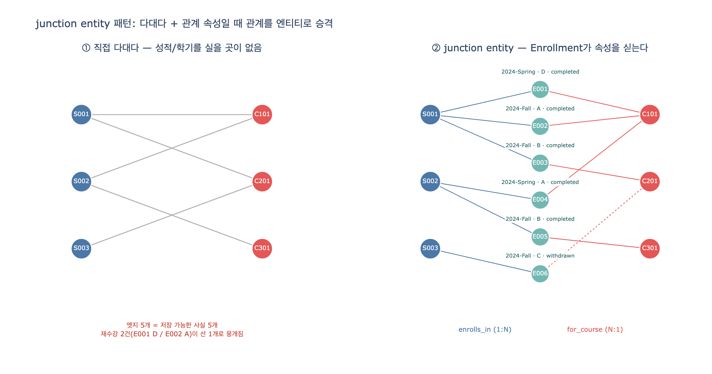

# junction entity 패턴은 언제 사용하는가?

## 한 줄 답

**두 엔티티가 다대다(many-to-many) 관계이면서, 그 관계 자체에 속성이 붙을 때** junction entity를 만든다.
학생은 여러 강좌를 듣고, 강좌는 여러 학생을 받는다. 그 사이에 놓인 `Enrollment`가 **성적·학기·상태**를 싣는다.

---

## 1. 문제: 다대다 관계는 그 자체로 속성을 실을 곳이 없다

`Student`와 `Course`의 관계를 직접 연결한다고 해보자.

```
Student ──takes──> Course     (다대다)
```

이 모델로 표현 가능한 것은 오직 **"이 학생이 이 강좌를 듣는다"** 라는 사실 하나뿐이다.
그런데 실제 학사 시스템이 답해야 하는 질문은 이렇다.

| 질문 | 이 정보는 누구의 속성인가? |
|---|---|
| 이 학생이 이 강좌에서 받은 성적은? | 학생도 아니고 강좌도 아니다 |
| 언제(어느 학기) 수강했는가? | 학생도 아니고 강좌도 아니다 |
| 수강 상태는? (수강중 / 철회 / 완료) | 학생도 아니고 강좌도 아니다 |

`grade`를 `Student`에 넣으면 "어느 강좌 성적인지"를 잃는다.
`grade`를 `Course`에 넣으면 "누구의 성적인지"를 잃는다.
`grade`는 **학생과 강좌가 만나는 지점**에만 존재하는 값이다.

> 핵심 판별 기준: **속성이 어느 한쪽 엔티티에도 자연스럽게 소속되지 않고, 오직 "짝(pair)"에만 소속될 때** → junction entity가 필요하다.

---

## 2. 해법: 관계를 1급 엔티티(first-class entity)로 승격시킨다

```
Student ──enrolls_in──> Enrollment ──for_course──> Course
        (one-to-many)              (many-to-one)
```

다대다 하나가 **1:N + N:1 두 개**로 분해된다. 그리고 가운데 노드가 속성을 갖는다.

### asset의 엔티티 정의

**Student**

| Property | Type | Identifier? |
|---|---|---|
| `studentId` | string | ✓ |
| `name` | string | |
| `gpa` | float | |
| `enrollmentYear` | integer | |
| `major` | string | |

**Course**

| Property | Type | Identifier? |
|---|---|---|
| `courseId` | string | ✓ |
| `title` | string | |
| `credits` | integer | |
| `level` | string | |
| `maxEnrollment` | integer | |

**Enrollment** (junction entity)

| Property | Type | Identifier? |
|---|---|---|
| `enrollmentId` | string | ✓ |
| `semester` | string | |
| `grade` | string | |
| `enrollDate` | date | |
| `status` | string | |

`enrollmentId`라는 **자체 식별자**를 갖는다는 점이 중요하다. 단순한 연결선(edge)이 아니라 조회·수정·참조가 가능한 독립 개체다.

---

## 3. 언제 쓰고, 언제 쓰지 않는가

### 써야 하는 신호

1. **양쪽 모두 "여러 개"** — 학생은 여러 강좌를, 강좌는 여러 학생을 갖는다.
2. **관계에 속성이 있다** — 성적, 학기, 상태, 등록일.
3. **같은 짝이 여러 번 반복될 수 있다** — 같은 학생이 같은 강좌를 재수강하면, `(student, course)` 쌍만으로는 두 기록을 구분할 수 없다. `Enrollment`가 별도 ID를 가지면 두 레코드가 공존한다.
4. **관계 자체에 생명주기가 있다** — 신청 → 수강중 → 철회/완료. 상태 전이가 있으면 그건 엔티티다.
5. **관계 자체를 다른 것이 참조한다** — 예: 특정 수강 기록에 대한 이의신청, 과제 제출물.

### 쓰지 않아도 되는 경우

- **다대일 관계** — `Professor → Department` (`belongs_to`)는 교수 하나가 학과 하나에 속한다. 중간 엔티티가 필요 없다.
- **속성 없는 순수 다대다** — 예를 들어 "강좌의 태그" 정도라면 굳이 junction 엔티티로 승격시킬 필요가 없다(관계형 DB의 순수 조인 테이블이면 충분).
- 즉 **다대다 그 자체만으로는 부족**하고, **다대다 + 속성**일 때 이 패턴이 정당화된다.

---

## 4. 이 패턴이 열어주는 질의

junction이 생기면 **양방향 조인 경로**가 만들어져서, 직접 연결이 없는 엔티티끼리도 이어진다.

```gql
MATCH (d:Department)-[:offers]->(c:Course)<-[:for_course]-(e:Enrollment)<-[:enrolls_in]-(s:Student)
WHERE e.grade IN ['C', 'D', 'F']
RETURN d.name, c.title, COUNT(e) AS struggling_count
ORDER BY struggling_count DESC
```

`Department`와 `Student` 사이에는 직접 관계가 **하나도 없다**. 그런데도 `Course`와 `Enrollment`를 징검다리 삼아 "학생들이 고전하는 학과"를 뽑아낼 수 있다. 이것이 asset에서 말하는 **transitive query**다.

junction 덕분에 가능해지는 대표 질의:

| 질문 | 경로 |
|---|---|
| 학생별 GPA | `Student → Enrollment` (grade 집계, credits 가중) |
| 강좌별 평균 성적 | `Course ← Enrollment` (grade 집계) |
| 학기별 수강 이력 | `Enrollment.semester` 필터 |
| 정원 대비 등록률 | `Course ← Enrollment` count / `Course.maxEnrollment` |
| 종신교수 강의를 듣는 학생 | `Professor → Course ← Enrollment ← Student` |

핵심은 **필터 조건 `e.grade IN [...]`가 관계 위에 걸린다**는 점이다. junction 없이는 이 `WHERE`절을 쓸 자리가 없다.

---

## 5. 다른 이름들 (같은 개념)

| 분야 | 명칭 |
|---|---|
| ER 모델링 | associative entity, 관계 엔티티 |
| 관계형 DB | join table, bridge table, link table |
| UML | association class |
| RDF/OWL | reification (관계를 노드로 사물화) |
| 온톨로지 | junction entity |
| 데이터 웨어하우스 | fact table (Student/Course는 dimension) |

특히 **fact table 비유**가 직관적이다. `Enrollment`는 측정값(grade)을 가진 사실 레코드이고, `Student`·`Course`는 그것을 잘라 보는 차원(dimension)이다.

---

## 6. 요약

- **조건**: 다대다 **AND** 관계에 속성 존재 (둘 다 충족해야 함)
- **효과**: 다대다 → `1:N + N:1`로 분해, 중간 노드가 속성·식별자·생명주기를 가짐
- **이득**: 관계 위 필터링, 같은 짝의 반복 기록, 다중 홉 transitive 질의
- **판별 질문**: *"이 속성은 A의 것인가, B의 것인가?"* — 어느 쪽도 아니라면 junction을 만들어라

## 시각화


