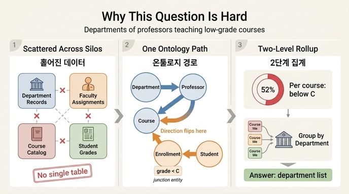

# "등록 학생의 50% 이상이 C 미만을 받은 강좌를 가르치는 교수가 속한 학과는?"이 어려운 이유

## 한 줄 답

**학과 기록, 교수 배정, 강좌 개설, 학생 성적** — 서로 다른 네 영역의 데이터를 한 번에 가로질러야 하기 때문이다.
단일 테이블이나 단일 시스템으로는 답할 수 없다.

---

## 1. 질문을 조각내 보기

이 한 문장에는 사실 네 개의 독립된 질문이 겹쳐 있다.

| 조각 | 필요한 데이터 | 원래 살던 곳 |
|---|---|---|
| "등록 학생" | 누가 이 강좌를 듣는가 (Enrollment) | 학사정보시스템(SIS) |
| "50% 이상이 C 미만" | 각 등록 건의 성적 (grade) | LMS / 성적 처리 시스템 |
| "강좌를 가르치는 교수" | 교수–강좌 배정 (teaches) | 학사 기획 DB / 시간표 시스템 |
| "교수가 속한 학과" | 교수 소속 (belongs_to) | 인사(HR) 시스템 |

각 조각은 혼자서는 쉽다. 어려운 건 **네 조각을 하나의 답으로 합치는 일**이다.

Scenario Overview가 말하는 그대로다:

> Data lives across student information systems (SIS), learning management systems (LMS), human resources, and academic planning databases.

---

## 2. 왜 "단일 테이블"로는 안 되는가

성적 테이블만 보면 "C 미만인 등록 건"은 찾을 수 있다. 하지만 그 등록 건이 **어느 강좌**인지, 그 강좌를 **누가** 가르치는지, 그 교수가 **어느 학과** 소속인지는 그 테이블에 없다.

반대로 학과 테이블만 보면 학과 이름·건물·예산은 있어도, 그 학과 교수의 수업에서 학생들이 어떤 성적을 받았는지는 흔적조차 없다.

즉 이 질문의 **출발점(학과)과 도착점(성적)이 데이터상 서로 인접하지 않는다.** 둘 사이에는 최소 세 번의 도약이 필요하다.

---

## 3. 온톨로지가 그리는 경로

Scenario Overview는 이 질문을 다음 경로로 환원한다.

```
Department → Professor → Course → Enrollment (grade < C) ← Student
```

관계 이름을 붙이면 이렇다.

```
Department ←[belongs_to]— Professor —[teaches]→ Course ←[for_course]— Enrollment ←[enrolls_in]— Student
```

- `belongs_to` — Professor → Department (다대일): 교수의 소속 학과
- `teaches` — Professor → Course (일대다): 교수가 맡은 강좌
- `for_course` — Enrollment → Course (다대일): 등록 건이 가리키는 강좌
- `enrolls_in` — Student → Enrollment (일대다): 학생의 수강 이력

이것이 학습 경로에서 말하는 **전이적 질의(transitive query)** 다. 직접 연결이 없는 Department와 Student를, 중간 노드들을 타고 넘어가며 잇는다.

주목할 점: 화살표 방향이 도중에 **뒤집힌다**. Department에서 Course까지는 내려가는 방향이지만, Enrollment와 Student는 Course를 향해 올라오는 방향이다. 사람의 머릿속 서술("학과 → ... → 성적")은 한 방향이지만, 실제 그래프 순회는 방향을 바꿔가며 진행한다. 이 방향 전환이 SQL JOIN을 손으로 짤 때 실수가 잦은 지점이다.

---

## 4. Enrollment가 없으면 질문 자체가 성립하지 않는다

"50% 이상이 C 미만" — 이 성적은 **학생의 속성도, 강좌의 속성도 아니다.** 특정 학생이 특정 강좌를 특정 학기에 들은 그 사건의 속성이다.

그래서 Enrollment는 **접합 엔티티(junction entity)** 로 존재한다. Student–Course의 다대일 관계가 아니라 다대다 관계이며, 그 연결선 자체가 `grade`, `semester`, `status`라는 자기 속성을 지고 있기 때문이다.

만약 Student와 Course를 직선으로 이어버렸다면 성적을 걸어둘 자리가 없고, 이 질문은 애초에 물어볼 수조차 없다.

---

## 5. 게다가 집계가 두 겹이다

경로를 다 밟았다고 끝이 아니다.

1. **강좌 단위 집계** — 강좌마다 전체 등록 수와 C 미만 등록 수를 세고, 비율이 0.5 이상인지 판정
2. **학과 단위 집계** — 그렇게 걸러진 강좌들의 담당 교수를 모으고, 그 교수들의 소속 학과로 묶기

즉 "grade IN ('C','D','F')" 같은 단순 필터가 아니라, **분모(전체 등록)와 분자(저성취 등록)를 같은 강좌 안에서 짝지어 계산**해야 한다. 학습 경로의 예시 GQL은 이 중 앞부분만 보여준다.

```gql
MATCH (d:Department)-[:offers]->(c:Course)<-[:for_course]-(e:Enrollment)<-[:enrolls_in]-(s:Student)
WHERE e.grade IN ['C', 'D', 'F']
RETURN d.name, c.title, COUNT(e) AS struggling_count
ORDER BY struggling_count DESC
```

이건 "고전 중인 등록 건의 **개수**"를 셀 뿐, **비율**은 아니다. 실제 질문에 답하려면 강좌별 전체 등록 수로 한 번 더 나눠야 한다.

또 한 가지 미묘한 차이: 위 쿼리는 `Department -[:offers]-> Course`, 즉 **학과가 개설한 강좌** 경로를 쓴다. 반면 원래 질문은 "**교수가 속한** 학과"이므로 `Department <-[:belongs_to]- Professor -[:teaches]-> Course` 경로다. 타 학과 강좌를 가르치는 교수가 있다면 두 경로의 답이 달라진다 — 학습 경로가 "Which professors teach outside their department's courses?"를 별도 질문으로 뽑아둔 이유가 이것이다.

---

## 6. 그래서 온톨로지가 왜 답인가

관계형 세계에서 이 질문은 네 개 시스템에 대한 데이터 통합 프로젝트가 된다. 시스템마다 학생 ID·교수 ID 체계가 다르고, JOIN 순서와 방향을 사람이 직접 설계해야 하며, 질문이 조금만 바뀌어도 쿼리를 다시 짜야 한다.

온톨로지는 이 네 영역을 **하나의 의미 계층**으로 통합한다.

- 엔티티 5개(Student, Course, Enrollment, Professor, Department)와 관계 6개가 지도 역할을 한다
- 질문은 SQL 설계가 아니라 **그래프 위의 경로 표현**이 된다
- Department는 Professor와 Course 양쪽으로 연결되는 **허브 엔티티**여서, 학과 단위 집계의 자연스러운 기준점이 된다

핵심은 이것이다. **어려움은 데이터가 부족해서가 아니라, 데이터가 흩어져 있고 그 사이의 관계가 어디에도 명시되어 있지 않아서 생긴다.** 온톨로지는 바로 그 "사이의 관계"를 일급 시민으로 만들어 어려움을 해소한다.

---

## 암기 포인트

- 질문이 가로지르는 네 영역: **학과 / 교수 배정 / 강좌 개설 / 학생 성적**
- 경로: `Department → Professor → Course → Enrollment (grade < C) ← Student`
- 성적은 Enrollment(접합 엔티티)의 속성 — Student도 Course도 아니다
- 단일 테이블·단일 시스템으로는 불가능 → 전이적 질의가 필요한 이유

## 인포그래픽


