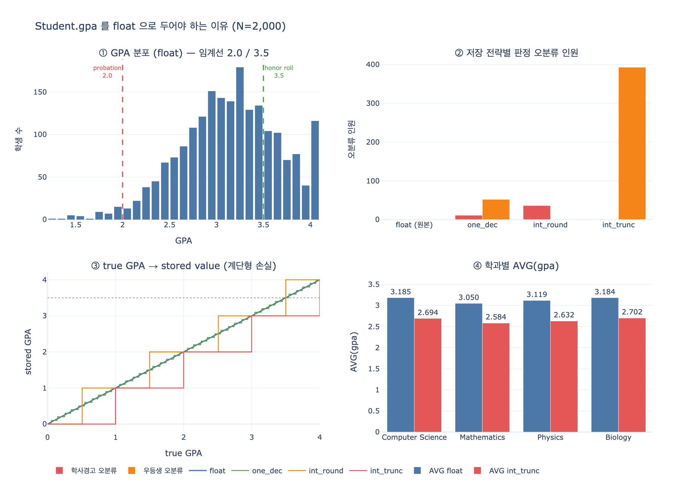

# Student의 `gpa` 속성이 float인 이유

## 질문과 답

**Q.** Student의 `gpa` 속성이 float인 이유는?

**A.** Grade Point Average가 0.0~4.0 범위의 소수값이기 때문이다. 이 집계 지표로 학사경고 판정이나 우등생(honor roll) 산정 같은 질의가 가능해진다.

---

## 1. 출처 확인 — Student 엔티티 정의

University System 온톨로지 학습 경로의 **Academic Core** 단계에서 정의되는 `Student` 엔티티는 다음과 같다.

| Property | Type | Identifier? |
|---|---|---|
| `studentId` | string | ✓ |
| `name` | string | |
| `gpa` | **float** | |
| `enrollmentYear` | integer | |
| `major` | string | |

원문의 설명은 한 문장이다.

> The `gpa` property is a float — Grade Point Average ranges from 0.0 to 4.0.
> This aggregate metric enables academic standing queries and honor roll calculations.

그리고 해당 단계의 정리(What we learned)에서도 다시 강조된다.

> **Float properties** (GPA) enable aggregate calculations and thresholds

즉 근거는 **값의 성질**과 **질의의 성질** 두 층으로 나뉜다.

---

## 2. 값의 성질 — GPA는 애초에 소수다

### 2.1 GPA는 원시 데이터가 아니라 파생 지표(aggregate metric)다

온톨로지에서 성적의 원천은 `Student`가 아니라 **`Enrollment`** 라는 junction entity 위에 있다.

| Entity | Property | Type |
|---|---|---|
| `Enrollment` | `grade` | string (`"A"`, `"B+"`, `"C-"` …) |
| `Course` | `credits` | integer |
| `Student` | `gpa` | **float** |

`Student.gpa`는 그 학생의 모든 Enrollment를 훑어 등급 문자열을 점수로 환산하고, 과목 학점 수로 **가중평균**한 결과다.

$$\text{GPA} = \frac{\sum_i c_i \cdot p_i}{\sum_i c_i}$$

- $c_i$ : i번째 과목의 학점 수 (`Course.credits`, integer)
- $p_i$ : i번째 과목의 등급 점수 (letter grade → grade point)

### 2.2 소수가 되는 이유는 두 군데다

**(1) 등급 → 점수 매핑부터 이미 소수다.** +/- 체계를 쓰는 대부분의 미국식 대학에서:

| Grade | A | A- | B+ | B | B- | C+ | C | C- | D | F |
|---|---|---|---|---|---|---|---|---|---|---|
| Point | 4.0 | **3.7** | **3.3** | 3.0 | **2.7** | **2.3** | 2.0 | **1.7** | 1.0 | 0.0 |

`A- = 3.7`, `B+ = 3.3` 은 정수로 표현할 수 없다.

**(2) 나눗셈의 결과라 정수로 떨어지지 않는다.** 4학점 A, 3학점 B+, 4학점 A-, 2학점 B를 들은 학생이라면

$$\frac{4(4.0) + 3(3.3) + 4(3.7) + 2(3.0)}{4+3+4+2} = \frac{46.7}{13} = 3.5923\ldots$$

값 자체가 연속적인 $[0.0,\ 4.0]$ 구간의 실수다. `integer`로 선언하는 순간 이 값을 저장할 방법이 없다.

> **가중평균이라는 점도 중요하다.** 단순 산술평균과 결과가 다르다. 1학점 세미나에서 A, 4학점 전공에서 B를 받은 학생은 단순평균 3.50이지만 학점 가중 GPA는 3.20이다. 위 예시 학생과 단순평균은 똑같이 3.50인데 가중 GPA는 3.59 vs 3.20으로 갈린다 — 그리고 이 차이가 우등생 판정(≥ 3.5)을 정확히 가른다.

---

## 3. 질의의 성질 — float이라서 가능해지는 것들

원문이 말하는 "enables academic standing queries and honor roll calculations"는 구체적으로 두 종류의 질의다.

### 3.1 임계값(threshold) 질의

```gql
-- 학사경고 (academic probation)
MATCH (s:Student) WHERE s.gpa < 2.0  RETURN s.studentId, s.name, s.major

-- 우등생 (honor roll)
MATCH (s:Student) WHERE s.gpa >= 3.5 RETURN s.studentId, s.name

-- 학장 표창 (dean's list)
MATCH (s:Student) WHERE s.gpa >= 3.9 RETURN s.studentId
```

| 판정 | 관례적 임계값 |
|---|---|
| Academic probation (학사경고) | `gpa < 2.0` |
| Good standing | `2.0 ≤ gpa < 3.5` |
| Honor roll (우등생) | `gpa ≥ 3.5` |
| Dean's list / Cum laude | `gpa ≥ 3.9` 등 |

임계값 자체가 `2.0`, `3.5`, `3.9` 같은 **소수 경계**다. 속성이 integer라면 이 경계선을 그을 수 없다.

### 3.2 집계(aggregate) 질의

경로 후반의 Complete University Model 단계에서 나오는 질문들:

| Question | Graph path |
|---|---|
| Which departments have the highest average student GPA? | `Department → Course ← Enrollment ← Student (avg GPA)` |
| What is the average GPA in Professor Smith's courses? | `Professor → Course ← Enrollment ← Student (avg GPA)` |

```gql
MATCH (d:Department)-[:offers]->(c:Course)<-[:for_course]-(e:Enrollment)<-[:enrolls_in]-(s:Student)
RETURN d.name, AVG(s.gpa) AS avg_gpa
ORDER BY avg_gpa DESC
```

`AVG()`, `MIN()`, `MAX()`, `STDDEV()` 같은 집계 함수는 소수 결과를 낸다. 학과 간 평균 GPA 격차는 흔히 0.05~0.15 수준이라, 소수점 아래를 잃으면 **순위 비교 자체가 성립하지 않는다**.

---

## 4. 만약 integer였다면 — 정보 손실 정량화

`expy.py`에서 학생 2,000명 코호트를 만들어 저장 전략별로 판정 오류를 세어 봤다.

| 저장 전략 | 표현 가능한 값 개수 | 학사경고 오분류 | 우등생 오분류 | `AVG(gpa)` |
|---|---|---|---|---|
| `float` (원본) | 227 | 0 | 0 | 3.1345 |
| `round(gpa, 1)` | 28 | 11 | 52 | 3.1343 |
| `round(gpa)` (반올림 정수) | 4 | 36 | 0 | 3.1330 |
| `int(gpa)` (버림 정수) | 4 | 0 | **393** | **2.6530** |

(실제 학사경고 대상 43명 / 우등생 509명)

읽는 법:

- **버림 정수**: `3.5 ~ 3.99`가 전부 `3`이 되므로 `gpa >= 3.5` 를 통과할 수 있는 학생은 GPA가 정확히 4.00인 경우뿐이다. 우등생 509명 중 393명이 사라진다. 게다가 평균이 3.13 → 2.65로 **0.48이나 낮게** 왜곡된다.
- **반올림 정수**: 우등생 쪽은 우연히 맞지만(3.5 이상이 4로 올라가므로), `1.5 ~ 1.99` 구간이 `2`가 되어 **학사경고 대상 43명 중 36명이 경고를 빠져나간다**.
- **어떤 정수 인코딩도 두 임계값을 동시에 보존하지 못한다.** 이것이 float이어야 하는 실질적 이유다.

집계 질의는 더 취약하다. 시뮬레이션에서 학과별 평균은 float 기준 CS 3.1848 > Biology 3.1844였는데, 정수 저장에서는 1위가 Biology로 뒤집혔다. 그리고 `AVG(gpa) >= 3.0` 인 학과를 찾는 질의는 float에서 4개 학과 전부 통과하지만 정수 저장에서는 **0개**가 된다.

---

## 5. 더 큰 맥락 — 속성 타입은 질의의 종류를 결정한다

이 카드가 진짜로 가르치려는 것은 GPA라는 개별 값이 아니라, **온톨로지에서 타입 선택이 곧 질의 능력의 선언**이라는 원리다. 같은 학습 경로 안에서 반복되는 패턴이다.

| 속성 | 타입 | 그 타입이 가능하게 하는 질의 |
|---|---|---|
| `Student.gpa` | float | 임계값 비교(`< 2.0`, `>= 3.5`), 집계(`AVG`) |
| `Department.budget` | float | 자원 배분 질의, 금액 집계 |
| `Course.credits` | integer | 학업량 계산 — 셀 수 있는 값이라 소수가 의미 없음 |
| `Course.maxEnrollment` | integer | 정원 대비 등록률 계산 |
| `Professor.tenured` | boolean | 범주 필터 (`tenured = true` 인 교수 수) |
| `Enrollment.enrollDate` | date | 시간 범위 질의, 학기별 추이 |
| `Student.studentId` | string (identifier) | 엔티티 식별·조인 |

같은 "숫자"라도 `credits`는 integer, `gpa`는 float인 이유가 여기 있다. **셀 수 있는 것(count)은 integer, 비율·평균·측정값(measure)은 float.** GPA는 후자다.

### 실무 참고: float vs decimal

부동소수는 이진 표현이라 `0.1 + 0.2 != 0.3` 같은 오차가 있다. 그래서 **금액**처럼 정확한 십진 연산이 필요한 값은 `decimal` 타입을 쓰는 게 정석이다. 다만 GPA는

- 최종 소비 형태가 "소수 둘째 자리 표시 + 임계값 비교"이고,
- 통계적 집계에 쓰는 측정값이지 회계 정산 대상이 아니므로

`float`으로 충분하다. 대신 경계값 판정에서 `>=` / `<` 방향을 명확히 고정해 두는 것이 안전하다 (예: 우등생은 `gpa >= 3.5`로 통일).

---

## 정리

| 근거 | 내용 |
|---|---|
| 값의 정의 | GPA = 학점 가중 평균 → $0.0 \sim 4.0$ 의 연속 소수값. 등급 점수(`A- = 3.7`)부터 이미 소수 |
| 임계값 질의 | 학사경고 `gpa < 2.0`, 우등생 `gpa >= 3.5` — 소수 경계를 표현하려면 float 필요 |
| 집계 질의 | `AVG(gpa)` per Department / per Professor. 학과 간 격차가 0.1 수준이라 해상도가 곧 신뢰도 |
| 정보 손실 | 정수 저장 시 우등생 509명 중 393명 누락, 평균 0.48 왜곡, 학과 순위 역전 |
| 일반 원리 | 온톨로지의 속성 타입은 그 속성으로 던질 수 있는 **질의의 종류를 결정**한다 |

## 시각화


