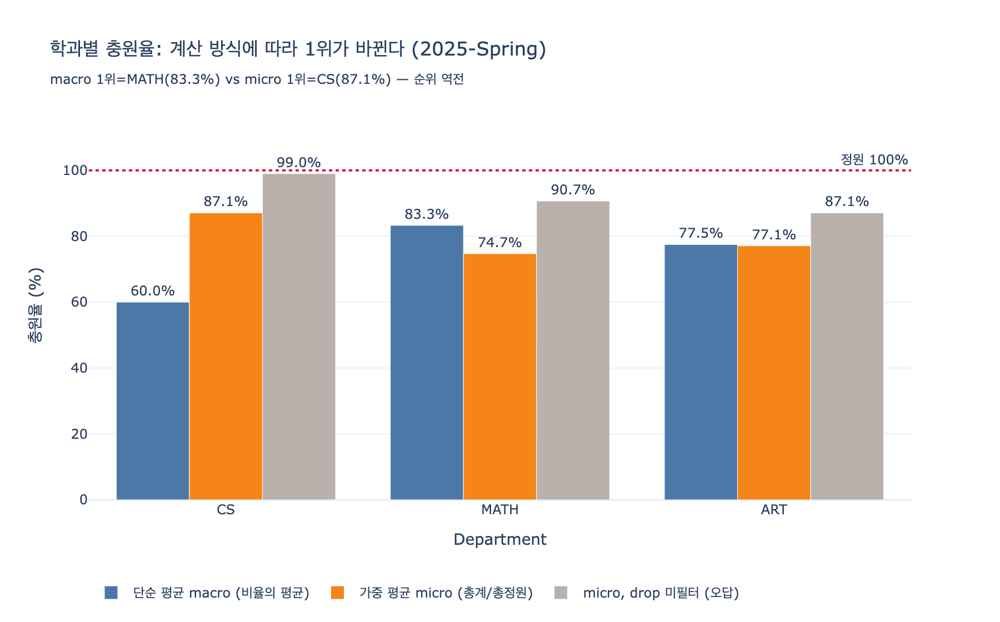

# 학과별 충원율(enrollment rate) 계산

## 질문

학과별 충원율(enrollment rate)은 어떻게 계산하는가?

## 답

`Department → Course ← Enrollment`로 수강 건수를 세고, 이를 `Course.maxEnrollment`로 나눈다. 정원 대비 실제 등록 비율이 나온다.

---

## 1. 그래프 경로부터 읽기

University 온톨로지에서 이 지표는 두 개의 관계를 타고 만들어진다.

```
Department -[:offers]-> Course <-[:for_course]- Enrollment
```

| 요소 | 출처 | 역할 |
|---|---|---|
| 분자 | `Enrollment` 노드 개수 (`COUNT(e)`) | 실제로 자리를 차지한 인원 |
| 분모 | `Course.maxEnrollment` 합 | 학과가 제공한 좌석 수 |
| 그룹 키 | `Department` | 집계 단위 |

화살표 방향이 서로 반대라는 점이 이 경로의 특징이다.
`offers`는 Department → Course(one-to-many)로 **나가는** 방향이고,
`for_course`는 Enrollment → Course(many-to-one)로 Course를 **향해 들어오는** 방향이다.
그래서 경로 표기가 `Department → Course ← Enrollment`가 된다.

Student는 이 계산에 필요 없다. `Enrollment`가 junction entity라서 "한 학생이 한 강좌를 듣는 한 건"이
이미 Enrollment 노드 하나로 표현되어 있기 때문이다. `Student`까지 조인하면 노드 수만 늘 뿐
카운트는 그대로다(중복 조인 시 오히려 부풀 위험만 생긴다).

또 하나: `Professor`를 거쳐 가지 않는다는 점도 중요하다.
`Department ← Professor → Course` 경로로 강좌를 모으면, 다른 학과 강좌를 겸임으로 가르치는
교수의 강좌까지 딸려 들어온다. 학과의 "교육과정 정원"을 묻는 지표이므로
`offers` 관계를 직접 쓰는 것이 맞다.

---

## 2. 핵심 함정 — 비율의 평균 ≠ 평균의 비율

"학과 충원율"이라는 한 마디 안에 서로 다른 두 지표가 숨어 있다.
학과 $d$가 강좌 $c \in C_d$를 offers 하고, $n_c$를 유효 수강건수, $m_c$를 `maxEnrollment`라 하자.

### (A) 단순 평균 — macro-average, "비율의 평균"

$$\mathrm{rate}^{\text{macro}}_d = \frac{1}{|C_d|}\sum_{c \in C_d} \frac{n_c}{m_c}$$

강좌 하나하나가 동등한 한 표를 갖는다. 정원 5명 세미나와 정원 200명 개론이 같은 무게다.

### (B) 가중 평균 — micro-average, "총계의 비율"

$$\mathrm{rate}^{\text{micro}}_d = \frac{\sum_{c \in C_d} n_c}{\sum_{c \in C_d} m_c}
= \sum_{c \in C_d} w_c \cdot \frac{n_c}{m_c}, \qquad w_c = \frac{m_c}{\sum_{k \in C_d} m_k}$$

전개하면 알 수 있듯 micro는 사실 **정원을 가중치로 쓴 가중 평균**이다.
"학과 전체 좌석 중 몇 %가 찼는가"를 뜻한다.

### 두 값은 언제 같은가

모든 $m_c$가 동일할 때만 $w_c = 1/|C_d|$가 되어 두 값이 일치한다.
정원 편차가 클수록 벌어지며, 이는 심슨의 역설(Simpson's paradox)과 같은 계열의 현상이다.

### 실제 역전 사례 (expy.py 데이터)

| 학과 | 강좌 (정원 → 유효등록) | macro | micro |
|---|---|---|---|
| CS | CS101 (200 → 180), CS490 (10 → 3) | **60.0%** | **87.1%** |
| MATH | MATH201 (50 → 35), MATH310 (20 → 16), MATH999 (5 → 5) | **83.3%** | **74.7%** |
| ART | ART100 (40 → 30), ART250 (30 → 24) | 77.5% | 77.1% |

- macro 순위: MATH > ART > CS
- micro 순위: CS > ART > MATH

**1위와 3위가 완전히 뒤집힌다.** 원인은 CS490이다.
macro에서 CS490은 CS의 절반(1/2 = 50%)을 좌우하지만,
micro에서는 $10/210 = 4.8\%$의 가중치만 갖는다.
CS 학과는 "정원 미달 세미나가 하나 있는 대형 개론 학과"인데,
macro는 이를 "충원율 60%의 부실 학과"로, micro는 "좌석 87% 활용 학과"로 그린다.

### 어느 쪽을 써야 하나

| 목적 | 적절한 정의 |
|---|---|
| 강의실·예산·TA 배정 등 자원 활용률 | **micro (가중 평균)** — 좌석 단위 실적 |
| 폐강 후보 탐지, "평균적 강좌 인기도" | **macro (단순 평균)** — 강좌 단위 실적 |
| 대외 보고 지표 | 정의를 문서에 **명시**. 둘 다 병기하는 것이 안전 |

기본값으로는 micro를 권한다. "충원율"이라는 단어의 상식적 의미(좌석이 얼마나 찼는가)에 맞고,
$n_c$와 $m_c$가 각각 명확한 물리적 의미를 갖는 총계이기 때문이다.
다만 **정의를 밝히지 않은 충원율 숫자는 신뢰할 수 없다**는 것이 이 함정의 교훈이다.

---

## 3. status 필터 — drop/withdrawn을 세면 안 된다

`Enrollment`는 junction entity로서 `status` 속성을 갖는다.
`enrolled`, `completed`는 좌석을 실제로 점유한 상태지만,
`dropped`, `withdrawn`은 **자리를 비운** 상태다.

필터 없이 `COUNT(e)`를 쓰면:

| 학과 | micro (필터 적용) | micro (필터 없음) | 과대계상 |
|---|---|---|---|
| CS | 87.1% | **99.0%** | +11.9%p |
| MATH | 74.7% | **90.7%** | +16.0%p |
| ART | 77.1% | 87.1% | +10.0%p |

강좌 단위로 보면 더 극적이다. CS101은 정원 200에 유효 등록 180명이지만
취소 25건까지 세면 $205/200 = 102.5\%$가 되어 **충원율이 100%를 넘는다**.
실제로는 빈자리가 20개 있는 강의인데 "정원 초과 인기 강좌"로 보고되는 셈이다.

100%를 넘는 충원율이 나오면 대체로 이 필터 누락(또는 다음 절의 학기 누락)을 의심해야 한다.

> 주의: `status` 값의 어휘(vocabulary)를 온톨로지 차원에서 정해 두어야 한다.
> `dropped` / `drop` / `DROPPED` / `W` 가 섞여 있으면 `IN` 필터가 조용히 실패한다.
> 소스가 SIS·LMS 등 여러 시스템이므로 값 정규화가 선행 과제다.

---

## 4. semester 구분 — 분자만 누적되면 안 된다

`Enrollment.semester`는 학기를 담고, `Course.maxEnrollment`는 **한 학기치 정원**이다.
분자에 여러 학기를 누적하고 분모는 한 학기치를 쓰면 단위가 어긋난다.

| 학과 | micro (2025-Spring 고정) | micro (학기 무시, 전체 누적) |
|---|---|---|
| CS | 87.1% | **158.6%** |
| MATH | 74.7% | **128.0%** |
| ART | 77.1% | **131.4%** |

전 학과가 100%를 넘는다. 전형적인 "분자는 누적, 분모는 단일 학기" 오류다.

충원율은 본질적으로 **학기별 스냅샷 지표**다. 학년도 단위로 보고 싶다면
학기별로 각각 계산한 뒤 학기 수로 나누거나(또는 학기별 정원을 모두 더해 micro 계산),
`Course.maxEnrollment`를 학기별 개설(offering) 엔티티로 분리 모델링해야 한다.

> 모델링 노트: 지금 온톨로지는 `maxEnrollment`가 `Course`에 붙어 있어
> "같은 과목의 학기별 정원 변동"을 표현하지 못한다.
> 실무에서는 `Course`와 `CourseOffering(semester, section, maxEnrollment)`을 분리하고
> `Enrollment → CourseOffering`으로 거는 것이 정석이다.
> 이 카드의 모델은 학습용 단순화 버전으로 이해하면 된다.

---

## 5. 0명 강좌를 분모에서 잃지 말 것

GQL에서 `MATCH`로 Enrollment를 붙이면, **수강생이 0명인 강좌는 결과에서 통째로 사라진다**.
그 강좌의 정원까지 분모에서 빠지므로 충원율이 부풀려진다.

MATH 학과에 정원 25명·수강생 0명인 `PHYS500`을 추가하면:

- `OPTIONAL MATCH` (정확): $56 / 100 = 56.0\%$
- `MATCH` (0명 강좌 누락): $56 / 75 = 74.7\%$

**18.7%p 차이**다. 충원율이 낮을 때 가장 문제가 되는 강좌가 바로 0명 강좌인데,
그것이 조용히 제외되면 지표가 정반대 신호를 준다. 반드시 `OPTIONAL MATCH`를 쓴다.

---

## 6. GQL 예시

### 가중 평균 (micro) — 권장 기본값

```gql
MATCH (d:Department)-[:offers]->(c:Course)
OPTIONAL MATCH (c)<-[:for_course]-(e:Enrollment)
  WHERE e.semester = '2025-Spring'
    AND e.status IN ['enrolled', 'completed']
WITH d, c, COUNT(e) AS n, c.maxEnrollment AS m
WITH d, SUM(n) AS totalEnrolled, SUM(m) AS totalSeats
RETURN d.name AS department,
       totalEnrolled,
       totalSeats,
       1.0 * totalEnrolled / totalSeats AS enrollmentRate
ORDER BY enrollmentRate DESC
```

### 단순 평균 (macro) — 강좌 동등 취급

```gql
MATCH (d:Department)-[:offers]->(c:Course)
OPTIONAL MATCH (c)<-[:for_course]-(e:Enrollment)
  WHERE e.semester = '2025-Spring'
    AND e.status IN ['enrolled', 'completed']
WITH d, c, COUNT(e) AS n
WITH d, AVG(1.0 * n / c.maxEnrollment) AS enrollmentRate
RETURN d.name AS department, enrollmentRate
ORDER BY enrollmentRate DESC
```

### 두 값을 함께 뽑아 괴리 확인

```gql
MATCH (d:Department)-[:offers]->(c:Course)
OPTIONAL MATCH (c)<-[:for_course]-(e:Enrollment)
  WHERE e.semester = '2025-Spring'
    AND e.status IN ['enrolled', 'completed']
WITH d, c, COUNT(e) AS n, c.maxEnrollment AS m
WITH d,
     1.0 * SUM(n) / SUM(m)     AS micro,
     AVG(1.0 * n / m)          AS macro
RETURN d.name, micro, macro, micro - macro AS gap
ORDER BY abs(gap) DESC
```

`gap`이 큰 학과는 정원 편차가 큰 학과다. 그런 학과의 충원율은 단일 숫자로 요약하면 안 된다.

### 미달 강좌 드릴다운

```gql
MATCH (d:Department {name: 'Computer Science'})-[:offers]->(c:Course)
OPTIONAL MATCH (c)<-[:for_course]-(e:Enrollment)
  WHERE e.semester = '2025-Spring'
    AND e.status IN ['enrolled', 'completed']
WITH c, COUNT(e) AS n
WHERE 1.0 * n / c.maxEnrollment < 0.5
RETURN c.courseId, c.title, n, c.maxEnrollment,
       1.0 * n / c.maxEnrollment AS rate
ORDER BY rate ASC
```

---

## 7. 체크리스트

| 항목 | 잘못된 계산 | 올바른 계산 |
|---|---|---|
| 집계 방식 | 정의 없이 "충원율" | macro/micro를 **명시**. 기본은 micro |
| 경로 | `Department ← Professor → Course` | `Department -[:offers]-> Course` |
| status | 전체 Enrollment 카운트 | `status IN ['enrolled','completed']` |
| semester | 전 학기 누적 | 대상 학기 고정 |
| 0명 강좌 | `MATCH`로 조용히 누락 | `OPTIONAL MATCH`로 정원 유지 |
| 검증 | 100% 초과를 그냥 보고 | 100% 초과 = 필터 누락 신호로 취급 |

기억할 한 문장: **분자는 `for_course`로 세고 분모는 `offers`로 세되, 세는 규칙을 먼저 정의하라.**

## 시각화



파란 막대(macro)와 주황 막대(micro)의 순위가 CS와 MATH에서 뒤집혀 있고,
회색 막대(drop 미필터)는 모든 학과를 100% 쪽으로 밀어 올린다.
CS의 회색 막대 99.0%는 "거의 만석"처럼 보이지만 실제 좌석 활용률은 87.1%다.
