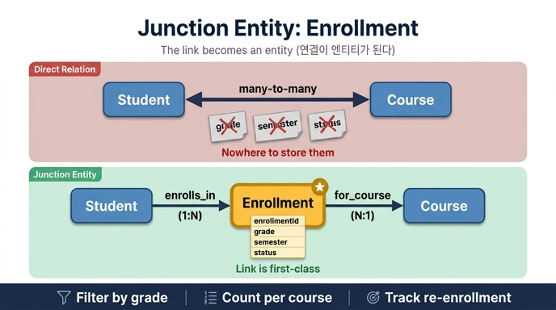

# Enrollment이 junction entity인 이유

## 질문

**Enrollment가 junction entity라고 불리는 이유는?**

## 답

Student와 Course를 잇기 위해 존재하는 엔티티이면서, 성적·학기·상태 같은 추가 맥락을 스스로 지니기 때문이다. 연결 자체가 일급(first-class) 엔티티가 된다.

---

## 1. 출발점: 풀리지 않는 many-to-many

University 온톨로지의 학사 핵심(academic core)은 세 가지 질문으로 시작한다.

- **Student** — 누가 배우는가?
- **Course** — 무엇을 가르치는가?
- **Enrollment** — 그 학생이 그 과목을 들은 기록은 무엇인가?

Student와 Course는 본질적으로 **다대다(many-to-many)** 관계다.

- 한 학생은 여러 과목을 듣는다.
- 한 과목은 여러 학생을 받는다.

여기서 `Student --takes--> Course` 라는 직접 관계 하나만 그리면 그래프는 만들어진다. 문제는 그 다음이다.

> "이 학생이 **2024 가을학기**에 이 과목에서 받은 **성적**은?"

이 질문에 답하려면 `grade`, `semester`, `status` 값을 어딘가에 저장해야 한다. 그런데 갈 곳이 없다.

## 2. 왜 속성을 양 끝에 붙일 수 없는가

| 후보 위치 | 왜 안 되는가 |
|---|---|
| `Student.grade` | 학생은 과목마다 다른 성적을 받는다. 학생당 값 하나로는 표현 불가 |
| `Course.grade` | 과목은 수강생마다 다른 성적을 준다. 과목당 값 하나로는 표현 불가 |
| 관계선 위의 속성 | `grade`는 학생의 것도 과목의 것도 아닌 **그 조합**의 것이다. 게다가 같은 학생이 같은 과목을 재수강하면 조합조차 유일하지 않다 |

핵심 통찰은 이것이다. **성적·학기·상태는 Student의 속성도 Course의 속성도 아니라, "연결"의 속성이다.** 그렇다면 연결에 신분증을 주어야 한다.

## 3. Junction entity의 정의

> **Junction entity 패턴:** 두 엔티티가 *속성을 가진* 다대다 관계를 맺을 때, 그 사이에 별도의 엔티티를 만든다.

Enrollment가 정확히 그것이다. 이름 그대로 두 갈래가 **합류(junction)** 하는 지점에 놓인 엔티티다. Junction entity라 불리는 조건은 두 가지가 동시에 성립할 때다.

1. **존재 이유가 연결이다** — Enrollment는 Student와 Course를 잇기 위해 태어났다. 독립된 실세계 사물이라기보다 "수강이라는 사건/기록"이다.
2. **연결 자체가 데이터를 지닌다** — 단순 매핑 테이블이 아니라 `grade`, `semester`, `status`, `enrollDate` 같은 고유 맥락을 스스로 소유한다.

이 두 번째 조건 때문에 연결은 더 이상 "선"이 아니라 **일급(first-class) 엔티티**가 된다. 조회의 대상이 되고, 식별자를 가지고, 필터·집계·정렬의 주체가 된다.

## 4. Enrollment의 실제 정의

| Property | Type | Identifier? |
|---|---|---|
| `enrollmentId` | string | ✓ |
| `semester` | string | |
| `grade` | string | |
| `enrollDate` | date | |
| `status` | string | |

주목할 점은 `enrollmentId`라는 **자체 식별자**가 있다는 것이다. 이것이 일급 엔티티의 증거다. `(studentId, courseId)` 조합에 종속되지 않으므로, 같은 학생이 같은 과목을 다른 학기에 재수강한 기록도 각각 별개의 Enrollment로 남는다.

## 5. 관계 구조

```
Student  --enrolls_in-->  Enrollment  --for_course-->  Course
        (one-to-many)                 (many-to-one)
```

- **enrolls_in** — `Student` → `Enrollment` (1:N). 한 학생은 학기를 거치며 여러 수강 기록을 쌓는다.
- **for_course** — `Enrollment` → `Course` (N:1). 각 수강 기록은 정확히 하나의 과목을 향한다.

주목할 점: **하나의 다대다가 두 개의 일대다로 분해되었다.** 이것이 junction entity의 구조적 효과다. 그래프 상에서 다대다 간선은 사라지고, 양쪽 모두 다루기 쉬운 1:N / N:1 관계만 남는다.

## 6. 직접 관계 vs Junction entity 비교

| 항목 | 직접 관계 (`Student --takes--> Course`) | Junction entity (`Student → Enrollment → Course`) |
|---|---|---|
| 관계 종류 | many-to-many | one-to-many + many-to-one |
| 성적 저장 | 불가능 | `Enrollment.grade` |
| 학기 구분 | 불가능 | `Enrollment.semester` |
| 재수강 표현 | 불가능 (조합 중복) | 가능 (`enrollmentId`가 별개) |
| 수강 취소/청강 상태 | 불가능 | `Enrollment.status` |
| 연결을 직접 조회 | 불가능 | 가능 (일급 엔티티) |
| 답할 수 있는 질문 | "이 학생이 이 과목을 듣는가?" | "이 학생이 이 과목에서 이번 학기에 몇 점 받았는가?" |

## 7. 그래서 무엇이 가능해지는가

Enrollment가 일급 엔티티이기 때문에 GQL에서 **Enrollment 자체를 필터 대상으로** 삼을 수 있다.

```gql
MATCH (d:Department)-[:offers]->(c:Course)<-[:for_course]-(e:Enrollment)<-[:enrolls_in]-(s:Student)
WHERE e.grade IN ['C', 'D', 'F']
RETURN d.name, c.title, COUNT(e) AS struggling_count
ORDER BY struggling_count DESC
```

여기서 `e.grade`로 거르고 `COUNT(e)`로 세는 동작은, Enrollment가 노드일 때만 성립한다. 직접 관계였다면 애초에 셀 대상도 거를 속성도 없다.

이 구조 덕분에 University 온톨로지 전체의 대표 질문 —

> "50% 넘는 수강생이 C 미만을 받은 과목을 가르치는 교수가 있는 학과는?"

가 `Department → Professor → Course → Enrollment(grade < C) ← Student` 라는 한 줄 경로로 표현된다. Enrollment는 학생 쪽 정보와 과목 쪽 정보가 만나는 **집계의 축**이 된다.

## 8. 시험에 나오는 오답들

Enrollment를 분리하는 이유로 흔히 제시되는 틀린 설명들:

- ❌ "그래프에 노드를 더 많이 만들기 위해" — 노드 수는 목적이 아니다.
- ❌ "온톨로지는 엔티티가 최소 3개여야 해서" — 그런 규칙은 없다.
- ❌ "엔티티 간 직접 관계는 허용되지 않아서" — 직접 관계도 당연히 허용된다. `teaches`, `belongs_to`, `offers`가 그 예다.
- ⭕ **"Enrollment가 Student에도 Course에도 속하지 않는 자체 속성(grade, semester, status)을 지니기 때문에"**

기준은 명확하다. **속성 없는 순수 연결이면 직접 관계로 충분하고, 연결이 속성을 지니는 순간 junction entity가 필요하다.**

## 9. 다른 이름, 같은 패턴

Junction entity는 여러 분야에서 이름만 달리 불린다.

- **관계형 DB** — junction table / join table / associative table (`enrollments` 테이블)
- **ER 모델링** — associative entity, 혹은 관계를 엔티티로 승격한 "gerund"
- **UML** — association class
- **온톨로지/그래프** — reified relationship (관계의 사물화)

용어는 달라도 동기는 하나다. **관계에 데이터를 붙이려면 관계를 사물로 만들어야 한다.**

## 10. 한 줄 요약

> Enrollment는 Student와 Course를 **잇기 위해서만** 존재하면서 동시에 **자기 데이터를 지니므로**, 연결이 선이 아니라 일급 엔티티로 승격된 것이다. 이것이 junction entity다.

## 인포그래픽


